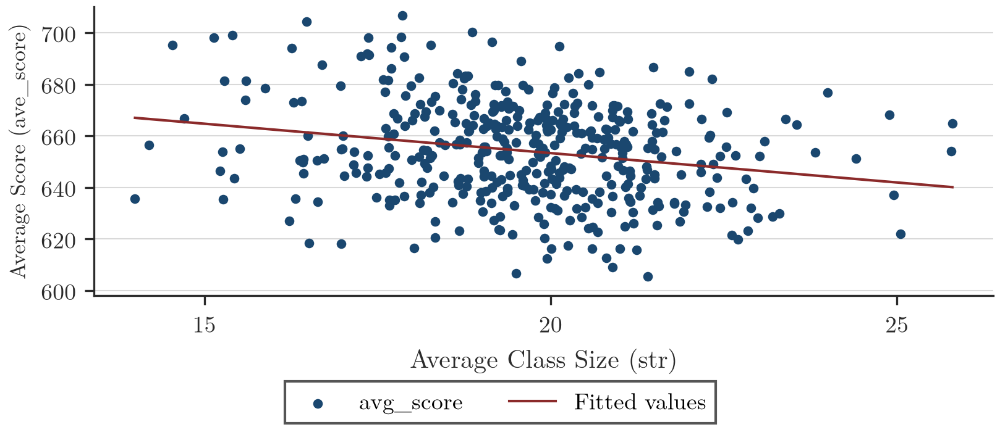
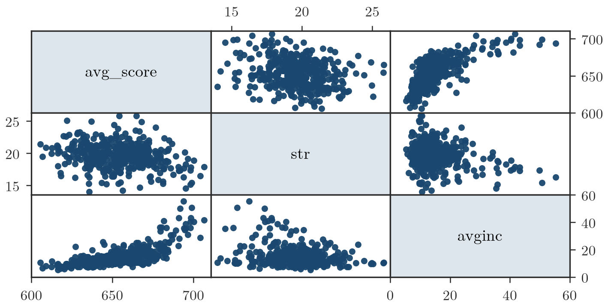
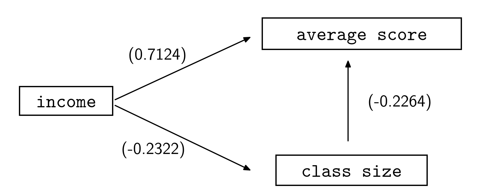
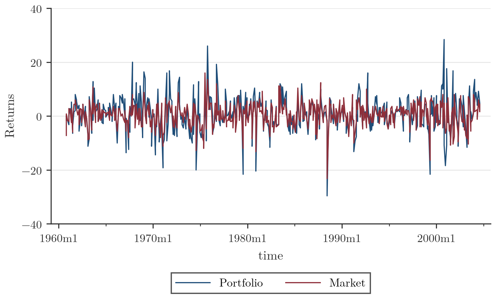
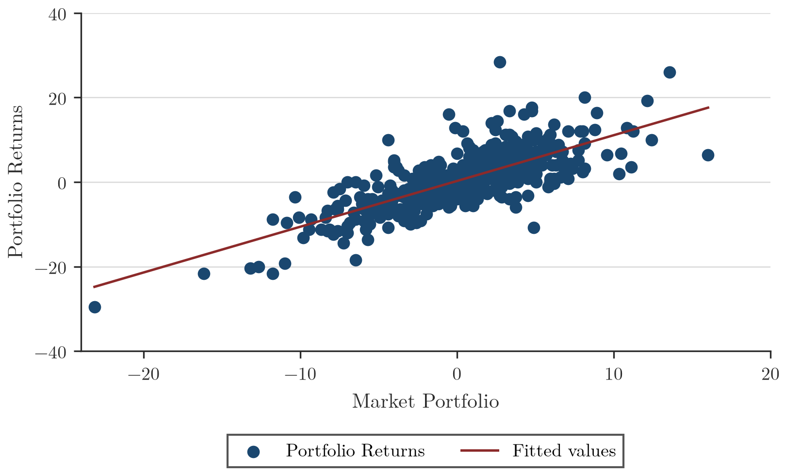

## Informazioni generali sul corso

**Docente:** Davide Raggi. Lezione del 11 novembre 2025.

**Syllabus (sintesi)**
- Elementi fondamentali dell'analisi di regressione con dati cross section:
  - il modello di regressione semplice con un regressore;
  - sistemi d'ipotesi ed intervalli di confidenza;
  - il modello di regressione multipla;
  - omoschedasticità ed eteroschedasticità.
- Regressioni con serie storiche:
  - modelli dinamici;
  - dati stazionari e non stazionari;
  - modelli autoregressivi ed a media mobile;
  - regressioni spurie e test di stazionarietà;
  - cointegrazione (approccio di Engle-Granger).
- Applicazioni con il software GRETL.

**Altre informazioni**
- Esercitazioni: Marco Bidoia.
- Materiale didattico: pagina Moodle del corso "Econometria", anno 2025/2026 (https://moodle.unive.it/course/view.php?id=22785).
- Metodi didattici: lezioni in presenza e materiale supplementare (materiali e ricevimenti aggiuntivi dedicati agli studenti aventi diritto, nella sezione Moodle "Accessibilità e Supporto allo studio").
- Software: Gretl (https://gretl.sourceforge.net/).

**Libro di testo**
- *Principi di econometria*, 2013, C. Hill, W. E. Griffiths e G. C. Lim, Ed. Zanichelli.
  - Modelli di regressione: capitoli 2–8.
  - Serie storiche: capitoli 9, 10 e 12.

*(slide 1–4)*

## Cos'è l'econometria?

> [!abstract] Definizione
> Non esiste una definizione unica di econometria. Secondo il docente, si può definire come **un insieme di tecniche statistiche che hanno lo scopo di**:
> - definire e misurare relazioni causali tra variabili economiche;
> - validare la credibilità di modelli economici teorici;
> - fare previsioni.

*(slide 5)*

## Causalità: definizione e criteri

> [!abstract] Definizione
> Un legame causale tra due variabili $X$ e $Y$, indicato $X \to Y$, specifica che $X$ è una variabile esplicativa che ha impatto su $Y$: questa dipendenza non è simmetrica, cioè $Y$ non causa $X$.
>
> Si può parlare di **causalità** se i seguenti tre criteri valgono **contemporaneamente**:
> 1. **Associazione tra le variabili.**
> 2. **Un ordine logico/temporale**: la causa precede l'effetto (prima si implementa una politica, poi se ne misura l'impatto). Alcune variabili non possono essere conseguenza di una decisione (ad esempio il sesso, la razza, l'età) e per questo possono essere considerate cause. In altri casi non è facile capire quale sia la causa e quale l'effetto: ad esempio, nei periodi di alta disoccupazione i tassi di criminalità sembrano aumentare. La disoccupazione è una causa? Forse, ma potrebbe esserci **causalità inversa**: in aree ad alta criminalità le imprese potrebbero chiudere, aumentando la disoccupazione.
> 3. **L'esclusione di spiegazioni alternative.**

*(slide 6)*

## Esempio: consumo di caffè e probabilità d'infarto

> [!example] Esempio
> Alcuni studi epidemiologici hanno evidenziato un'associazione positiva tra la probabilità di avere un infarto (variabile $Y$) e il consumo di caffè (variabile $X$).
> - Un possibile link causale: bere caffè aumenta la pressione sanguigna, che rappresenta un fattore di rischio per questa patologia.
>
> Altri studi hanno mostrato che, una volta controllato per altri fattori (tipo di lavoro, residenza, genere, reddito, livello di stress), l'associazione condizionata si riduce a zero.
> - Questo fornisce una spiegazione alternativa: persone con lavori più stressanti bevono più caffè. È il lavoro stressante il fattore determinante per la probabilità di avere un infarto, e non il caffè.
>
> In pratica, in questo esempio (non supportato da analisi empiriche reali) esiste una variabile $Z$, lo stress, che ha un impatto congiunto su $X$ e $Y$. La relazione tra $X$ e $Y$ viene detta **spuria**, ed è indotta da $Z$: in questo caso la relazione spuria è indotta da una variabile omessa nello studio.

*(slide 7–8)*

## Esempio: boy scout e criminalità

> [!example] Esempio
> Si vuole investigare la relazione tra l'essere stati boy scout ($S$) e la criminalità giovanile ($D$), nel senso che ci si aspetta che aver frequentato i boy scout riduca la probabilità di commettere crimini.
>
> Alcune evidenze empiriche (dati non reali) sono sintetizzate nella tabella seguente:
>
> **Tabella 1 — Essere boy scout e crimine**
>
> | Boy scout | Delinquency: Yes | Delinquency: No | Total |
> |---|---|---|---|
> | Yes | 36 (9%) | 364 (91%) | 400 |
> | No | 60 (15%) | 340 (85%) | 400 |
>
> L'evidenza empirica suggerisce una relazione negativa tra $S$ e $D$. Dal punto di vista logico questo legame sembra sensato, per cui $S \to D$. Tuttavia non possiamo escludere che un criminale possa aver evitato ambienti "virtuosi", per cui anche la relazione inversa ha senso logico: $D \to S$.
> - Entrambe le spiegazioni sono ragionevoli.
> - L'ordinamento logico non è chiaro, quindi non possiamo parlare di causalità.

*(slide 9–10)*

## Causalità: l'impossibilità di dimostrarla e il ruolo della confutazione

In generale **non è possibile dimostrare l'esistenza di una relazione causale**, perché quasi mai è possibile escludere tutte le altre possibili spiegazioni di un fenomeno. Spesso non siamo in grado di controllare per tutte le possibili spiegazioni alternative (sono troppe) rispetto a un certo livello di associazione misurato.

Possiamo però **confutare** ipotesi di causalità: se riusciamo a confutare tutte le ipotesi tranne una, possiamo essere abbastanza certi nel definire il legame come nesso causale.

*(slide 11)*

## Esempio: fumo e cancro ai polmoni

> [!example] Esempio
> L'associazione tra fumo e probabilità di tumore è ampiamente documentata. È sintomo di legame causale?
> - Esiste una ricca letteratura epidemiologica che documenta la relazione tra le due variabili.
> - Esiste un legame logico sensato (il cancro si manifesta di solito dopo un consumo intensivo di sigarette).
> - Non sono state trovate, nella letteratura epidemiologica, spiegazioni alternative più convincenti. Esistono inoltre evidenze teoriche che spiegano il legame tra fumo e malattia.
>
> A differenza dei casi precedenti (caffè, boy scout), questo esempio soddisfa tutti e tre i criteri di causalità: associazione, ordine logico/temporale, esclusione di spiegazioni alternative.

*(slide 12)*

## Associazione non implica causalità

In generale, l'associazione tra variabili **non** rappresenta un criterio sufficiente per stabilire se un legame sia interpretabile come causale. Una raccolta (a scopo illustrativo) di associazioni spurie "divertenti" è disponibile su http://www.tylervigen.com/spurious-correlations.

Non è difficile trovare variabili fortemente associate ma non legate tra loro: come visto sopra, l'associazione in questi casi rappresenta un **legame spurio**.

Una volta osservato un legame statistico, risulta indispensabile spiegarlo dal punto di vista teorico e verificare se risulti anche credibile dal punto di vista logico.

*(slide 13)*

## Tipi di dato

> [!abstract] Definizione
> - **Cross Section**: tipo di dati che fanno riferimento a osservazioni raccolte in un unico istante temporale su molti soggetti (individui, Paesi, imprese). Esempio: il database STAR, che raccoglie osservazioni su scuole, bambini e alcune loro caratteristiche.
> - **Serie storiche**: sequenze di osservazioni misurate sequenzialmente, spesso a intervalli regolari; il tempo definisce un ordine. Esempi: i prezzi di chiusura di un particolare asset finanziario, o il volume d'acqua orario di un fiume.
> - **Dati Panel** (o longitudinali): fanno riferimento a cross section sui medesimi individui, osservate nel tempo. Ogni osservazione è caratterizzata da una doppia dimensione, tempo e soggetto. Esempio: l'evoluzione dei prezzi di un campione di case in un intervallo temporale limitato.

*(slide 14)*

## Esempio Cross Section: dimensione della classe e punteggio ai test

> [!example] Esempio
> **Il problema.** Si pensa spesso che un basso rapporto studenti/insegnanti (*class size*) possa migliorare la performance degli alunni. In California, verso la fine degli anni '90, tutte le classi K-3 furono ridotte per ottenere un rapporto studenti/insegnanti pari a 20 (*Class Size Reduction Act* – CSR), con un costo iniziale di $1.8 miliardi annui. Per questo costo, ne vale davvero la pena?
>
> Ci si chiede se la dimensione della classe sia l'unico (o il principale) fattore rilevante nello spiegare la variazione della performance attesa degli studenti, oppure se esistano ulteriori informazioni rilevanti da considerare. Si vuole inoltre **quantificare** come una riduzione della dimensione della classe impatti sui voti degli alunni.
>
> 
>
> **Figura 1** — Scatterplot delle variabili rilevanti (Fonte: *California Standardized Testing and Reporting Survey*, year 1999). Lo scatterplot mette in relazione l'*Average Class Size* ($str$, asse orizzontale) con l'*Average Score* ($avg\_score$, asse verticale); la retta interpolante (*fitted values*) ha pendenza negativa, suggerendo che classi più numerose sono associate a punteggi mediamente più bassi.
>
> Sembrerebbe quindi che ridurre il rapporto studenti/insegnanti sia rilevante: a una riduzione della dimensione delle classi corrisponde un aumento medio dei punteggi. La correlazione tra le due variabili è **-0.2264** (rappresenta la pendenza della retta di regressione). Esiste inoltre un legame temporale e logico plausibile: prima viene implementata la policy, poi si valutano i benefici.
>
> **Un'altra possibile spiegazione.** Un'analisi più dettagliata suggerisce che anche il reddito medio ($avginc$) delle persone che vivono in ogni distretto scolastico risulta positivamente correlato con il punteggio $avg\_score$: distretti più ricchi tendono ad essere associati a voti migliori. Inoltre esiste una dipendenza negativa tra $income$ e $class\ size$ ($str$), suggerendo che distretti ad alto reddito sono legati a scuole in cui le classi sono mediamente più piccole.
>
> **Matrice di correlazione** (comando `correlate avg_score str avginc`):
>
> |            | avg_score | str     | avginc  |
> |------------|-----------|---------|---------|
> | avg_score  | 1.0000    |         |         |
> | str        | -0.2264   | 1.0000  |         |
> | avginc     | 0.7124    | -0.2322 | 1.0000  |
>
> Sulla base di questi risultati, ci si chiede se sia il **reddito** la variabile rilevante per spiegare la performance, e non la dimensione della classe.
>
> 
>
> **Figura 2** — Scatterplot delle variabili a coppie. La matrice di scatterplot incrocia $avg\_score$, $str$ e $avginc$ a due a due, confermando visivamente le correlazioni riportate nella matrice sopra (in particolare la forte associazione positiva tra $avg\_score$ e $avginc$).
>
> 
>
> **Figura 3** — Rappresentazione causale del nuovo modello (in parentesi le correlazioni): $income \to average\ score$ (0.7124), $income \to class\ size$ (-0.2322), $class\ size \to average\ score$ (-0.2264). Il diagramma mostra uno schema in cui il reddito ($income$) influisce sia sul punteggio medio sia sulla dimensione delle classi, potendo così generare una correlazione osservata (ma potenzialmente spuria) tra $class\ size$ e $average\ score$.
>
> Questa evidenza empirica suggerisce che la dipendenza negativa tra *class size* e *performance* potrebbe essere **spuria**, poiché potrebbe essere spiegata dall'effetto reddito. Questa relazione causale più complessa potrebbe rappresentare una nuova spiegazione del fenomeno e fornire strumenti per una migliore comprensione della realtà.
>
> **Verifica: controllo per il reddito.** Cosa si può fare? Si divide il dataset in due parti: da un lato i distretti ad alto reddito, dall'altro quelli a basso reddito. In questi due sottoinsiemi si calcola la correlazione tra *class size* e *test score*. In questo modo è possibile controllare l'effetto reddito, poiché ogni sottoinsieme risulta omogeneo rispetto a quel fattore: quindi l'effetto reddito dovrebbe non essere più rilevante.
> - Nei distretti a **basso reddito**, la correlazione tra *class size* e *test score* è **-0.1464**, debolmente statisticamente significativa.
> - Nei distretti ad **alto reddito** la correlazione è **-0.1962**, comunque non significativa.
>
> Quindi, una volta controllato l'effetto reddito, la correlazione tra la variabile di policy *class size* e *test score* viene praticamente azzerata. Questo rappresenta, con buona probabilità, il sintomo di una relazione **spuria**.

*(slide 15–22)*

## Serie storiche: il modello CAPM

> [!tip] Teorema
> In ambito finanziario si ipotizza spesso che gli investitori abbiano bisogno di incentivi per aumentare il rischio che sono disposti ad accollarsi: i rendimenti attesi $R$ di un investimento rischioso dovrebbero essere maggiori di quelli di un investimento non rischioso (*risk-free*, $R_f$). Gli extra rendimenti $R - R_f \geq 0$ dovrebbero quindi essere positivi.
>
> Il rischio viene spesso descritto tramite la varianza; può essere minimizzato costruendo portafogli diversificati, comprando o vendendo asset i cui prezzi sono correlati alle variazioni di mercato. Misurare il rischio, quindi, non implica solo il calcolo delle varianze, ma anche della struttura di covarianza tra l'investimento e il mercato.
>
> Il modello **CAPM** (*Capital Asset Pricing Model*) è stato proposto per descrivere la relazione tra i rendimenti di un portafoglio generico e il *portafoglio di mercato*. Gli investitori decidono come allocare le proprie risorse massimizzando il rendimento atteso di un portafoglio, mantenendo fissato il livello di rischio.
>
> In equilibrio si dimostra che deve valere:
> $$\underbrace{E[R_t]}_{\text{Rendimenti attesi}} = \beta \, \underbrace{E[(R_{mt})]}_{\text{Rendimento del mercato}}$$
>
> Ci si chiede se questa relazione teorica sia credibile dal punto di vista empirico.
>
> Si ipotizzi di descrivere la relazione come segue:
> $$E[R_t] = \alpha + \beta R_{mt}$$
>
> La variabilità di $R_t$ può essere descritta aggiungendo una componente di *noise* $\epsilon_t$, che descrive l'impatto di notizie improvvise, con media $0$ e varianza $\sigma^2$. Quindi:
> $$R_t = \alpha + \beta R_{mt} + \epsilon_t$$
>
> dove:
> - $R_t$ sono i rendimenti di un asset all'istante $t$;
> - $R_{mt}$ rappresenta i rendimenti del mercato a $t$;
> - $\beta = \dfrac{\text{Cov}(R_t, R_{mt})}{\text{Var}(R_{mt})}$;
> - $\epsilon_t$ è una componente non prevedibile che rappresenta uno shock finanziario;
> - $\alpha$ è un'intercetta (costante).

*(slide 23–25)*

## Serie storiche: verifica empirica del CAPM

> [!example] Esempio
>
> 
>
> **Figura 4** — Serie storiche dei rendimenti del portafoglio (*Portfolio*) e del mercato (*Market*) nel tempo, da gennaio 1960 a inizio anni 2000. I due andamenti mostrano un forte comovimento: i rendimenti del portafoglio seguono da vicino le oscillazioni dei rendimenti di mercato, con ampiezza leggermente maggiore nei picchi (positivi e negativi).
>
> 
>
> **Figura 5** — Scatterplot di *Portfolio Returns* contro *Market Portfolio*, con retta di regressione interpolante (*fitted values*). La nuvola di punti mostra una chiara relazione lineare positiva, con pendenza superiore a 1, coerente con un $\beta$ maggiore di uno.
>
> Se il modello CAPM fosse coerente con i dati, ci si aspetta che il parametro $\alpha$ sia $0$. Per verificarlo è quindi necessario stimarlo e verificare l'ipotesi che sia nullo. L'analisi di regressione può essere utilizzata a questo scopo.
> - Una stima credibile per $\beta$ è **1.083759**, con errore standard **.0404768**. L'intervallo di confidenza al 95% è **[1.004; 1.163]**, che suggerisce che questo investimento è più rischioso del mercato. Infatti:
> $$\text{Var}(R_t) = \beta^2 \text{Var}(R_{mt}) + \sigma^2, \qquad \beta > 1$$
> - La stima di $\alpha$ è **.2942161**, e l'intervallo di confidenza al 95% è **[-.063; .651]**. Questa evidenza non permette di escludere che $0$ possa essere il vero valore per l'intercetta.
> - Il rischio idiosincratico è $\sigma = 4.157$.

*(slide 26–28)*

## Panel data: l'impatto di un inceneritore sul prezzo delle case

> [!example] Esempio
> Kiel e McClain (1995) hanno studiato l'effetto che la costruzione di un nuovo inceneritore di rifiuti ha avuto sul valore delle case a North Andover, nel Massachusetts. Gli autori originali eseguirono un'analisi econometrica piuttosto complicata; in questo esempio si considera un modello semplificato, anche se la strategia implementata è simile all'originale.
>
> I rumor secondo cui un nuovo inceneritore sarebbe stato costruito a North Andover iniziarono dopo il 1978, anche se la costruzione iniziò solo nel 1981. L'inceneritore sarebbe entrato in funzione subito dopo l'inizio della costruzione, e ha effettivamente iniziato a funzionare nel 1985. Si utilizzano i dati sui prezzi delle case vendute nel 1978 e un altro campione su quelle vendute nel 1981. L'ipotesi è che il prezzo delle case situate vicino all'inceneritore diminuisca maggiormente rispetto a quello delle case più distanti.
>
> **Prima evidenza (solo 1981).** Alcune evidenze empiriche suggeriscono che nel 1981 le case costruite vicino al nuovo stabilimento costavano circa 30mila dollari in meno rispetto alle altre:
>
> | year | Base price | "Near" effect |
> |---|---|---|
> | 1981 | 101,308.0 | -30,688.3 |
>
> Tuttavia, queste evidenze non sono sufficienti per affermare che l'inceneritore abbia causato una perdita sui prezzi delle case: non sappiamo se ci fossero differenze nei prezzi già prima del 1981. Ci si aspetta infatti che un inceneritore non venga costruito in una zona di pregio.
>
> **Confronto 1978 vs 1981.** Per fare chiarezza su questo punto è necessario conoscere quali erano i prezzi anche prima che cominciassero le voci. Queste evidenze congiunte sono riassunte nella tabella seguente:
>
> | year | Base price | "Near" effect |
> |---|---|---|
> | 1978 | 82,517.7 | -18,824.4 |
> | 1981 | 101,308.0 | -30,688.3 |
>
> Una regola per verificare se il nuovo inceneritore ha ridotto il valore delle abitazioni è calcolare la seguente statistica (uno stimatore **differenza-nelle-differenze**):
> $$\hat{\delta} = \Big(\overline{price}_{81,near} - \overline{price}_{81,far}\Big) - \Big(\overline{price}_{78,near} - \overline{price}_{78,far}\Big)$$
> dove il primo termine tra parentesi è il coefficiente sull'effetto vicinanza (*near effect*) del 1981, e il secondo è quello del 1978.
>
> **Calcolo.** Come possiamo sapere se la costruzione di un nuovo inceneritore ha ridotto il valore delle case? Possiamo osservare come è cambiato il coefficiente sull'effetto vicinanza tra il 1978 e il 1981. La differenza nel valore medio delle case era molto maggiore nel 1981 rispetto al 1978 (30.688,27 contro 18.824,37), anche come percentuale del valore medio delle case non vicine al sito dell'inceneritore. La differenza tra i due coefficienti sulla vicinanza è:
> $$\hat{\delta} = -30{,}688.3 - (-18{,}824.4) = -11{,}863.9$$
>
> $\hat{\delta}$ è statisticamente diverso da 0? Occorre calcolare opportuni errori standard. Per questo, risulta opportuno usare modelli di regressione specifici per l'analisi dei **dati panel**.

*(slide 29–32)*
