## Introduzione: l'associazione tra variabili quantitative — l'esempio wage vs. education

Il filo conduttore della lezione è un esempio applicato: la relazione tra **salari (wage)** e **livello di istruzione (educ)**. Le domande a cui l'analisi vuole rispondere sono:

- Esiste una relazione positiva tra istruzione e salario?
- Per un dato livello di istruzione, qual è il salario medio che un lavoratore può ottenere?
- Qual è il guadagno atteso se si decide di studiare un anno in più?
- Quanto farebbe guadagnare in più conseguire una laurea magistrale (2 anni di studio in più)?

Questo tipo di informazione è utile per prendere decisioni: ad esempio, un individuo potrebbe decidere di iscriversi a una magistrale se il salario atteso aumenta di almeno 1 euro l'ora.

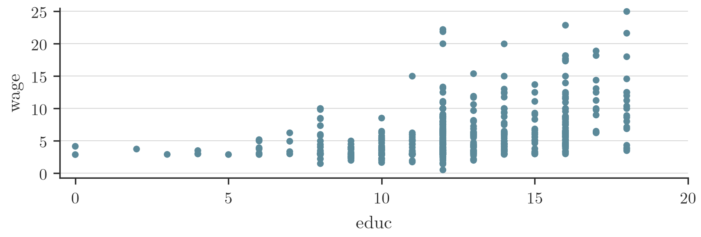

**Figura 1** — Scatterplot di educ vs. wage (526 individui osservati nel 1976). Mostra la relazione grezza tra anni di istruzione e salario orario per un campione di 526 lavoratori; i punti presentano una tendenza crescente ma con forte dispersione attorno ad essa.

Con l'analisi di regressione si cerca un modello che riassuma, **in modo semplice**, come variano le distribuzioni condizionali di una variabile $Y$ al variare di una seconda variabile $X$. Nell'esempio, la distribuzione condizionale è la distribuzione di probabilità dei salari ($Y$) per un qualsiasi livello di istruzione ($X$). Questo modello rappresenta l'ipotesi (ex-ante) sulla relazione causale: si definisce una variabile obiettivo (variabile dipendente) e una variabile causale (regressore, causa scatenante). Il nesso causale ipotizzato è, per costruzione, **unidirezionale** ($X \to Y$).

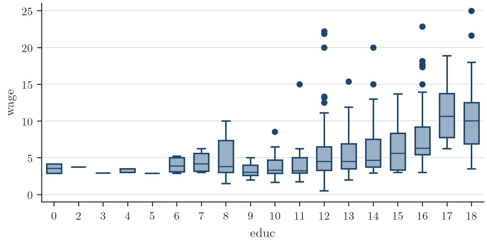

**Figura 2** — Distribuzione condizionale dei salari per ogni livello di istruzione. Boxplot che mostrano come la distribuzione del salario (mediana, quartili, valori estremi) cambi per ciascun valore di anni di istruzione; sia il livello medio sia la dispersione dei salari tendono a crescere con l'istruzione.

Trovare un modello che si adatti con precisione a **tutte** le distribuzioni condizionali sarebbe troppo complicato. I modelli statistici si concentrano quindi sul descrivere la dinamica di alcuni momenti (caratteristiche) delle distribuzioni condizionali; nel modello di regressione queste caratteristiche sono i valori attesi (medie). L'obiettivo diventa costruire un modello che descriva le **medie condizionali** di $Y$: ad esempio, qual è il salario atteso per i lavoratori che hanno studiato esattamente 10 anni?

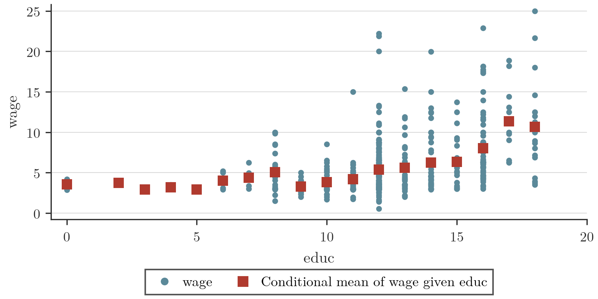

**Figura 3** — Scatterplot di educ vs. wage e $E[wage|educ]$ (quadrati rossi). Sovrappone ai dati osservati le medie condizionate stimate per ciascun livello di istruzione, evidenziando un andamento crescente ma non perfettamente lineare delle medie.

Per rispondere a queste domande è conveniente definire un modello che descriva la relazione tra istruzione e salari attesi: **la linea è il modello più semplice che si conosca**.

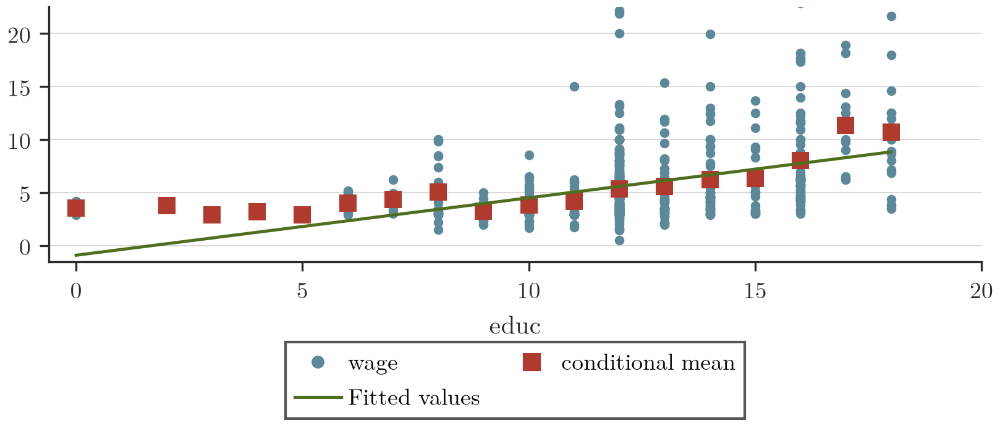

**Figura 4** — Scatterplot di educ vs. wage con $E[wage|educ]$ (quadrati rossi) e la linea di regressione. Aggiunge alla figura precedente la retta di regressione stimata (fitted values), mostrando come la retta approssimi in modo semplice l'andamento delle medie condizionate.

Il valore atteso condizionale $E[Y|X=x]$ è la media di $Y$ per un dato livello $x$ di $X$. La retribuzione media stimata per un dato numero di anni di istruzione è riportata nella tabella seguente:

**Tabella 1** — Valori attesi stimati di wage fissato educ

| years of educ | E[wage\|educ] | years of educ | E[wage\|educ] |
|---|---|---|---|
| educ=0 | 3.53 | educ=10 | 3.83 |
| educ=1 | not available | educ=11 | 4.18 |
| educ=2 | 3.75 | educ=12 | 5.37 |
| educ=3 | 2.92 | educ=13 | 5.59 |
| educ=4 | 3.17 | educ=14 | 6.23 |
| educ=5 | 2.90 | educ=15 | 6.32 |
| educ=6 | 3.98 | educ=16 | 8.04 |
| educ=7 | 4.38 | educ=17 | 11.34 |
| educ=8 | 5.03 | educ=18 | 10.67 |
| educ=9 | 3.27 | educ=19 | not available |

*(slide 3–10)*

## Il modello di regressione semplice

> [!abstract] Definizione
> La **funzione di regressione semplice** descrive le medie condizionali $E[Y|X=x]$ attraverso un modello lineare:
>
> $$E[Y|X] = \alpha + \beta X$$
>
> Questa retta è un'**approssimazione** della vera media condizionale (i quadrati rossi delle figure precedenti), poiché in generale non è possibile trovare un modello semplice che corrisponda esattamente a tutte le medie condizionate.
>
> Data questa ipotesi per la media condizionale, ogni osservazione $(X_i, Y_i)$ nel campione può essere rappresentata come
>
> $$Y_i = E[Y|X=X_i] + \epsilon_i$$
>
> dove $\epsilon_i$ è una quantità stocastica che misura la distanza tra ciascuna osservazione e la retta di regressione.
>
> **Terminologia:**
> - $Y_i$, $i=1,\dots,n$: variabile dipendente;
> - $X_i$, $i=1,\dots,n$: regressore o predittore;
> - $\epsilon_i$, $i=1,\dots,n$: termine di errore.
>
> Intuitivamente $\epsilon_i$ è un fattore di rumore che raccoglie gli effetti di tutte le variabili che potrebbero influenzare $Y$ (escluso $X$) e non sono incluse esplicitamente nel modello. Si assume che l'unico predittore utile per il valore atteso di $Y$ sia il regressore: per questo ci si aspetta che, in media, l'impatto di $\epsilon$ non sia rilevante, ovvero formalmente che $E[\epsilon|X]=0$. Ciò significa che il termine di errore per alcuni soggetti è positivo, per altri negativo, ma in media tutti questi errori si sommano a zero.
>
> **Interpretazione causale — effetto di una variazione di $X$.** Ipotizzando che i parametri $\alpha$ e $\beta$ siano noti, la previsione di $Y$ per un individuo con $X=X_1$ è
>
> $$\hat{Y}(X_1) = \alpha + \beta X_1 + \epsilon(X_1)$$
>
> e per $X=X_2$:
>
> $$\hat{Y}(X_2) = \alpha + \beta X_2 + \epsilon(X_2)$$
>
> dove $\epsilon(X_1)$ ed $\epsilon(X_2)$ rappresentano le caratteristiche non osservate di soggetti con istruzione rispettivamente $X_1$ o $X_2$ anni. La variazione di $Y$ è quindi
>
> $$\underbrace{\hat{Y}(X_2)-\hat{Y}(X_1)}_{\Delta Y} = \beta\underbrace{(X_2-X_1)}_{\Delta X} + \underbrace{[\epsilon(X_2)-\epsilon(X_1)]}_{\Delta \epsilon}$$
>
> $\Delta Y$ dipende quindi da una scelta economica ($\Delta X$) e da qualcos'altro ($\Delta\epsilon$), quest'ultimo in generale non misurabile. Se si assume che $\epsilon$ non dipenda da $X$, diversi livelli di $X$ non porteranno a variazioni di $\epsilon$, cioè $\Delta \epsilon = 0$. Pertanto la variazione di $Y$ è proporzionale alla variazione di $X$, con coefficiente di proporzionalità $\beta$:
>
> $$\Delta Y = \beta \Delta X$$
>
> Inoltre, sapendo che $\mathrm{Cov}(X,\epsilon)=0$, si può dimostrare che $E[\epsilon|X]=0$ e, di conseguenza, che $\hat{Y}(X)\approx E[Y|X]$. Questa ipotesi stabilisce che l'unica spiegazione delle variazioni di $Y$ è fornita da $X$: ipotizzando che $\epsilon$ e $X$ non siano correlati, il risultato di una scelta dipende unicamente dalla scelta stessa ($\Delta X$) e non da altri fattori confondenti ($\Delta \epsilon$). Questa ipotesi è nota come **esogeneità**, ed è un ingrediente cruciale nello studio di relazioni causali.
>
> **Esempio numerico.** Si consideri il modello che lega salario e istruzione con $\alpha=-1$ e $\beta=0.5$:
>
> $$wage_i = \alpha + \beta\, educ_i + \epsilon_i = -1 + 0.5\, educ_i + \epsilon_i$$
>
> Assumendo che altre caratteristiche (genere, esperienza, tenure, ecc.), riassunte in $\epsilon_i$, non siano rilevanti, un anno di scuola in più ($\Delta educ = 1$) induce una variazione della retribuzione oraria prevista di 0.50 dollari; due anni in più inducono una variazione dello stipendio atteso di 1 dollaro.

*(slide 11–16)*

## Stima del modello: il metodo dei minimi quadrati ordinari (OLS)

> [!abstract] Definizione
> Considerati dei dati, è fondamentale poter stimare i parametri $\alpha$ e $\beta$ del modello di regressione. L'idea di base è trovare valori per $\alpha$ e $\beta$ che **minimizzino la distanza media** tra ciascuna osservazione e la retta di regressione: questi due parametri identificano in modo univoco la retta.
>
> Il metodo dei **minimi quadrati ordinari (OLS)** suggerisce di minimizzare la varianza del termine di errore, ovvero calcolare
>
> $$\min_{\alpha,\beta} \mathrm{Var}(\epsilon) = \min_{\alpha,\beta} E[\epsilon^2] \approx \min_{\alpha,\beta} \frac{1}{n}\sum_{i=1}^n (Y_i-\alpha-\beta X_i)^2$$
>
> Si può dimostrare facilmente che la pendenza della retta di regressione $\beta$ è proporzionale alla covarianza tra $X$ e $Y$:
>
> $$\hat\beta = \frac{\frac{1}{n}\sum_{i=1}^n (Y_i-\bar Y)(X_i-\bar X)}{\frac{1}{n}\sum_{i=1}^n (X_i-\bar X)^2} = \frac{\mathrm{Cov}(X,Y)}{\mathrm{Var}(X)}$$
>
> **Esempio: wage vs. education.** Si consideri il modello $wage_i = \alpha + \beta\, educ_i + \epsilon_i$. Le stime OLS basate su un campione di 526 osservazioni sono:
>
> | Variabile | Coef. | Std. Err. | t | P>\|t\| | IC 95% inf. | IC 95% sup. |
> |---|---|---|---|---|---|---|
> | educ | .5413593 | .053248 | 10.17 | 0.000 | .4367534 | .6459651 |
> | _cons | -.9048516 | .6849678 | -1.32 | 0.187 | -2.250472 | .4407687 |
>
> Il modello stimato risulta quindi
>
> $$wage = -.9048 + .5413\, educ$$
>
> Studiare un anno in più induce una variazione positiva di circa 54 centesimi nei salari.
>
> **Valori predetti e residui.** La previsione della media condizionale, o valore predetto, è
>
> $$\hat Y_i = \hat E[Y_i|X=x_i] = \hat\alpha + \hat\beta x_i$$
>
> Il termine di errore viene stimato come differenza tra la variabile osservata $Y_i$ e il valore atteso $\hat Y_i$; è chiamato **residuo** ed è definito come
>
> $$\hat\epsilon_i = Y_i - \hat\alpha - \hat\beta X_i = Y_i - \hat Y_i$$
>
> 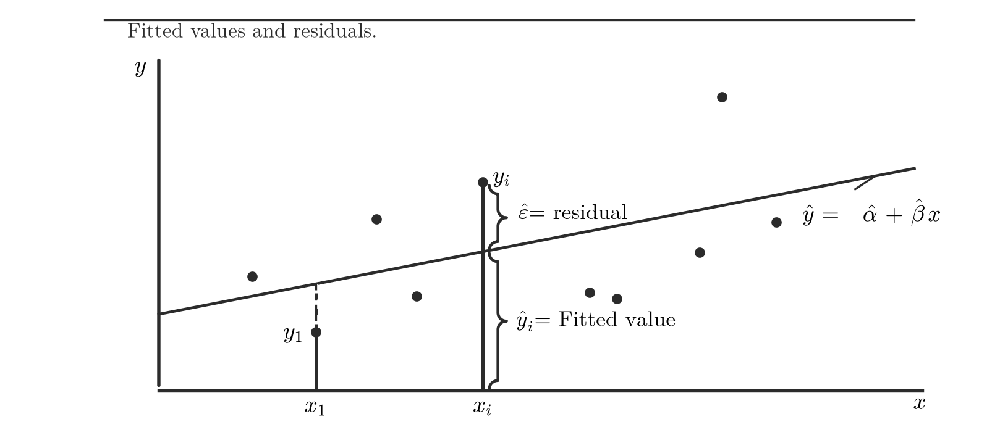
>
> **Figura 5** — Rappresentazione grafica di $Y_i$ come somma di residuo ($\hat\epsilon_i$) e valore predetto ($\hat Y_i$). Mostra graficamente come ogni osservazione $Y_i$ si scomponga nella somma del valore previsto dalla retta di regressione e del residuo, cioè la distanza verticale tra il punto osservato e la retta.

*(slide 17–21)*

## Il termine d'errore ε: proprietà, omoschedasticità ed eteroschedasticità

> [!abstract] Definizione
> Le proprietà della variabile casuale $\epsilon$ sono cruciali per derivare le proprietà degli stimatori OLS: interessano i suoi momenti e la relazione tra $\epsilon$ ed $X$.
>
> Per costruzione, $\epsilon_i$ è la differenza tra $Y_i$ e la media condizionale $E[Y|X_i]$:
>
> $$\epsilon_i = Y_i - E[Y|X_i] = Y_i - \alpha - \beta X_i$$
>
> $\epsilon$ raccoglie tutte le caratteristiche non esplicitamente considerate dal modello e descrive l'eterogeneità presente nei dati: non tutte le persone che hanno studiato 10 anni ricevono la stessa somma di denaro, alcune ricevono uno stipendio superiore alla media condizionata, altre inferiore. Il termine di errore spiega questa variabilità e raccoglie intuitivamente la quantità di informazioni su $Y$ non osservabili che non sono spiegate da $X$.
>
> **Media condizionale $E[\epsilon|X]$.** Ipotizzando che $\alpha+\beta X$ sia un'approssimazione credibile di $E[Y|X]$ (cioè $E[Y|X]\approx \alpha+\beta X$), la media condizionale di $\epsilon$ deve essere
>
> $$E[\epsilon|X] = E[Y|X] - \alpha - \beta X = 0$$
>
> Come conseguenza principale, $\mathrm{Cov}(\epsilon,X)=0$: tutte le variabili che contribuiscono alla costruzione di $\epsilon$ non possono essere correlate con $X$. Questo implica
>
> $$\Delta E[Y|X] = \Delta Y = \beta \Delta X + \Delta \epsilon = \beta \Delta X$$
>
> L'intuizione è che l'unica informazione rilevante per descrivere la media condizionale di $Y$ è fornita da $X$; tutte le altre variabili non possono avere un impatto sistematico su di essa.
>
> **Varianza condizionale $\mathrm{Var}(\epsilon|X)$.** In generale spesso non si sa come descrivere la varianza condizionale di $\epsilon$. Si noti però che la variabilità di $\epsilon$ descrive anche la variabilità della variabile dipendente $Y$:
>
> $$\mathrm{Var}(\epsilon|X) = \mathrm{Var}(Y|X)$$
>
> Si possono formulare due ipotesi alternative sulle varianze condizionali:
>
> - **Omoschedasticità**: $\mathrm{Var}(\epsilon|X)=\sigma^2$, cioè non dipende da $X$.
> - **Eteroschedasticità**: $\mathrm{Var}(\epsilon|X)=\sigma^2(X)$, quindi è funzione di $X$.
>
> Differenti ipotesi su $\mathrm{Var}(\epsilon|X)$ portano a diversi stimatori OLS.
>
> 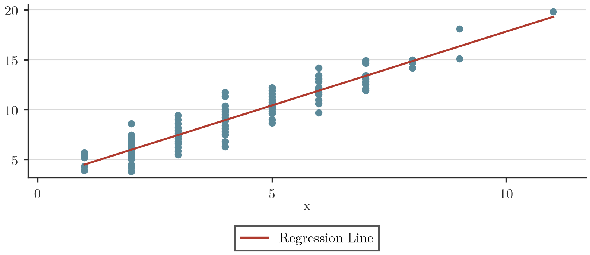
>
> **Figura 6** — Retta di regressione $E(Y|X=x)$ ed errori omoschedastici. Lo scatterplot mostra che, a diversi valori di $X$, la dispersione di $Y$ attorno alla retta rimane simile (livelli simili di variabilità condizionale).
>
> 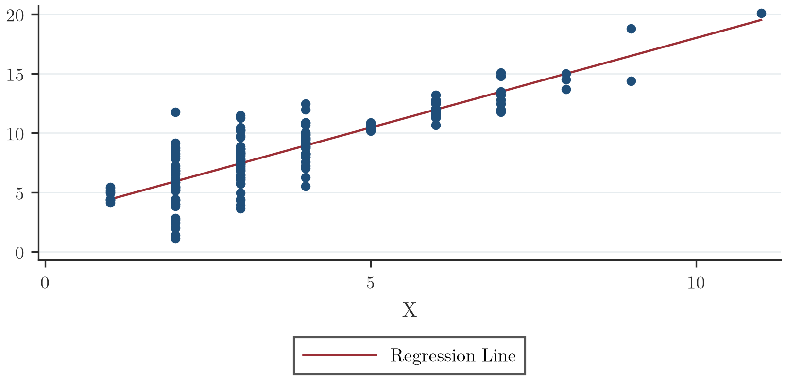
>
> **Figura 7** — Retta di regressione $E(Y|X=x)$ ed errori eteroschedastici. Lo scatterplot mostra che a diversi valori di $X$ corrispondono diverse ampiezze della variabilità di $Y$ attorno alla retta, cioè diverse $\mathrm{Var}(Y|X)$.

*(slide 22–27)*

## Le ipotesi del modello di regressione OLS

> [!abstract] Definizione
> Sembra cruciale, ai fini pratici, verificare se la strategia OLS fornisce stime affidabili dei parametri di interesse: il coefficiente $\beta$ misura l'impatto di una politica (valutata come $\Delta X$) sulla variabile dipendente. Per valutare queste proprietà occorre definire formalmente le ipotesi sul modello di regressione:
>
> 1. Il vero modello (la retta nella popolazione) è lineare: $E[Y|X]=\alpha+\beta X$;
> 2. Il modello statistico (approssimato) coincide con quello vero, ovvero $Y=\alpha+\beta X+\epsilon$. Come conseguenza principale, $\mathrm{Cov}(X,\epsilon)=0$;
> 3. Le coppie $(X_i,Y_i)$, $i=1,\dots,n$ sono **I.I.D.**;
> 4. I momenti quarti di $X$ e $Y$ esistono e sono finiti;
> 5. Si suppone, ad esempio, che $\mathrm{var}[\epsilon|X]=\sigma^2$ (**Omoschedasticità**).
>
> **Nota: ipotesi OLS equivalenti.** L'ipotesi OLS può essere formulata in modo diverso ma equivalente. Finora si è ipotizzato che il modello empirico (quello valutato attraverso un dataset) sia $Y=\alpha+\beta X+\epsilon$, e che la media condizionale (il vero modello) sia $E[Y|X]=\alpha+\beta X$. Nell'ipotesi che il modello empirico coincida con quello vero, $\epsilon \equiv Y-E[Y|X]$, quindi
>
> $$E[\epsilon|X]=0 \;\Rightarrow\; \mathrm{Cov}(X,\epsilon)=0$$
>
> Un modo alternativo ed equivalente di definire l'ipotesi:
>
> - si considera che il modello empirico sia lineare, $Y=\alpha+\beta X+\epsilon$;
> - si suppone inoltre che $E[\epsilon|X]=0$;
> - quindi $E[Y|X]=\alpha+\beta X$ corrisponde al vero modello.
>
> Le ipotesi alternative ma equivalenti per il metodo OLS si possono quindi riassumere come:
>
> - Il regressore $X$ è **esogeno**, ovvero la media condizionale di $\epsilon|X$ è zero ($E[\epsilon|X]=0$); conseguenza principale: $E[Y|X]=\alpha+\beta X$;
> - Le coppie $(X_i,Y_i)$, $i=1,\dots,n$ sono I.I.D.;
> - I momenti quarti di $X$ e $Y$ esistono e sono finiti;
> - Si suppone che $\mathrm{var}[\epsilon|X]=\sigma^2$ (Omoschedasticità).
>
> **Nota: sull'esogeneità.** Si supponga che il regressore non sia esogeno, cioè sia **endogeno**, quindi $\mathrm{Cov}(X,\epsilon)\neq 0$. Considerando la variazione attesa di $Y$
>
> $$\underbrace{\hat Y(X_2)-\hat Y(X_1)}_{\Delta Y} = \alpha+\beta X_2+\epsilon(X_2) - [\alpha+\beta X_1+\epsilon(X_1)] = \beta\underbrace{(X_2-X_1)}_{\Delta X} + \underbrace{[\epsilon(X_2)-\epsilon(X_1)]}_{\Delta \epsilon}$$
>
> Poiché $\mathrm{Cov}(X,\epsilon)\neq 0$, ragionevolmente ci si aspetta che $E[\Delta\epsilon|X]$, misurato come $\epsilon(X_2)-\epsilon(X_1)$, sia diverso da zero. In questo caso
>
> $$\Delta Y = \beta \Delta X + \Delta \epsilon$$
>
> Le variazioni attese di $Y$ non dipendono solo da $\beta$ ma anche da $\Delta\epsilon$, in generale non calcolabile: quindi $\beta$ non è più una misura precisa delle implicazioni di $\Delta X$.
>
> **Esempio: sull'esogeneità.** Si consideri un dataset simulato di dimensione 200 che soddisfa
>
> $$Y_i = 3 + 1.5 X_i + \epsilon_i, \qquad \mathrm{cov}(X,\epsilon)=0.6$$
>
> Si stima il modello $Y=\alpha+\beta X+\epsilon$:
>
> | Variabile | Coef. | Std. Err. | t | P>\|t\| | IC 95% inf. | IC 95% sup. |
> |---|---|---|---|---|---|---|
> | X | 2.129496 | .063634 | 33.46 | 0.000 | 2.004008 | 2.254983 |
> | _cons | 2.962697 | .0635759 | 46.60 | 0.000 | 2.837324 | 3.08807 |
>
> Si noti che $\hat\beta = 2.129$ è abbastanza diverso da $1.5$. Qui $\hat\beta$ non è una stima affidabile del parametro di policy $\beta$: in questo caso $2.129$ è una stima affidabile di $(\beta+\Delta\epsilon)$, che non è ciò che interessa.

*(slide 28–33)*

## Le proprietà degli stimatori OLS: non distorsione, consistenza e teorema di Gauss-Markov

> [!tip] Teorema
> **Domanda guida:** OLS è una buona strategia per stimare $\beta$ e $\alpha$?
>
> La funzione di regressione stimata nel campione (**Sample Regression Function - SRF**) va confrontata con la funzione di regressione nella popolazione (**PRF**), il vero modello che descrive i dati. Poiché non si potrà mai conoscere la PRF, non si potrà mai sapere quanto siano vicine SRF e PRF: un altro campione fornirebbe una SRF diversa, più o meno vicina alla PRF. Occorre quindi capire quando la regressione stimata è una buona proxy per l'intera popolazione: in pratica, la SRF è una buona approssimazione nel campione, ma non è detto lo sia per tutta la popolazione.
>
> 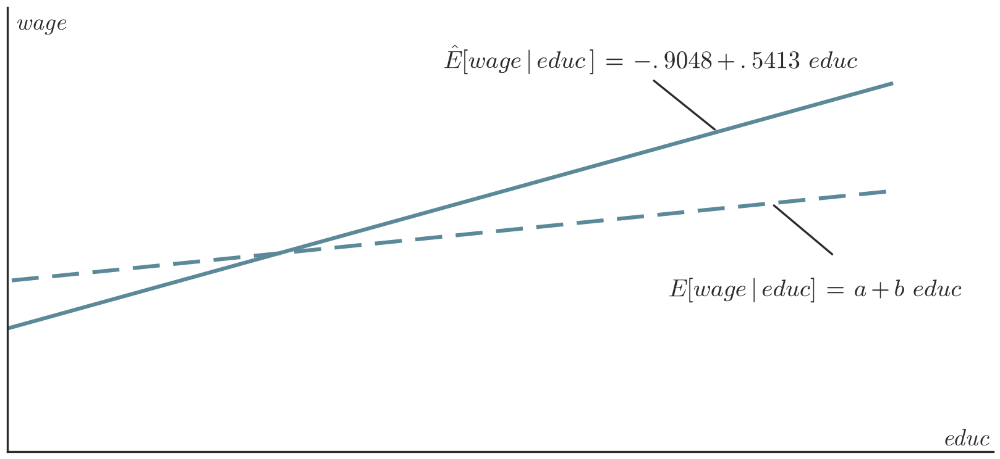
>
> **Figura 8** — Modello reale sulla popolazione $E(Y|X=x)$ (linea tratteggiata) rispetto alla regressione stimata (linea retta). Ci si attende che OLS funzioni correttamente se le due rette sono molto vicine tra loro, cioè se $\hat\alpha\approx\alpha$ e $\hat\beta\approx\beta$.
>
> Le stime OLS si basano su un set di dati estratti casualmente dalla popolazione: campioni diversi forniscono stime diverse, quindi $\hat\alpha$ e $\hat\beta$ sono **variabili casuali**. Interessa derivarne media e varianza, e approssimarne le distribuzioni di probabilità per calcolare intervalli di confidenza ed eseguire test statistici.
>
> **Rappresentazione di $\hat\beta$ in funzione di $\epsilon$.** È sempre possibile scrivere $\hat\beta$ come
>
> $$\hat\beta = \sum_{i=1}^n \underbrace{\left[\frac{(X_i-\bar X)}{\sum_{i=1}^n (X_i-\bar X)^2}\right]}_{\omega_i} (Y_i-\bar Y) = \sum_{i=1}^n \omega_i \underbrace{Y_i}_{\alpha+\beta X_i+\epsilon_i} - \bar Y \underbrace{\sum_{i=1}^n \omega_i}_{=0} = \beta + \sum_{i=1}^n \omega_i \epsilon_i \qquad (1)$$
>
> **Non distorsione (valore atteso di $\hat\beta$).** Dalla eq. (1):
>
> $$E[\hat\beta|X_1,\dots,X_n] = \beta + \sum \omega_i \underbrace{E[\epsilon_i|X_1,\dots,X_n]}_{\text{per hyp. } =0} = \beta$$
>
> I momenti marginali, cioè la media di $\hat\beta$ rispetto a tutti i possibili $X_1,\dots,X_n$ osservati, è quindi $\beta$: lo stimatore è **non distorto**. Se $E[\epsilon|X_1,\dots,X_n]\neq 0$, questo risultato non è più valido e, in media, lo stimatore non fornisce una buona proxy per il vero coefficiente $\beta$.
>
> **Varianza condizionale (consistenza).** La varianza condizionale di $\hat\beta$ è
>
> $$\mathrm{Var}[\hat\beta|X_1,\dots,X_n] = \sum \omega_i^2 \underbrace{\mathrm{Var}[\epsilon_i|X_1,\dots,X_n]}_{\times \text{ ip. } =\sigma^2} = \frac{\sigma^2}{\sum_{i=1}^n (X_i-\bar X)^2} = \frac{\sigma^2}{(n-1)}\underbrace{\frac{n-1}{\sum_{i=1}^n (X_i-\bar X)^2}}_{=1/\sigma^2 \text{ if } n\to+\infty} \quad (\text{consistency})$$
>
> Per questo risultato si è utilizzata l'ipotesi di omoschedasticità.
>
> 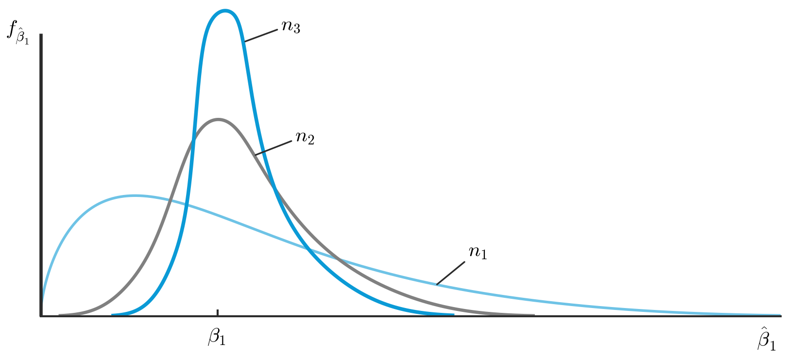
>
> **Figura 9** — Distribuzioni di $\hat\beta$ per campioni di diverse dimensioni ($n_1<n_2<n_3$). Mostra come la dispersione della distribuzione campionaria di $\hat\beta$ si riduca al crescere della dimensione campionaria, collassando su $\beta$ quando $n\to\infty$.
>
> 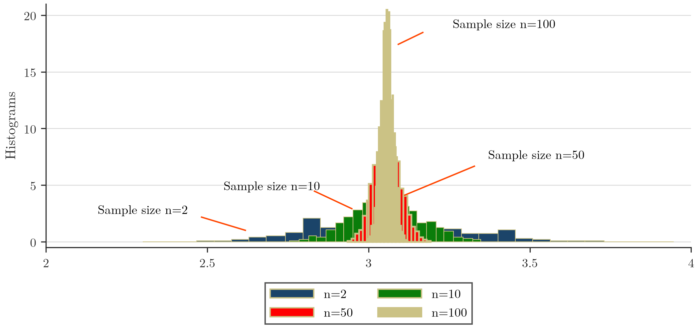
>
> **Figura 10** — Distribuzioni di $\hat\beta$ per campioni di diverse dimensioni (standardizzate per ottenere una media pari a 0), per $n=2,10,50,100$. Se $n\to\infty$, $\hat\beta\to\beta$ (**Legge dei grandi numeri**).
>
> **Teorema di Gauss-Markov.** Se sono soddisfatte le seguenti ipotesi:
>
> - **Linearità**: il modello nella popolazione è lineare nei parametri, $Y=\alpha+\beta X+\epsilon$;
> - **I.I.D.**: campione casuale di $(X_i,Y_i)$, $i=1,\dots,N$;
> - **Esogenità**: il regressore non è correlato al termine di errore;
> - **Omoschedasticità**: $\mathrm{Var}(Y|X=x_i)=\sigma^2$;
>
> allora OLS fornisce il **miglior stimatore lineare non distorto (BLUE)**, il più efficiente (con varianza minore) nella classe degli stimatori lineari e non distorti.

*(slide 34–42)*

## La distribuzione di β̂: campioni finiti e normalità asintotica

> [!tip] Teorema
> **Distribuzione in campioni finiti.** Si può dimostrare che, sotto opportune ipotesi, la distribuzione di $\hat\beta$ è gaussiana. In particolare, se l'errore nella popolazione $\epsilon$ è indipendente da $X$ ed è normalmente distribuito con media nulla e varianza $\sigma^2$, cioè $\epsilon\sim N(0,\sigma^2)$, allora:
>
> - lo stimatore di $\beta$ ha distribuzione normale: $\hat\beta \sim N\big(\beta,\ \mathrm{Var}(\hat\beta|X)\big)$;
> - lo stimatore standardizzato ha distribuzione Student $t$:
>
> $$\frac{\hat\beta-\beta}{\sqrt{\mathrm{Var}(\hat\beta|X)}} \sim t_{n-2}$$
>
> Quest'ultimo risultato dipende dal fatto che il denominatore è ignoto e deve essere stimato. Se $n\to\infty$, la Student $t$ converge a una gaussiana.
>
> **Normalità asintotica.** In statistica, per stimare il valore atteso di una popolazione si usa la media campionaria, che si distribuisce come una v.c. gaussiana per campioni sufficientemente grandi. Nell'ipotesi che $E[\epsilon|X]=0$, $\hat\beta$ gode della stessa proprietà, essendo sostanzialmente costruito come una media:
>
> $$\hat\beta \sim N\big(\beta,\ \hat\sigma_{\hat\beta}^2\big)$$
>
> in cui
>
> $$\hat\sigma_{\hat\beta}^2 = \frac{\hat\sigma^2}{\sum_{i=1}^n (X_i-\bar X)^2}, \qquad \hat\sigma^2 = \frac{1}{n-2}\sum_{i=1}^n \hat\epsilon_i^2$$
>
> Questo risultato consente di effettuare test di ipotesi su $\beta$ e di costruire intervalli di confidenza.
>
> **Perché vale la normalità asintotica — Teorema del limite centrale (CLT).** Se una sequenza $Z_i$ è I.I.D. tale che $E[Z_i]=\mu_Z<+\infty$ e $0<\mathrm{Var}[Z_i]=\sigma_Z^2<+\infty$, allora
>
> $$\frac{(\bar Z-\mu_Z)}{\sigma_{\bar Z}} \to N(0,1)$$
>
> Il numeratore di $\hat\beta$ è la media campionaria di variabili $Z=(X-E[X])(Y-E[Y])$, indipendenti per ipotesi, a cui si può applicare il CLT. Il denominatore converge a una costante, essendo in pratica una media di variabili $X^2$ (Legge dei Grandi Numeri). Quindi
>
> $$\frac{\hat\beta - E[\hat\beta]}{\sqrt{\mathrm{Var}(\hat\beta)}} = \frac{\hat\beta-\beta}{\sigma_{\hat\beta}} \to N(0,1) \;\Rightarrow\; \hat\beta \sim N\big(\beta,\sigma_{\hat\beta}^2\big)$$
>
> 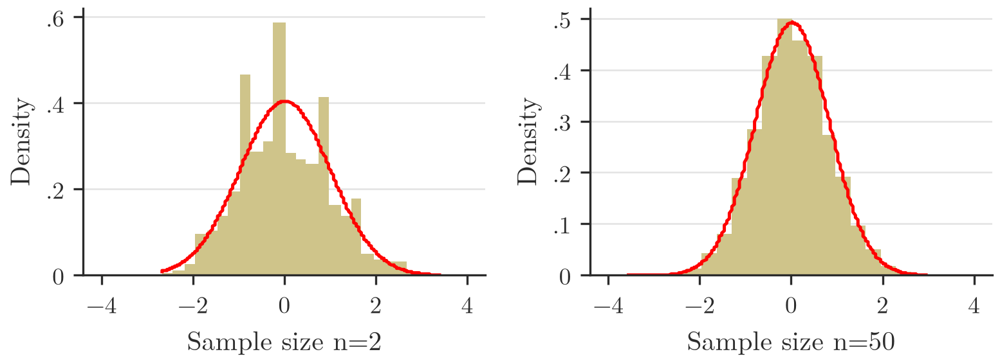
>
> **Figura 11** — Istogramma rispetto alla densità normale: stime standardizzate di $\beta$ per diversi campioni di dimensione $n$, rappresentate come istogrammi. Pannello di sinistra: campione di piccole dimensioni ($n=2$); pannello di destra: campione di grandi dimensioni ($n=50$, buona approssimazione gaussiana). Il confronto mostra come l'approssimazione normale migliori al crescere della dimensione campionaria.

*(slide 43–46)*

## Lo stimatore della varianza σ² e gli errori standard

> [!abstract] Definizione
> In caso di omoschedasticità, il modello di regressione è caratterizzato anche dal parametro $\sigma$, che descrive l'eterogeneità dei soggetti che condividono lo stesso livello di $X$. Uno stimatore non distorto di $\sigma^2$ è
>
> $$\hat\sigma^2 = \frac{1}{n-2}\sum_{i=1}^n \hat\epsilon_i^2$$
>
> Si può dimostrare che $E[\hat\sigma^2]=\sigma^2$.
>
> Gli errori standard per $\hat\alpha$ e $\hat\beta$ si ricavano inserendo $\hat\sigma^2$ nella formula di $\mathrm{Var}(\hat\beta|X_1,\dots,X_n)$. Quindi, $\sigma_{\hat\beta}$ si stima come
>
> $$\hat\sigma_{\hat\beta} = \sqrt{\frac{\hat\sigma^2}{\sum_{i=1}^n (X_i-\bar X)^2}}$$
>
> Gli errori standard per $\hat\alpha$ sono quindi
>
> $$\hat\sigma_{\hat\alpha} = \sqrt{\frac{\hat\sigma^2 \left(\frac{1}{n}\sum_{i=1}^n X_i^2\right)}{\sum_{i=1}^n (X_i-\bar X)^2}}$$

*(slide 47–48)*

## Intervalli di confidenza per β

> [!abstract] Definizione
> Per quanto riguarda la media campionaria, è utile fornire un intervallo di possibili valori in cui si ritiene il vero parametro $\beta$ rientrerà con alta probabilità. Come per la media campionaria, $\hat\beta$ è distribuita normalmente, e si vuole ottenere un intervallo che includa il vero parametro sconosciuto $\beta$ con alta probabilità (diciamo $1-\alpha$). Valgono quindi tutti i risultati validi per la media campionaria: un intervallo di confidenza per $\beta$ può essere calcolato come
>
> $$\text{Confidence interval} = \left[\hat\beta - z_{\frac{\alpha}{2}}\times \hat\sigma_{\hat\beta}\ ;\ \hat\beta + z_{\frac{\alpha}{2}}\times \hat\sigma_{\hat\beta}\right]$$
>
> **Esempio: wage vs. educ.** L'intervallo di confidenza al 95% per $\beta$ è calcolato come
>
> $$[0.541 - 1.96\times 0.053\ ;\ 0.541 + 1.96\times 0.053] = [.436;\ .645]$$
>
> | Variabile | Coef. | Std. Err. | t | P>\|t\| | IC 95% inf. | IC 95% sup. |
> |---|---|---|---|---|---|---|
> | educ | .5413593 | .053248 | 10.17 | 0.000 | .4367534 | .6459651 |
> | _cons | -.9048516 | .6849678 | -1.32 | 0.187 | -2.250472 | .4407687 |
>
> Ci si aspetta quindi che, con probabilità 95%, il vero $\beta$ sia compreso tra $[.436;\ .645]$, suggerendo l'esistenza di un'associazione positiva tra wages e years of education.

*(slide 49–50)*

## Verifica d'ipotesi per β

> [!abstract] Definizione
> Ci si potrebbe chiedere se $X$ sia un predittore utile, cioè se abbia un impatto sulla media condizionale di $Y$. Si ricordi che $\Delta \hat Y = \beta \Delta X$: se $\beta$ fosse $0$, non importa quale sia la variazione di $X$, la variazione attesa di $Y$ prevista dal modello sarebbe nulla. È quindi naturale verificare se $\beta$ sia abbastanza vicino a 0 oppure no. In generale, si potrebbe voler verificare se l'evidenza empirica riassunta in $\hat\beta$ sia coerente con qualche valore specifico, corrispondente a un'ipotesi di natura economica.
>
> Poiché $\hat\beta$ è distribuito come una variabile casuale gaussiana, la procedura di test si basa sugli stessi risultati validi per la media campionaria. Un'ipotesi tipica da verificare è $H_0: \beta=0$ contro l'alternativa $H_a: \beta\neq 0$. La statistica $t$ è definita come
>
> $$t = \frac{\hat\beta - 0}{\hat\sigma_{\hat\beta}}$$
>
> Il p-value si calcola allo stesso modo del caso della media. In generale, il sistema di ipotesi $H_0:\beta=\kappa$ contro una delle tre possibili alternative ($>$, $<$ o $\neq$) può essere verificato tramite
>
> $$t = \frac{\hat\beta - \kappa}{\hat\sigma_{\hat\beta}}$$
>
> **Esempio: wage vs. educ.** Ci si potrebbe chiedere se un anno in più di scuola abbia un effetto positivo sui salari.
>
> | Variabile | Coef. | Std. Err. | t | P>\|t\| | IC 95% inf. | IC 95% sup. |
> |---|---|---|---|---|---|---|
> | educ | .5413593 | .053248 | 10.17 | 0.000 | .4367534 | .6459651 |
> | _cons | -.9048516 | .6849678 | -1.32 | 0.187 | -2.250472 | .4407687 |
>
> Scritto in linguaggio statistico: $H_0:\beta=0$ vs. $H_a:\beta>0$.
>
> La statistica $t$ osservata è
>
> $$t^{obs} = \frac{.5413593-0}{.053248} = 10.17$$
>
> Il p-value $P_{H_0}(t>t^{obs})\approx 0$, che permette di rifiutare l'ipotesi nulla.
>
> Se si considera invece il sistema d'ipotesi $H_0:\beta=0$ vs. $H_a:\beta\neq 0$, la statistica $t$ osservata rimane $t^{obs}=10.17$ e il p-value viene calcolato come $2\,P_{H_0}(t>|t^{obs}|)\approx 0$.

*(slide 51–53)*

## Misure di bontà di adattamento: l'R²

> [!abstract] Definizione
> Non è stato ancora considerato il problema di misurare come la variabile $X$ approssimi la variabile dipendente $Y$. Spesso è utile calcolare un indicatore che riassuma quanto bene la linea di regressione OLS si adatti ai dati. L'idea è calcolare la correlazione tra la variabile dipendente $Y$ e le previsioni del modello $\hat Y$: maggiore è questo numero, migliore è l'adattamento del modello empirico ai dati. L'$R^2$ è definito come
>
> $$R^2 = \mathrm{Corr}^2\big(Y,\hat Y\big)$$
>
> Per costruzione $0 \le R^2 \le 1$:
>
> - Un $R^2$ vicino a 1 significa che il regressore è un **buon** predittore per il valore atteso condizionale della variabile dipendente.
> - Un $R^2$ vicino a 0 significa che il regressore è un predittore **mediocre**.
> - **$R^2$ non dice nulla riguardo alla causalità!** Indica solamente come, in uno specifico campione, la retta di regressione approssima le medie dei dati osservati.
>
> **Esempio 1 — caso endogeno.** Si consideri l'esempio precedente in cui $X$ è endogeno ($Y_i=3+1.5X_i+\epsilon_i$, $\mathrm{cov}(X,\epsilon)=0.6$, $n=200$):
>
> | Source | SS | df | MS |
> |---|---|---|---|
> | Model | 903.491169 | 1 | 903.491169 |
> | Residual | 159.74002 | 198 | .806767779 |
> | Total | 1063.23119 | 199 | 5.3428703 |
>
> Number of obs = 200; F(1, 198) = 1119.89; Prob > F = 0.0000; R-squared = 0.8498; Adj R-squared = 0.8490; Root MSE = .8982
>
> | Variabile | Coef. | Std. Err. | t | P>\|t\| | IC 95% inf. | IC 95% sup. |
> |---|---|---|---|---|---|---|
> | x | 2.129496 | .063634 | 33.46 | 0.000 | 2.004008 | 2.254983 |
> | _cons | 2.962697 | .0635759 | 46.60 | 0.000 | 2.837324 | 3.08807 |
>
> Si noti che l'$R^2$ è elevato ($\approx 84.9\%$). Tuttavia si sa già che il modello **non** rappresenta una relazione causale: un $R^2$ alto non implica causalità.
>
> **Esempio 2 — wage vs. educ.** Si consideri ora la relazione tra salari e istruzione, che potrebbe rappresentare un legame causale:
>
> | Source | SS | df | MS |
> |---|---|---|---|
> | Model | 1179.73204 | 1 | 1179.73204 |
> | Residual | 5980.68225 | 524 | 11.4135158 |
> | Total | 7160.41429 | 525 | 13.6388844 |
>
> Number of obs = 526; F(1, 524) = 103.36; Prob > F = 0.0000; R-squared = 0.1648; Adj R-squared = 0.1632; Root MSE = 3.3784
>
> | Variabile | Coef. | Std. Err. | t | P>\|t\| | IC 95% inf. | IC 95% sup. |
> |---|---|---|---|---|---|---|
> | educ | .5413593 | .053248 | 10.17 | 0.000 | .4367534 | .6459651 |
> | _cons | -.9048516 | .6849678 | -1.32 | 0.187 | -2.250472 | .4407687 |
>
> Si noti che $R^2$ è piuttosto basso ($\approx 16.4\%$). Nonostante questo risultato, il collegamento tra le due variabili ha comunque senso da un punto di vista logico: un $R^2$ basso non esclude una relazione causale plausibile.

*(slide 54–57)*
