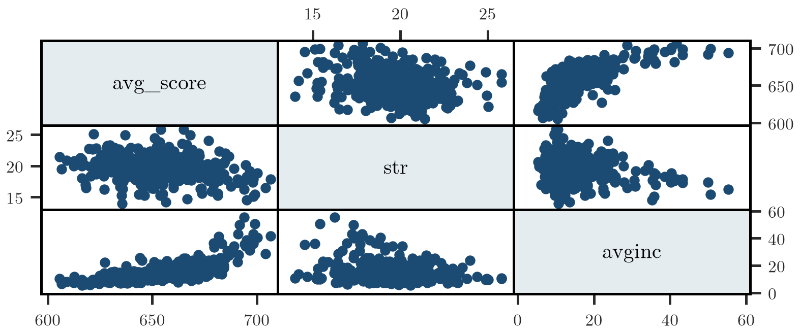
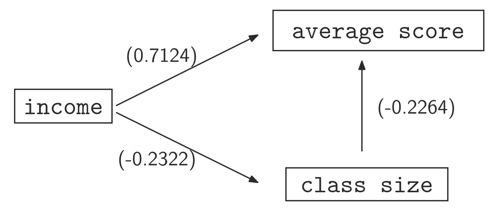

## Esempio motivante: test scores e dimensione della classe

> [!example] Esempio
> Comunemente si pensa che un rapporto studenti-insegnanti più basso induca un rendimento migliore degli studenti. Di conseguenza, ad esempio in California, verso la fine degli anni '90, tutte le classi K-3 sono state ridotte per avere un rapporto massimo studenti-insegnanti di 20 (*Class Size Reduction Act* - CSR). Ciò ha un costo, ovviamente: inizialmente era di 1,8 miliardi di dollari all'anno. Per un costo così alto, sorge spontanea la domanda se ne valga la pena o meno. Il Commissario per l'Istruzione potrebbe essere interessato a sapere se questa spesa extra ha un impatto significativo sul rendimento scolastico atteso.
>
> Ci chiediamo se la dimensione della classe sia l'unica informazione rilevante che ha un impatto nello spiegare la variazione del punteggio medio atteso di questi studenti, o se c'è qualcosa di più da considerare.
>
> Un modello di regressione naïve evidenzia che esiste una dipendenza negativa significativa tra la dimensione media della classe, `str`, e il punteggio medio atteso, `avg_score`:
>
> | | Coef. | Std. Err. | t | P>\|t\| | [95% Conf. | Interval] |
> |---|---|---|---|---|---|---|
> | str | -2.279808 | .4798256 | -4.75 | 0.000 | -3.22298 | -1.336637 |
> | _cons | 698.933 | 9.467491 | 73.82 | 0.000 | 680.3231 | 717.5428 |
>
> Apparentemente sembra che ridurre la dimensione delle classi sia una scelta rilevante, poiché una riduzione della dimensione di una classe induce un aumento del punteggio medio di circa 2,28 punti. Ma questo modello statistico è una relazione causale? Esistono altre spiegazioni più credibili?
>
> Ad un esame più attento, osserviamo che il reddito medio (`avginc`) per le persone che vivono in ciascun distretto è correlato positivamente con `avg_score`: i distretti con reddito più alto tendono ad avere studenti con voti più alti. Esiste anche una dipendenza negativa tra reddito e dimensione della classe (`str`): i distretti a reddito più elevato tendono ad avere classi di dimensioni inferiori. Le correlazioni (comando `correlate avg_score str avginc`) sono:
>
> | | avg_score | str | avginc |
> |---|---|---|---|
> | avg_score | 1.0000 | | |
> | str | -0.2264 | 1.0000 | |
> | avginc | 0.7124 | -0.2322 | 1.0000 |
>
> Ci chiediamo se includere il reddito nel modello di regressione possa essere utile per prevedere il punteggio medio e spiegare la relazione causa-effetto performance vs. riduzione delle classi.
>
> 
>
> **Figura 1** — Scatterplot a coppie delle variabili coinvolte (`avg_score`, `str`, `avginc`). La matrice di scatterplot mostra visivamente le correlazioni della tabella precedente: `avg_score` cresce al crescere di `avginc` e decresce (debolmente) al crescere di `str`; `str` e `avginc` sono debolmente correlate negativamente.
>
> Questa evidenza empirica suggerisce che l'associazione negativa tra dimensione della classe e punteggio del test potrebbe essere **spuria**, poiché può essere spiegata dall'effetto del reddito su ciascuna variabile.
>
> 
>
> **Figura 2** — Rappresentazione causale del modello (diagramma con `income` che punta sia ad `average score` con correlazione 0.7124 sia a `class size` con correlazione -0.2322, e una freccia da `class size` ad `average score` con correlazione -0.2264). Il diagramma illustra come il reddito (`income`) sia una causa comune che influenza sia il punteggio medio sia la dimensione della classe, generando una correlazione osservata tra `class size` e `average score` che non riflette necessariamente un nesso causale diretto.

*(slide 3–7)*

## Il modello di regressione multipla e l'interpretazione dei parametri

> [!abstract] Definizione
> Si ipotizzi esistano due o più variabili esplicative, $X_1$ ed $X_2$ ($X_3,\ldots,X_k$) potenzialmente utili per descrivere la media condizionale di $Y$. In questo caso, la funzione di regressione semplice può essere generalizzata da
>
> $$E[Y|X_1,X_2] = \alpha + \beta_1 X_1 + \beta_2 X_2$$
>
> Come per il modello di regressione semplice, ogni osservazione è descritta da
>
> $$Y_i = \alpha + \beta_1 X_{1,i} + \beta_2 X_{2,i} + \epsilon_i$$
>
> $Y$ è la variabile dipendente, $X_1$ e $X_2$ sono i regressori mentre $\epsilon$ è un termine di errore che misura la distanza tra il modello di regressione e l'osservabile $Y$.
>
> **Interpretazione dei parametri.** Nell'ambito della regressione semplice, $\beta_1$ misura la variazione attesa di $Y$ a condizione che $\Delta X = 1$. Infatti $\Delta \hat{Y} = \beta_1 \underbrace{\Delta X}_{=1}$.
>
> Nell'impostazione data dalla regressione multipla, il coefficiente $\beta_1$ è la variazione attesa di $Y$ dovuta a una variazione unitaria di $X_1$ a condizione che $X_2$ sia mantenuto costante. In pratica, se calcoliamo la variazione attesa di $Y$ per un dato livello dei due regressori $X_1=\bar X_1$ e $X_2=\bar X_2$, otteniamo
>
> $$\hat{Y}(\bar X_1, \bar X_2) = \alpha + \beta_1 \bar X_1 + \beta_2 \bar X_2 + \epsilon(\bar X_1, \bar X_2).$$
>
> Supponiamo ora di voler calcolare $Y$ atteso per $X_1 = \bar X_1 + \Delta X_1$ e $X_2 = \bar X_2$:
>
> $$\hat{Y}(\bar X_1 + \Delta X_1, \bar X_2) = \alpha + \beta_1(\bar X_1 + \Delta X_1) + \beta_2 \bar X_2 + \epsilon(\bar X_1 + \Delta X_1, \bar X_2).$$
>
> La variazione prevista di $Y$ è la differenza
>
> $$\Delta \hat{Y} = \hat{Y}(\bar X_1 + \Delta X_1, \bar X_2) - \hat{Y}(\bar X_1, \bar X_2) = \beta_1 \Delta X_1 + \Delta \epsilon$$
>
> Nell'ipotesi che $\epsilon$ non sia rilevante per descrivere il valore atteso di $Y$, cioè $\Delta \epsilon = 0$, allora una variazione del valore atteso di $Y$ è proporzionale alla variazione di $X_1$, cioè
>
> $$\Delta Y = \beta_1 \Delta X_1$$
>
> Nella regressione multipla, un parametro descrive l'effetto di una variabile esplicativa una volta controllati gli effetti dell'altra variabile esplicativa nel modello (imponendo $X_2 = \bar X_2$). La regressione semplice ha una sola variabile esplicativa, quindi il parametro descrive l'effetto di una variabile al netto di tutte le altre possibili variabili esplicative. I coefficienti $\beta_j$ sono chiamati **effetti marginali**.
>
> **Esempio: class scores vs. reddito e class size.** Consideriamo il modello di regressione multipla che lega il punteggio medio degli studenti, la dimensione della classe e il reddito delle famiglie:
>
> $$\text{avg\_score}_i = \alpha + \beta_1 \text{str}_i + \beta_2 \text{avginc}_i + \epsilon_i$$
>
> | | Coef. | Std. Err. | t | P>\|t\| | [95% Conf. | Interval] |
> |---|---|---|---|---|---|---|
> | str | -.6487401 | .354405 | -1.83 | 0.068 | -1.345383 | .0479028 |
> | avginc | 1.839112 | .0927868 | 19.82 | 0.000 | 1.656724 | 2.0215 |
> | _cons | 638.7292 | 7.449077 | 85.75 | 0.000 | 624.0867 | 653.3716 |
>
> Questi risultati suggeriscono che, per un dato livello di reddito, se la dimensione della classe si riduce di un'unità, allora il punteggio medio atteso aumenta di circa 0.65 punti. Questa variazione però risulta debolmente significativa.

*(slide 8–11)*

## Cause di endogeneità: distorsione da variabile omessa

> [!tip] Teorema
> Nel modello di regressione semplice, abbiamo ipotizzato che $E[\epsilon|X] = 0$ ($\Rightarrow \text{Cov}(\epsilon, X) = 0$).
>
> Supponiamo che la **vera** media condizionale (relazione causale) sia ben approssimata dal seguente modello:
>
> $$\text{Modello 1:} \quad Y = \alpha + \beta_1 X_1 + \beta_2 X_2 + \tilde\epsilon$$
>
> Poiché non conosciamo il vero modello, supponiamo di stimare la seguente regressione **sbagliata**, ovvero un modello statistico non correttamente specificato:
>
> $$\text{Modello 2:} \quad Y = \alpha + \beta_1 X_1 + \epsilon$$
>
> Quali sono le conseguenze di questo errore?
>
> Supponiamo ad esempio che valga la seguente ipotesi:
> - $\text{Cov}(\tilde\epsilon, X_j) = 0$, $j=1,2$ (esogeneità rispetto al vero modello)
> - $\text{Cov}(X_1, X_2) \neq 0$
>
> Nel Modello 2, la variabile $X_2$ è stata omessa. Ciò significa che il suo impatto atteso su $Y$ è stato inglobato dal termine di errore $\epsilon$. Come conseguenza principale, nel Modello 2, $\epsilon = \beta_2 X_2 + \tilde\epsilon$, quindi
>
> $$\text{Cov}(X_1, \epsilon) = \beta_2 \text{Cov}(X_1, X_2) \neq 0 \quad \text{se } \beta_2 \neq 0$$
>
> In particolare, è violata la condizione di esogeneità per il modello di regressione semplice. Si può dimostrare che gli stimatori OLS di $\beta_1$ sono distorti in campioni piccoli e grandi. Quindi, se $n \to \infty$:
>
> $$\hat\beta_1 \xrightarrow{p} \beta_1 + \rho_{X_1\epsilon} \frac{\sigma_\epsilon}{\sigma_X} \quad \text{(non consistenza di } \hat\beta_1\text{)}$$
>
> Se prendiamo come punto di riferimento una regressione sbagliata, probabilmente prenderemo decisioni sbagliate. Come affermato prima, ciò che effettivamente stimiamo è
>
> $$\hat\beta_1 = \beta_1 + \rho_{X_1\epsilon} \frac{\sigma_\epsilon}{\sigma_X} \neq \beta_1$$
>
> In particolare, una variazione unitaria di $X$, cioè $\Delta X = 1$, produce
>
> $$\Delta Y = \beta_1 + \underbrace{\Delta \epsilon}_{\approx \rho_{X_1\epsilon}\, \sigma_\epsilon/\sigma_X}$$
>
> In questo caso non possiamo distinguere gli effetti dovuti dai regressori inclusi e da quelli omessi dal modello. Nell'esempio della CAL school, non sappiamo se la stima di $\hat\beta = -2.279$ sia dovuta all'effettiva variazione della dimensione della classe o ad altri fattori come ad esempio il reddito.
>
> **Sintesi.** Nel modello di regressione semplice, l'ipotesi chiave è $E(\epsilon|X)=0 \Rightarrow \text{Cov}(\epsilon,X)=0$. Se una variabile rilevante viene omessa, dobbiamo affrontare delle conseguenze:
> - L'omissione di una variabile rilevante induce una correlazione non nulla tra il regressore incluso ed il termine di errore $\Rightarrow \text{Cov}(\epsilon,X) \neq 0$. L'ipotesi di **esogeneità** non è più valida;
> - $E[\hat\beta] \neq \beta$, ovvero $\hat\beta$ è **distorto**;
> - Questa distorsione persiste anche se $n$ è grande (**non consistenza**).

*(slide 12–16)*

## Cause di endogeneità: errori di misura

> [!tip] Teorema
> Si trova endogeneità anche quando il regressore non è osservato esattamente, ma conosciamo solo una sua approssimazione. Consideriamo l'esempio seguente, in cui non possiamo osservare $X_i$ ma solo un suo proxy, diciamo $X_i^*$. Poi
>
> $$Y_i = \gamma X_i + \epsilon_i$$
> $$X_i^* = X_i + u_i \qquad \text{Cov}(X_i, u_i) = 0$$
>
> - $X_i$ è il vero regressore, non osservabile;
> - $X_i^*$ è il regressore osservabile, ma impreciso;
> - $u_i$ è l'errore di misura.
>
> La regressione calcolabile è quindi
>
> $$Y_i = \beta X_i^* + \epsilon_i^*$$
>
> Per comprendere a fondo ciò che stiamo facendo, scriviamo la regressione originale in funzione del regressore osservabile $X^*$, per verificare se la regressione ammissibile soddisfa l'ipotesi OLS:
>
> $$Y_i = \gamma X_i + \epsilon_i = \gamma(X_i^* - u_i) + \epsilon_i = \gamma X_i^* + \underbrace{\epsilon_i - \gamma u_i}_{\epsilon_i^*}$$
>
> La regressione calcolabile diventa
>
> $$Y_i = \gamma X_i^* + \epsilon_i^* \;\Rightarrow\; \text{Cov}(X_i^*, \epsilon_i^*) = \gamma \text{Var}(u_i) \neq 0 \;\Rightarrow\; \text{Endogeneity}$$
>
> Quindi, l'utilizzo di regressori che non sono osservati accuratamente porta a stimatori distorti e non consistenti.
>
> **Esempio numerico.** Consideriamo un dataset simulato di dimensione 200 che soddisfa le seguenti condizioni:
>
> $$Y = 3 + 1.5X + \epsilon$$
>
> La variabile $X$ è il vero regressore (misurato senza errore). Come benchmark, stimiamo il modello di regressione $Y = \alpha + \beta X + \epsilon$, in cui utilizziamo $X$ come regressore:
>
> | | Coef. | Std. Err. | t | P>\|t\| | [95% Conf. | Interval] |
> |---|---|---|---|---|---|---|
> | X | 1.427984 | .0654388 | 21.82 | 0.000 | 1.298938 | 1.557031 |
> | _cons | 3.072873 | .06727 | 45.68 | 0.000 | 2.940215 | 3.205531 |
>
> Le stime sono molto precise, nel senso che $\hat\beta$ e $\hat\alpha$ sono vicini rispettivamente a 1.5 e 3.
>
> Ipotizziamo ora che $X$ non sia osservabile ma sia disponibile solo $X^* = X + u$, $u \sim N(0,1)$. Cosa accade se stimiamo la seguente regressione:
>
> $$Y = \alpha + \beta X^* + \epsilon$$
>
> in cui anche $\epsilon \sim N(0,1)$ ed è indipendente da $u$:
>
> | | Coef. | Std. Err. | t | P>\|t\| | [95% Conf. | Interval] |
> |---|---|---|---|---|---|---|
> | Xs | .70249 | .0742756 | 9.46 | 0.000 | .5560173 | .8489628 |
> | _cons | 3.135813 | .1029848 | 30.45 | 0.000 | 2.932726 | 3.338901 |
>
> Si noti che in questo caso $\hat\beta$ non è neanche vicino a 1.5 (il valore vero per questo parametro) poiché l'intervallo di confidenza del 95% non lo include.
>
> La distorsione o bias in questo caso può essere quantificato. Sappiamo infatti che nella regressione calcolabile (con $X^*$),
>
> $$\hat\beta = \frac{\text{Cov}(X^*, y)}{V(X^*)} = \beta \frac{V(X)}{V(X) + V(u) + \text{Cov}(X,u)} \approx \frac{1}{2}\beta$$
>
> Nella simulazione è stato ipotizzato $\text{Var}(X) = \text{Var}(u) = 1$. Inoltre si è ipotizzato $\text{Cov}(X,u) = 0$. Di conseguenza la distorsione risulta essere la metà del vero valore del parametro, in questo esempio circa 0.75. Si noti quindi che quello che stimo (.70249) corrisponde al vero $\beta = 1.5$ meno la distorsione (.75).

*(slide 17–21)*

## L'errore ε: momenti condizionali

> [!abstract] Definizione
> Le proprietà della variabile casuale $\epsilon$ sono cruciali per derivare le proprietà degli stimatori OLS. In particolare, ci interessa valutare i suoi momenti e le relazioni tra $\epsilon$ e $X_1,\ldots,X_k$.
>
> Per costruzione, $\epsilon_i$ può essere visto come la differenza tra $Y_i$ e la media condizionale $E[Y|X_1,\ldots,X_k]$, cioè
>
> $$\epsilon_i = Y_i - E[Y|X_{ji},\ldots,X_{ki}] = Y_i - \alpha - \sum_{j=1}^{k} \beta_j X_{ji}$$
>
> $\epsilon$ raccoglie tutte le caratteristiche dei soggetti non esplicitamente prese in considerazione dal modello e descrive una certa eterogeneità del campione.
>
> **Media condizionale, $E[\epsilon|X_1,\ldots,X_k]$.** Supponiamo, ad esempio, che $E[Y|X] = \alpha + \beta X$ sia un'approssimazione credibile della media condizionale. Con questa ipotesi, la media condizionale di $\epsilon$ è quindi
>
> $$E[\epsilon|X] = E[Y|X] - \alpha - \sum_{j=1}^{k} \beta_j X_j = 0$$
>
> Come conseguenza principale, $\text{Cov}(\epsilon, X) = 0$ e quindi tutte le variabili che concorrono a costruire $\epsilon$ devono essere incorrelate con $X_j$, $\forall j$. L'intuizione alla base di questo risultato è che le uniche informazioni rilevanti per descrivere la media condizionale di $Y$ sono $X_1,\ldots,X_k$. Tutte le altre variabili non possono avere un impatto sistematico su di esso.
>
> **Varianza condizionale, $\text{Var}(\epsilon|X_1,\ldots,X_k)$.** In generale, la forma funzionale della varianza condizionale di $\epsilon$ non è nota. In ogni caso, la variabilità di $\epsilon$ descrive anche la variabilità della variabile dipendente $Y$, ovvero
>
> $$\text{Var}(Y|X) = \text{Var}(\epsilon|X)$$
>
> Possiamo formulare due diverse ipotesi riguardo alle varianze condizionali:
> - **Omoschedasticità**: si assume che $\text{Var}(\epsilon|X_1,\ldots,X_k) = \sigma^2$ non dipende da $X$.
> - **Eteroschedasticità**: si assume che $\text{Var}(\epsilon|X_1,\ldots,X_k) = \sigma^2(X_1,\ldots,X_k)$ dipende da $X_j$, $\forall j$.

*(slide 22–24)*

## Le ipotesi OLS

> [!abstract] Definizione
> Sono le ipotesi necessarie per valutare correttamente i coefficienti tramite OLS. Le slide propongono due formulazioni equivalenti (Caso I e Caso II), contenenti lo stesso insieme di ipotesi:
>
> - Il modello vero (nella popolazione) è lineare, ovvero $E[Y|X] = \alpha + \beta_1 X_1 + \cdots + \beta_k X_k$;
> - Il modello statistico corrisponde a quello vero, ovvero $Y = \alpha + \beta_1 X_1 + \cdots + \beta_k X_k + \epsilon$;
>   - Come conseguenza principale, $\text{Cov}(X_j, \epsilon) = 0$, e quindi $X_j$ si dice **esogeno** (per ogni $j$);
> - Le $k$-uple $(X_{1,i},\ldots,X_{k,i}, Y_i)$, $i=1,\ldots,n$ sono **I.I.D.**;
> - I momenti quarti di $X_j$ e $Y$ esistono e sono finiti (per tutti i $j$);
> - Supponiamo, ad esempio, che $\text{var}[\epsilon|X] = \sigma^2$ (**Omoschedasticità**);
> - **Assenza di perfetta collinearità**: non esistono relazioni lineari esatte tra le variabili indipendenti.

*(slide 25–26)*

## Perfetta collinearità

> [!example] Esempio
> Intuitivamente, il motivo per cui la perfetta multicollinearità è un problema è legato alla logica alla base del modello di regressione. In generale, un parametro rappresenta come varia $Y$ in corrispondenza di una variazione unitaria del regressore, diciamo $X_1$, una volta che tutte le altre variabili sono fissate. Ma se, ad esempio, $X_1$ e $X_2$ sono perfettamente correlati, come è possibile variare $X_1$ e fissare $X_2$, dato che $X_1$ ed $X_2$ si muovono assieme?
>
> Perfetta collinearità viene osservata quando almeno uno dei regressori è funzione lineare esatta di alcuni altri regressori. Un esempio di una relazione lineare esatta tra $X_1, X_2, X_3$ e $X_5$ è $X_2 = a_1 X_1 + a_3 X_3 + a_5 X_5$ per alcune costanti note $a_1, a_3, a_5$.
>
> **Esempio.** Consideriamo la regressione multipla
>
> $$Y = \beta_0 + \beta_1 X_1 + \beta_2 X_2 + \beta_3 X_3 + \epsilon$$
>
> Si ricordi che l'impatto atteso di $X_2$ o $X_3$ su $Y$ è misurato rispettivamente da $\beta_2$ e $\beta_3$. Supponiamo ad esempio che $X_2 = \phi X_3$ e $\phi$ sia una costante nota. La previsione $\hat Y$ può essere calcolata come
>
> $$E[Y|X_1,X_2,X_3] = \beta_0 + \beta_1 X_1 + \beta_2 X_2 + \beta_3 X_3 = \beta_0 + \beta_1 X_1 + (\beta_2\phi + \beta_3) X_3 = \beta_0 + \beta_1 X_1 + \tilde\beta_3 X_3$$
>
> In questo caso non è possibile distinguere gli effetti di $X_2$ e $X_3$. La combinazione di $\beta_2$ e $\beta_3$, ovvero $(\beta_2\phi+\beta_3)$, misura l'impatto congiunto di $X_2$ e $X_3$ sulla $Y$ attesa.
>
> **Conseguenza**: quando stimiamo i parametri tramite OLS, il sistema di equazioni non ha un'unica soluzione e quindi non possiamo stimare i parametri.
>
> La soluzione alla collinearità perfetta è semplice: **eliminare uno qualsiasi dei regressori che causano collinearità** al modello.

*(slide 27–29)*

## Stima OLS della regressione multipla

> [!note] Dimostrazione
> Una volta osservati dei dati, è fondamentale poter stimare i parametri $\alpha$ e $\beta_j$ che definiscono il modello di regressione. L'idea di base è trovare i parametri $\alpha$ e $\beta_j$ che permettano di minimizzare la distanza tra ciascuna osservazione e la retta di regressione.
>
> Come nel caso della regressione semplice, OLS suggerisce di minimizzare la varianza del termine di errore:
>
> $$\min_{\alpha,\beta_1,\beta_2} \text{Var}(\epsilon) = \min_{\alpha,\beta_1,\beta_2} E[\epsilon^2] \approx \min_{\alpha,\beta_1,\beta_2} \frac{1}{n}\sum_{i=1}^{n} (Y_i - \alpha - \beta_1 X_{1,i} - \beta_2 X_{2,i})^2$$
>
> La soluzione OLS per $\hat\beta_j$ potrebbe essere una funzione poco intuitiva di $X_1, X_2$ ed $Y$. Tuttavia, lo stimatore può essere ricavato come risultato di una regressione semplice del tipo
>
> $$Y = \alpha + \beta_j \hat u_j + \eta,$$
>
> Il regressore ausiliario $\hat u_j$ è definito come segue:
>
> $$\hat u_j = X_j - \hat a - \hat b X_i, \qquad i \neq j$$
>
> Si noti che $\hat u_j$ sono i residui della regressione $X_j = a + bX_i + u_j$, per cui lo stimatore OLS risulta
>
> $$\hat\beta_j = \frac{\sum_{i=1}^n \hat u_{j,i} Y_i}{\sum_{i=1}^n \hat u_{j,i}^2}, \qquad j=1,2$$
>
> In particolare, $\hat u_j$ rappresenta l'informazione fornita dalla variabile $X_j$, ma che non dipende da $X_i$. Risultati equivalenti possono essere ottenuti per regressioni con un numero generico $k$ di regressori.
>
> Questa formula mostra che possiamo quindi eseguire una semplice regressione di $Y$ su $\hat u_j$ per ottenere $\hat\beta_j$. L'intuizione è la seguente: l'informazione fornita dai regressori $X_j$ può essere suddivisa in due segnali: (1) la parte che può essere spiegata da altri fattori ($X_i, i \neq j$); (2) la parte che non dipende da $X_i$. Ad esempio, per $\hat\beta_1$, i residui $\hat u_{1,i}$ sono la parte di $X_1$ non correlata con $X_2$.
>
> Un altro modo per dirlo è che $\hat u_{1,i}$ rappresenta $X_{1,i}$ dopo che gli effetti di $X_{2,i}$ sono stati controllati. Quindi, $\hat\beta_1$ misura la **relazione campionaria tra $Y$ e $X_1$ dopo che l'effetto di $X_2$ è stato controllato/eliminato**.
>
> **Valori predetti e residui.** La previsione del valore atteso di $Y$, o valore predetto, è
>
> $$\hat Y_i = \hat E[Y_i|X_1=x_{1,i}, X_2=x_{2,i}] = \hat\alpha + \hat\beta_1 x_{1,i} + \hat\beta_2 x_{2,i}$$
>
> Il termine di errore viene stimato come la differenza tra la variabile osservata $Y_i$ e il valore atteso stimato $\hat Y_i$. Viene detto **residuo** ed è definito come
>
> $$\hat\epsilon_i = Y_i - \hat\alpha - \hat\beta_1 X_{1,i} - \hat\beta_2 X_{2,i} = Y_i - \hat Y_i$$
>
> Come per la regressione semplice, ogni osservazione $Y_i$ può essere scritta come la somma tra la previsione della media condizionale e della componente residuale:
>
> $$Y_i = \hat Y_i + \hat\epsilon_i = \underbrace{\hat\alpha + \hat\beta_1 X_{1,i} + \hat\beta_2 X_{2,i}}_{\text{previsione}} + \underbrace{\hat\epsilon_i}_{\text{Residuo}}$$

*(slide 30–33)*

## Il teorema di Frisch-Waugh-Lovell (caso a due regressori) e verifica numerica

> [!tip] Teorema
> Come evidenziato prima, invece di calcolare $\hat\beta_1$ tramite la consueta procedura OLS, esso può essere ottenuto come segue:
>
> (a) Si regredisce $Y$ su $X_2$ e si ottiene il residuo $\hat\epsilon_y$.
> (b) Si regredisce $X_1$ su $X_2$ e si calcolano i residui $\hat u$.
> (c) Infine, si regredisce $\hat\epsilon_y$ su $\hat u$ per ottenere $\hat\beta_1$.
>
> Questo risultato, noto come **Teorema di Frisch-Waugh-Lovell**, permette di interpretare ciascun coefficiente OLS $\beta_1$ come la correlazione tra la variabile dipendente $Y$ e il regressore $X_1$, una volta eliminati gli effetti di $X_2$ (lo stesso vale se siamo interessati a $\beta_2$).
>
> **Esempio.** Consideriamo il modello di regressione che lega le performance e la dimensione della classe:
>
> $$\text{avg\_score}_i = \alpha + \beta_1 \text{str}_i + \beta_2 \text{avginc}_i + \epsilon_i$$
>
> Le stime OLS basate su un campione di 420 osservazioni sono:
>
> | | Coef. | Std. Err. | t | P>\|t\| | [95% Conf. | Interval] |
> |---|---|---|---|---|---|---|
> | str | -.6487401 | .354405 | -1.83 | 0.068 | -1.345383 | .0479028 |
> | avginc | 1.839112 | .0927868 | 19.82 | 0.000 | 1.656724 | 2.0215 |
> | _cons | 638.7292 | 7.449077 | 85.75 | 0.000 | 624.0867 | 653.3716 |
>
> Il modello stimato diventa quindi
>
> $$E[\text{avg\_score}] = 638.72 - 0.648\,\text{str} + 1.839\,\text{avginc}$$
>
> Usando il teorema di Frisch-Waugh-Lovell:
>
> **(1)** Si stimi $\text{str} = a + b\,\text{avginc} + u_{str}$ e si calcoli $\hat u_{str}$:
>
> | | Coef. | Std. Err. | t | P>\|t\| | [95% Conf. | Interval] |
> |---|---|---|---|---|---|---|
> | avginc | -.0607907 | .0124556 | -4.88 | 0.000 | -.0852741 | -.0363073 |
> | _cons | 20.57153 | .2108957 | 97.54 | 0.000 | 20.15698 | 20.98608 |
>
> **(2)** Si stimi $\text{avg\_score} = a + b\,\text{avginc} + u_{score}$ e si calcoli $\hat u_{score}$:
>
> | | Coef. | Std. Err. | t | P>\|t\| | [95% Conf. | Interval] |
> |---|---|---|---|---|---|---|
> | avginc | 1.87855 | .0905044 | 20.76 | 0.000 | 1.700649 | 2.05645 |
> | _cons | 625.3836 | 1.532405 | 408.11 | 0.000 | 622.3714 | 628.3958 |
>
> **(3)** Si stimi $\hat u_{score} = a + b\,\hat u_{str} + u$ per ottenere $\hat\beta_1$:
>
> | | Coef. | Std. Err. | t | P>\|t\| | [95% Conf. | Interval] |
> |---|---|---|---|---|---|---|
> | resid_str | -.6487401 | .3539808 | -1.83 | 0.068 | -1.344544 | .0470642 |
> | _cons | 1.35e-08 | .6505869 | 0.00 | 1.000 | -1.27883 | 1.27883 |
>
> Il coefficiente ottenuto nel passo (3), -.6487401, coincide esattamente con il coefficiente di `str` stimato nella regressione multipla completa, verificando numericamente il teorema.

*(slide 34–36)*

## Bontà di adattamento (R²)

> [!abstract] Definizione
> La misura della bontà di adattamento $R^2$ può essere calcolata anche per un modello di regressione multipla. Come per la regressione semplice, possiamo calcolarla come la correlazione al quadrato tra la variabile dipendente e la previsione, ovvero
>
> $$R^2 = \text{Corr}^2(Y, \hat Y)$$
>
> Vale la pena notare che questo indicatore è appropriato per verificare se il modello prevede correttamente la variabile dipendente, **ma non indica presenza di relazioni causali**.
>
> **Output completo (esempio avg_score su str e avginc, n = 420):**
>
> | Source | SS | df | MS | |
> |---|---|---|---|---|
> | (ESS) Model | 77801.487 | 2 | 38900.7435 | Number of obs = 420 |
> | (RSS) Residual | 74308.1067 | 417 | 178.196898 | F( 2, 417) = 218.30 |
> | (TSS) Total | 152109.594 | 419 | 363.030056 | Prob > F = 0.0000 |
> | | | | | R-squared = 0.5115 |
> | | | | | Adj R-squared = 0.5091 |
> | | | | | Root MSE = 13.349 |
>
> | | Coef. | Std. Err. | t | P>\|t\| | [95% Conf. | Interval] |
> |---|---|---|---|---|---|---|
> | str | -.6487401 | .354405 | -1.83 | 0.068 | -1.345383 | .0479028 |
> | avginc | 1.839112 | .0927868 | 19.82 | 0.000 | 1.656724 | 2.0215 |
> | _cons | 638.7292 | 7.449077 | 85.75 | 0.000 | 624.0867 | 653.3716 |

*(slide 37–38)*

## Proprietà degli stimatori OLS: distribuzione e varianza

> [!tip] Teorema
> Come per la media campionaria, le stime OLS si basano su un dataset ottenuto da campionamento casuale. Per questo motivo campioni diversi forniscono stime diverse: **le stime OLS sono quindi variabili casuali**.
>
> Si può dimostrare che $\hat\beta_j$, $\forall j$, è ben approssimato da una variabile casuale Normale. In particolare, se $E[\epsilon|X_1,X_2,\ldots,X_k]=0$, e $\hat\beta_j$ è uno stimatore OLS di $\beta_j$, allora
>
> $$\hat\beta_j \sim N\left(\beta_j, \hat\sigma_{\hat\beta_j}^2\right)$$
>
> in cui
>
> $$\hat\sigma_{\hat\beta_j}^2 = \frac{\hat\sigma^2}{\sum_{i=1}^n (X_{i,j} - \bar X_j)^2 (1-R_j^2)}, \qquad \hat\sigma^2 = \frac{1}{n-k}\sum_{i=1}^n \hat\epsilon_i^2$$
>
> e $R_j^2$ è il coefficiente di bontà di adattamento calcolato dalla regressione di $X_j$ su tutte le altre variabili indipendenti. Questo risultato consente di effettuare test di ipotesi su $\beta_j$ e di costruire intervalli di confidenza.
>
> **La varianza di $\hat\beta_j$.** L'errore standard di $\hat\beta_j$ è
>
> $$\hat\sigma_{\hat\beta_j} = \sqrt{\frac{\hat\sigma^2}{\sum_{i=1}^n (X_{i,j}-\bar X_j)^2 (1-R_j^2)}}$$
>
> - Valori grandi di $\sigma^2$ rendono grande l'errore standard (nota: questa grandezza non dipende dalla dimensione del campione $n$);
> - Valori grandi di $\sum_{i=1}^n (X_{ji}-\bar X_j)^2$ rendono piccolo l'errore standard. Cioè, maggiore è la variabilità di $X_j$, minore è l'errore standard;
> - Inoltre, maggiore è la dimensione del campione $n$, minore è l'errore standard;
> - Alta correlazione tra regressori (quasi collinearità) implica un errore standard grande. Vale la pena notare che, nel caso di perfetta collinearità, $R_j^2 = 1 \Rightarrow \hat\sigma_{\hat\beta} \to +\infty$.

*(slide 39–40)*

## Intervalli di confidenza per βj

> [!abstract] Definizione
> Per quanto riguarda la media campionaria, è utile fornire un intervallo di possibili valori in cui riteniamo il vero parametro $\beta$ probabilmente cadrà con alta probabilità. Si noti che, come per la media campionaria, $\hat\beta_j$ è normalmente distribuita.
>
> Per questo motivo valgono ancora tutti i risultati validi per la media campionaria. Un intervallo di confidenza per $\beta_j$ può quindi essere calcolato come
>
> $$\text{Intervallo di confidenza} = \left[\hat\beta_j - z_{\alpha/2} \times \hat\sigma_{\hat\beta_j} \;;\; \hat\beta_j + z_{\alpha/2} \times \hat\sigma_{\hat\beta_j}\right]$$
>
> **Esempio: intervalli di confidenza per scores vs. income and class size.** Nell'esempio del performance vs. class size e reddito, l'intervallo di confidenza al 95% per $\beta_1$ e $\beta_2$ è calcolato come
>
> $$C.I.(\beta_1) \equiv [-0.648 - 1.96\times 0.354 \;;\; -0.648 + 1.96\times 0.354] = [-1.345;\, 0.047]$$
>
> $$C.I.(\beta_2) \equiv [1.839 - 1.96\times 0.092 \;;\; 1.839 + 1.96\times 0.092] = [1.656;\, 2.021]$$
>
> | | Coef. | Std. Err. | t | P>\|t\| | [95% Conf. | Interval] |
> |---|---|---|---|---|---|---|
> | str | -.6487401 | .354405 | -1.83 | 0.068 | -1.345383 | .0479028 |
> | avginc | 1.839112 | .0927868 | 19.82 | 0.000 | 1.656724 | 2.0215 |
> | _cons | 638.7292 | 7.449077 | 85.75 | 0.000 | 624.0867 | 653.3716 |

*(slide 41–42)*

## Verifica d'ipotesi per βj

> [!tip] Teorema
> Potremmo chiederci se $X_1$ o $X_2$ siano predittori utili, nel senso che hanno un impatto sul valore atteso di $Y$. Si ricordi che
>
> $$\Delta \hat Y = \beta_j \Delta X_j.$$
>
> Se $\beta_j$ fosse 0, allora qualunque sia la variazione di $X_j$, la variazione attesa di $Y$ prevista dal modello sarebbe nulla. Diventa quindi abbastanza naturale verificare se $\beta_j$ è abbastanza vicino a 0 oppure no.
>
> In generale, potremmo essere interessati a verificare se l'evidenza empirica è **coerente** con qualche valore specifico del parametro. Si noti che $\hat\beta_j$ è distribuito secondo una variabile casuale gaussiana. Quindi la procedura di test può basarsi esattamente sugli stessi risultati forniti per la regressione semplice.
>
> Per verificare $H_0: \beta_j = 0$ rispetto all'alternativa $H_a: \beta_j \neq 0$, la statistica $t$ è
>
> $$t = \frac{\hat\beta_j - 0}{\hat\sigma_{\hat\beta_j}}$$
>
> Il p-value può essere facilmente calcolato come al solito.
>
> **Esempio.** Nel punteggio medio vs. dimensione della classe e reddito, per il sistema di ipotesi $H_0: \beta_1 = 0$ vs. $H_a: \beta_1 \neq 0$, la statistica t osservata è
>
> $$t^{obs} = \frac{-.6487401 - 0}{.354405} = -1.83$$
>
> e il p-value è calcolato come $2P_{H_0}(|t| > t^{oss}) = 0.068$. Ciò significa che a un livello del 5% non rifiutiamo l'ipotesi nulla e quindi questo parametro non è considerato statisticamente diverso da 0. Quindi la dimensione della classe, secondo questo modello, non è una variabile rilevante.
>
> Per il sistema di ipotesi $H_0: \beta_2 = 0$ vs. $H_a: \beta_2 \neq 0$ la statistica t osservata è
>
> $$t^{obs} = \frac{1.839112 - 0}{.0927868} = 19.82$$
>
> e il p-value calcolato è $2P_{H_0}(|t| > t^{obs}) \approx 0$. Ciò significa che al livello dell'1% (e anche al 5%) rifiutiamo l'ipotesi nulla: il reddito è un predittore statisticamente significativo.

*(slide 43–44)*

## Il teorema di Gauss-Markov

> [!tip] Teorema
> Un risultato importante può essere enunciato come segue. Se sono soddisfatte le seguenti ipotesi:
>
> - **Linearità**: nel modello sulla popolazione, la variabile dipendente $Y$ è correlata alle variabili indipendenti $X_1,\ldots,X_k$ e all'errore $\epsilon$, come
>
> $$Y = \alpha + \beta_1 X_1 + \ldots + \beta_k X_k + \epsilon$$
>
> - **Esogenità**: l'errore $\epsilon$ ha un valore atteso condizionato pari a zero per qualsiasi valore delle variabili esplicative. In altre parole, $E(\epsilon|X) = 0$.
> - **Omoschedasticità**: $\text{Var}(Y|X_1,\ldots,X_k) = \sigma^2$;
> - **Campionamento casuale**: i dati sono ottenuti da un campione casuale di dimensione $n$, $(X_{1,i},\ldots,X_{k,i}, Y_i)$, $i=1,\ldots,n$.
>
> Allora, OLS fornisce il **miglior stimatore lineare non distorto (BLUE)**, che è il più efficiente (con varianza minore) nella classe degli stimatori lineari e non distorti.

*(slide 45–46)*

## Rappresentazione matriciale del modello

> [!abstract] Definizione
> Un modo compatto e pratico per descrivere un modello di regressione passa per la sua rappresentazione matriciale.
>
> Definiamo la matrice dei regressori come
>
> $$\mathbf{X}_{n\times(k+1)} = \begin{pmatrix} 1 & X_{11} & X_{12} & \ldots & X_{1k} \\ 1 & X_{21} & X_{22} & \ldots & X_{2k} \\ \vdots & \vdots & \vdots & \vdots & \vdots \\ 1 & X_{n1} & \ldots & \ldots & X_{nk} \end{pmatrix}$$
>
> $X_{ij}$ è l'osservazione corrispondente al $j$-esimo regressore relativo all'$i$-esimo soggetto. La prima colonna rappresenta un regressore associato all'intercetta $\alpha$.
>
> Il vettore $\mathbf{Y}$ di dimensione $n\times 1$ ($n$ righe e 1 colonna) raccoglie tutte le osservazioni relative alla variabile dipendente
>
> $$\mathbf{Y}_{n\times 1} = \begin{pmatrix} Y_1 \\ Y_2 \\ \vdots \\ Y_n \end{pmatrix}$$
>
> Il vettore $\beta$ di dimensione $k+1$ raccoglie tutti i parametri associati ai $k$ regressori $\beta_1,\ldots,\beta_k$ e l'intercetta $\alpha$.
>
> $$\beta_{(k+1)\times 1} = \begin{pmatrix} \alpha \\ \beta_1 \\ \vdots \\ \beta_k \end{pmatrix}$$
>
> Il vettore $\epsilon$ di dimensione $n\times 1$ include gli errori per ciascun soggetto
>
> $$\epsilon_{n\times 1} = \begin{pmatrix} \epsilon_1 \\ \epsilon_2 \\ \vdots \\ \epsilon_n \end{pmatrix}$$
>
> In poche parole, il modello di regressione può essere scritto come:
>
> $$\begin{pmatrix} Y_1 \\ Y_2 \\ \vdots \\ Y_n \end{pmatrix} = \begin{pmatrix} 1 & X_{11} & X_{12} & \ldots & X_{1k} \\ 1 & X_{21} & X_{22} & \ldots & X_{2k} \\ \vdots & \vdots & \vdots & \vdots & \vdots \\ 1 & X_{n1} & \ldots & \ldots & X_{nk} \end{pmatrix} \begin{pmatrix} \alpha \\ \beta_1 \\ \vdots \\ \beta_k \end{pmatrix} + \begin{pmatrix} \epsilon_1 \\ \epsilon_2 \\ \vdots \\ \epsilon_n \end{pmatrix}$$
>
> ... ed in forma compatta con
>
> $$\mathbf{Y} = \mathbf{X}\beta + \epsilon$$

*(slide 47–50)*

## OLS in notazione matriciale

> [!note] Dimostrazione
> OLS può essere scritto tramite la funzione quadratica
>
> $$S(\alpha,\beta_1,\ldots,\beta_k) = (\mathbf{Y}-\mathbf{X}\beta)'(\mathbf{Y}-\mathbf{X}\beta) = \epsilon'\epsilon = \sum_{i=1}^n \epsilon_i^2$$
>
> I coefficienti $\beta$ possono essere stimati, come al solito, minimizzando $\epsilon'\epsilon \approx n\text{Var}(\epsilon)$, cioè
>
> $$\min_{\alpha,\beta_1,\ldots,\beta_k} S(\alpha,\beta_1,\ldots,\beta_k) = \min_\beta S(\beta)$$
>
> Uguagliando a 0 le derivate prime rispetto a $\beta$ si ottiene
>
> $$\frac{\partial S}{\partial \beta} = -\mathbf{X}'\mathbf{Y} + \mathbf{X}'\mathbf{X}\beta = 0$$
>
> Gli stimatori OLS possono essere ottenuti come
>
> $$\hat\beta = (\mathbf{X}'\mathbf{X})^{-1}\mathbf{X}'\mathbf{Y}$$

*(slide 51)*

## Il teorema di Frisch-Waugh-Lovell (versione generale, matriciale)

> [!tip] Teorema
> Consideriamo il seguente modello di regressione
>
> $$\mathbf{Y} = \beta_1 \mathbf{X}^1 + \beta_2 \mathbf{X}^2 + \epsilon$$
>
> in cui $\mathbf{X}^1$ e $\mathbf{X}^2$ sono sottoinsiemi dei regressori tali che $\mathbf{X} = [\mathbf{X}^1, \mathbf{X}^2]$ e il vettore dei parametri $\beta$ viene diviso di conseguenza in due parti, ovvero $\beta = (\beta_1, \beta_2)$.
>
> Il modello di regressione può quindi essere scritto come
>
> $$\mathbf{Y} = [\mathbf{X}^1, \mathbf{X}^2] \begin{pmatrix} \beta_1 \\ \beta_2 \end{pmatrix} + \epsilon$$
>
> Il **teorema di Frisch-Waugh-Lovell** afferma che gli stimatori OLS per il vettore dei parametri $\beta_1$ possono essere calcolati come:
>
> (a) Si regredisce $\mathbf{Y}$ su $\mathbf{X}^2$ e si ottiene il residuo $\hat\epsilon_y$.
> (b) Quindi si regredisce **ogni** regressore in $\mathbf{X}^1$ su **tutti** i regressori in $\mathbf{X}^2$ per ottenere i residui $\hat u$.
> (c) Infine, regredendo $\hat\epsilon_y$ su $\hat u$ si ottiene $\hat\beta_1$.
>
> Stessi risultati si possono ottenere per $\hat\beta_2$.

*(slide 52–53)*
