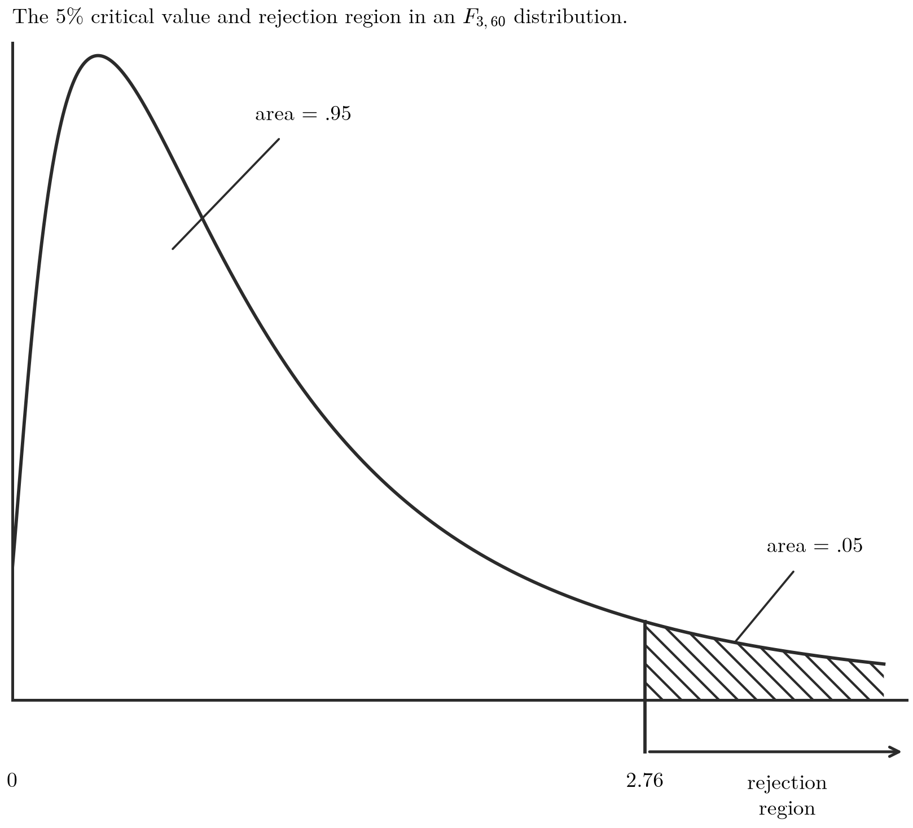
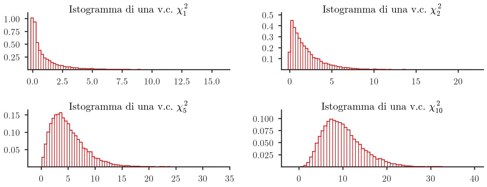

## Esempio introduttivo: differenze salariali tra gruppi

> [!example] Esempio
> Consideriamo il seguente modello di regressione:
>
> $$\log(wage) = \alpha + \beta_1 educ + \beta_2 exper + \beta_3 tenure + \beta_4 south + \beta_5 urban + \beta_6 marr\_black + \beta_7 single\_black + \beta_8 marr\_nonblack + \beta_9 single\_nonblack + \epsilon$$
>
> Ci sono 4 variabili dummy che suddividono il campione in 4 gruppi diversi e non sovrapposti. In particolare, definiamo *married_black*, *single_black*, *married_nonblack* e *single_nonblack* per distinguere lo stato civile insieme alla razza.
>
> Siamo interessati a valutare se i lavoratori sposati e di colore e sposati non di colore ricevono, in media, la stessa quantità di denaro.
>
> Le stime OLS (comando: `reg lwage educ exper tenure south urban marr_black single_black marr_nonblack single_nonblack`) sono:
>
> | lwage | Coef. | Std. Err. | t | P>\|t\| | [95% Conf. Interval] |
> |---|---|---|---|---|---|
> | educ | .0654751 | .006253 | 10.47 | 0.000 | .0532034 .0777469 |
> | exper | .0141462 | .003191 | 4.43 | 0.000 | .0078837 .0204087 |
> | tenure | .0116628 | .0024579 | 4.74 | 0.000 | .006839 .0164866 |
> | south | -.0919894 | .0263212 | -3.49 | 0.000 | -.1436455 -.0403333 |
> | urban | .1843501 | .0269778 | 6.83 | 0.000 | .1314053 .2372948 |
> | marr_black | .2502685 | .0940889 | 2.66 | 0.008 | .0656162 .4349208 |
> | single_black | (dropped) | | | | |
> | marr_nonbl~k | .4297348 | .0880447 | 4.88 | 0.000 | .2569445 .6025251 |
> | single_non~k | .2408201 | .0960229 | 2.51 | 0.012 | .0523724 .4292678 |
> | _cons | 5.162973 | .1359471 | 37.98 | 0.000 | 4.896173 5.429773 |
>
> (*single_black* viene automaticamente escluso dal software — "dropped" — perché costituisce la categoria di riferimento rispetto alla quale sono definite le altre tre dummy di gruppo, insieme alla costante.)
>
> I salari medi attesi per ogni gruppo, condizionati sulle altre variabili, sono:
>
> - Se $married=1$ e $black=1$, cioè $marr\_black=1$:
> $$E[lwage|X] = \alpha + \beta_1 educ + \dots + \beta_6 \times 1 + \beta_8 \times 0 + \beta_9 \times 0$$
> - Se $married=1$ e $black=0$, cioè $marr\_nonblack=1$:
> $$E[lwage|X] = \alpha + \beta_1 educ + \dots + \beta_6 \times 0 + \beta_8 \times 1 + \beta_9 \times 0$$
> - Se $married=0$ e $black=1$, cioè $single\_black=1$:
> $$E[lwage|X] = \alpha + \beta_1 educ + \dots + \beta_6 \times 0 + \beta_8 \times 0 + \beta_9 \times 0$$
> - Se $married=0$ e $black=0$, cioè $single\_nonblack=1$:
> $$E[lwage|X] = \alpha + \beta_1 educ + \dots + \beta_6 \times 0 + \beta_8 \times 0 + \beta_9 \times 1$$
>
> Sulla base del modello, tra le persone sposate, la differenza salariale causata dalla razza è rappresentata da:
>
> $$E[lwage|married\_black=1] - E[lwage|married\_nonblack=1] = \beta_6 - \beta_8 = .2502685 - .4297348$$
>
> È possibile verificare se questa differenza è statisticamente significativa? Una possibile soluzione è calcolare il seguente statistico $t$:
>
> $$t = \frac{\hat\beta_6 - \hat\beta_8 - 0}{\text{st.err.}\left(\hat\beta_6 - \hat\beta_8\right)}$$
>
> Sfortunatamente, in alcuni casi, non è immediato valutare il denominatore (lo standard error di una combinazione lineare di stimatori correlati). Serve quindi una strategia più generale per implementare questo tipo di test — il test F, sviluppato nelle sezioni seguenti.

*(slide 2–5)*

## Perché un test t ripetuto non è una soluzione valida per ipotesi congiunte

> [!note] Dimostrazione
> **Esempio motivante: test di significatività congiunta.** Consideriamo un modello di regressione multipla
>
> $$Y = \alpha + \beta_1 X_1 + \beta_2 X_2 + \beta_3 X_3 + \epsilon$$
>
> e vogliamo testare se $X_1$, $X_2$ e $X_3$, congiuntamente, sono predittori utili per $Y$. Vogliamo cioè valutare l'ipotesi congiunta
>
> $$H_0: \beta_1=\beta_2=\beta_3=0 \quad \text{contro} \quad H_1: \text{almeno un } \beta_j \neq 0,\ j=1,2,3.$$
>
> Se l'ipotesi nulla è corretta, i tre regressori sono inutili per predire $Y$: se $H_0$ fosse vera, la regressione si ridurrebbe a
>
> $$Y = \alpha + \epsilon$$
>
> (il *modello ristretto*). Serve una strategia che permetta di confrontare questo modello ristretto con il *modello completo*.
>
> **Un primo tentativo (naïve): ripetere il test t tre volte.** La strategia consiste nel:
>
> 1. Calcolare tre statistiche $t$, cioè $t_1$, $t_2$ e $t_3$, per le ipotesi $H_0^{(1)}: \beta_1=0$, $H_0^{(2)}: \beta_2=0$ e $H_0^{(3)}: \beta_3=0$, contro l'alternativa bilaterale.
> 2. Decidere secondo lo schema seguente:
>    - Se non rigettiamo tutte e tre le ipotesi nulle, non rigettiamo neanche l'ipotesi congiunta $H_0:\beta_1=\beta_2=\beta_3=0$.
>    - Se rigettiamo almeno una delle tre ipotesi, rigettiamo anche $H_0:\beta_1=\beta_2=\beta_3=0$.
>
> **Questa strategia può portare a risultati errati.** Se l'ipotesi nulla è vera, la probabilità di non rigettarla in un singolo test è $1-0.05$ quando $\alpha=0.05$. Supponendo (per semplicità algebrica, anche se non è un'ipotesi credibile) che $t_1$, $t_2$ e $t_3$ siano test indipendenti, e ricordando che per tre eventi indipendenti $A,B,C$ vale $P(A,B,C)=P(A)P(B)P(C)$, la probabilità di non rigettare congiuntamente le tre ipotesi nulle è
>
> $$0.95 \times 0.95 \times 0.95 = 0.8574$$
>
> L'errore di Tipo I del test congiunto — cioè la probabilità di rigettare l'ipotesi nulla quando è corretta — è quindi
>
> $$1 - 0.8574 = 0.1426 \neq 0.05$$
>
> ossia la probabilità di rigettare erroneamente l'ipotesi nulla è circa $3\times\alpha$. Con la strategia naïve, quindi, si perde il controllo sul vero livello di significatività del test.

*(slide 6–8)*

## Restrizioni lineari: definizione generale

> [!abstract] Definizione
> I due esempi precedenti coinvolgono entrambi **restrizioni lineari** sui parametri, cioè vincoli del tipo
>
> $$r_1\beta_1 + r_2\beta_2 + \dots + r_{k-1}\beta_{k-1} + r_k\beta_k = q$$
>
> dove $r_1,\dots,r_k$ e $q$ sono costanti note.
>
> - Nel primo esempio (differenze salariali) questo è immediato: consideriamo $\beta_6 - \beta_8 = 0$, con $r_6=1$, $r_8=-1$, tutti gli altri $r_i=0$ e $q=0$. Si tratta di un'unica combinazione lineare, cioè **1 restrizione**.
> - Anche il secondo esempio (test di significatività congiunta) coinvolge restrizioni lineari particolari: ogni $\beta_j=0$ è una combinazione lineare in cui tutti i pesi $r_i=0$ per $i\neq j$, mentre $r_j=1$ e $q=0$. In questo caso ci sono **3 diverse combinazioni lineari** che devono essere soddisfatte congiuntamente (3 restrizioni).
>
> Il **test F** consente di valutare in un unico passo se una o più restrizioni lineari sono coerenti con le evidenze empiriche.

*(slide 9)*

## Costruzione del test F: modello completo vs modello ristretto

Una strategia credibile per implementare un test su parametri multipli passa attraverso la **statistica F**.

Siano $R_c^2$ e $R_r^2$ gli indicatori di bontà di adattamento ($R^2$) rispettivamente del modello *completo* e del modello *ristretto*:

- il **modello ristretto** è quello in cui si ipotizza che l'ipotesi nulla sui parametri sia valida;
- il **modello completo** è il modello di regressione originale (non vincolato).

Se l'ipotesi alternativa fosse corretta, ci si aspetta che la capacità predittiva del modello completo sia superiore a quella del modello ristretto (che è vincolato). In particolare, la differenza tra i due $R^2$ sarà grande. Il test F studia quindi il comportamento della quantità $(R_c^2 - R_r^2)$.

*(slide 10)*

## La statistica F: definizione

> [!abstract] Definizione
> Il test F è definito come
>
> $$F_{s;\,n-k-1} = \frac{(R_c^2 - R_r^2)/s}{(1-R_c^2)/(n-k-1)}$$
>
> dove:
>
> - $s$ è il numero di vincoli sotto l'ipotesi nulla (nell'esempio di significatività congiunta è 3, poiché si ipotizza $\beta_1=0$, $\beta_2=0$ e $\beta_3=0$);
> - $k$ è il numero totale di regressori nel modello completo (nell'esempio è 3);
> - $n$ è la dimensione del campione.

*(slide 11)*

## Proprietà del test F, regola di decisione e p-value

> [!tip] Teorema
> Si può dimostrare che la statistica $F$ ha le seguenti proprietà:
>
> - **È sempre positiva.** Infatti si può dimostrare che $R^2$ è sempre non decrescente quando si aggiungono regressori (quindi $R_c^2 \geq R_r^2$).
> - **I valori di $F$ vicini a 0 sono più favorevoli a $H_0$ che a $H_1$.** Ciò implica che si respinge l'ipotesi nulla solo quando $F$ è grande: si tratta di un **test unilaterale**. In pratica si calcola la statistica $F$ osservata, $F^{oss}$, e il p-value viene calcolato come $P(F>F^{oss})$. Se il p-value è più piccolo del livello $\alpha$, si respinge l'ipotesi nulla; altrimenti non c'è sufficiente evidenza per respingerla.
> - **Se l'ipotesi nulla è corretta**, allora la distribuzione di $F$ è ben approssimata da una variabile casuale $F$ con $s$ e $n-k-1$ gradi di libertà (parametri). Per questa distribuzione sono disponibili tabelle.
>
> 
>
> **Figura 1** — Rappresentazione grafica della variabile casuale F. Il grafico (*"The 5% critical value and rejection region in an $F_{3,60}$ distribution"*) mostra la densità di una distribuzione F asimmetrica a destra: l'area sottesa fino al valore critico 2.76 corrisponde al 95% della probabilità ("area = .95"), mentre l'area a destra di 2.76 ("area = .05", la *rejection region*) corrisponde al livello di significatività del 5%. Se la statistica F osservata cade in quest'area, l'ipotesi nulla viene respinta.
>
> **Regola di decisione con il valore critico.** Come al solito si può definire il livello $\alpha$ e calcolare il valore critico utilizzando tabelle F adeguate:
>
> - se $F^{oss}$ è più grande del livello critico, si respinge l'ipotesi nulla;
> - se $F^{oss}$ è più piccolo del livello critico, non c'è sufficiente evidenza per respingere l'ipotesi nulla.
>
> **Regola di decisione con il p-value.** Si può calcolare anche il p-value, cioè $P_{H_0}(F>F^{oss})$: se il p-value è più piccolo di $\alpha$ (in percentuale), si respinge l'ipotesi nulla, altrimenti non la si può respingere.

*(slide 12–14)*

## Relazione tra la distribuzione F e la distribuzione chi-quadro

Si noti che $F(k_1,k_2)$ è ben approssimata da una variabile $\chi^2_{k_1}$ se $k_2$ è sufficientemente grande. Questo accade quando $n$ è grande, visto che $F \sim F_{s;\,n-k-1}$ (e quindi $k_2 = n-k-1$ cresce con la numerosità campionaria).



**Figura 2** — $\chi^2_{df}$ con diversi gradi di libertà, cioè $df=1,2,5,10$. Il pannello mostra quattro istogrammi di variabili casuali chi-quadro simulate con gradi di libertà crescenti (1, 2, 5, 10): per $df=1$ la densità è fortemente concentrata vicino allo zero e decrescente; all'aumentare dei gradi di libertà la distribuzione si sposta verso destra, si allarga e assume una forma progressivamente più simmetrica e campanulare, illustrando visivamente come l'approssimazione chi-quadro della F migliori (in forma) al crescere dei gradi di libertà al denominatore.

*(slide 15)*

## Esempio: dimensione della classe e reddito rispetto al punteggio del test

> [!example] Esempio
> Supponiamo di voler testare se `str` (dimensione della classe) e `avginc` (reddito medio) sono predittori utili per il punteggio del test. Il modello completo è
>
> $$avg\_score = \alpha + \beta_1\, str + \beta_2\, avginc + \epsilon$$
>
> L'ipotesi nulla è quindi $H_0: \beta_1=\beta_2=0$ contro l'alternativa che almeno uno di questi due parametri sia diverso da 0.
>
> Non è banale calcolare, carta e penna, la statistica F osservata, poiché richiede una serie di calcoli noiosi: stimare i due modelli (completo e ristretto), calcolare i loro indicatori di bontà di adattamento $R^2$, e valutare la statistica $F$ osservata, cioè $F^{obs}$. Di solito i test F vengono calcolati tramite software statistici/econometrici.
>
> **Procedura con Gretl:**
>
> a. Si stimi la regressione completa.
> b. Dall'output della regressione si utilizzi il menu *Test -> Vincoli lineari*.
> c. Si definisca il test come segue:
>
> ```
> b[str] = 0
> b[avginc] = 0
> ```
>
> L'output è riportato di seguito:
>
> ```
> Insieme di vincoli
>  1: b[str] = 0
>  2: b[avginc] = 0
>
> Statistica test: F(2, 417) = 218,302, con p-value = 1,3533e-65
> ```
>
> In questo caso si respinge l'ipotesi nulla poiché il p-value è prossimo a 0. Ciò significa che almeno uno dei due regressori è un predittore utile per il punteggio medio.

*(slide 16–17)*

## Esempio: verifica della differenza salariale tra gruppi con il test F

> [!example] Esempio
> Riprendendo l'esempio delle differenze salariali, per verificare se $\beta_6 - \beta_8 \neq 0$, cioè se la differenza tra lavoratori sposati di colore e sposati non di colore è statisticamente significativa, si implementa il test
>
> $$H_0: \beta_6-\beta_8=0 \quad \text{vs.} \quad H_1: \beta_6-\beta_8\neq 0$$
>
> In Gretl si procede così:
>
> 1. Si stimi la regressione completa (`reg lwage` su `educ exper tenure south urban marr_black single_black marr_nonblack single_nonblack`).
> 2. Dall'output della regressione si utilizzi il menu *Test -> Vincoli lineari*.
> 3. Si definisca il test come segue:
>
> ```
> b[marr_black] - b[marr_nonblack] = 0
> ```
>
> L'output è riportato di seguito:
>
> ```
> Insieme di vincoli
>  1: b[marr_black] - b[marr_nonblack] = 0
>
> Statistica test: F(1, 926) = 19,60, con p-value = 0.000
> ```
>
> Il p-value è nullo. In altre parole, la differenza tra i due gruppi (lavoratori sposati di colore vs. sposati non di colore) è effettivamente significativamente diversa da 0 — confermando, con lo strumento generale del test F, quanto ci si chiedeva nell'esempio introduttivo senza poter calcolare agevolmente la statistica t per la combinazione $\hat\beta_6-\hat\beta_8$.

*(slide 18)*
