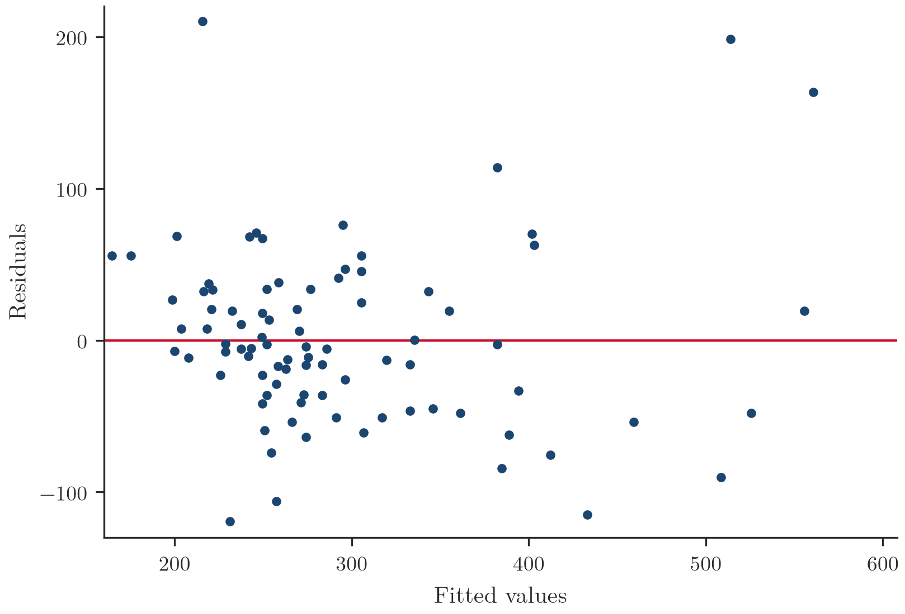
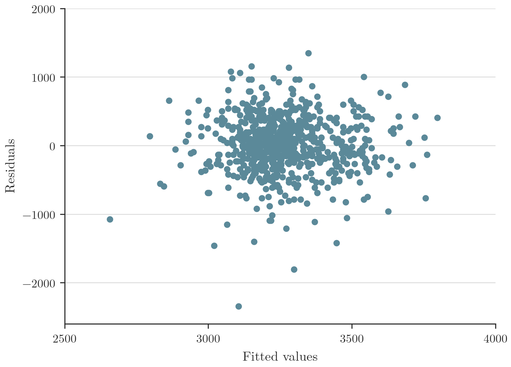
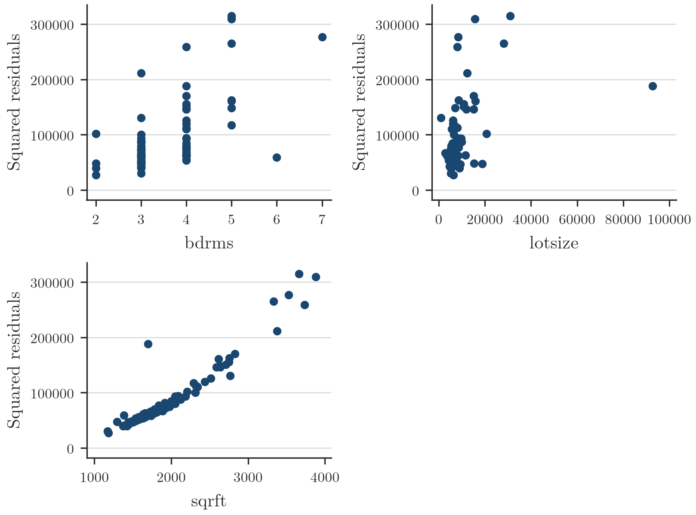

## Introduzione e struttura della lezione

Corso: *Econometrics* — lezione **L'ipotesi di Eteroschedasticità**, tenuta da Davide Raggi, 25 novembre 2025.

Argomenti trattati nella lezione:

- L'ipotesi di omoschedasticità
- Soluzioni per l'eteroschedasticità
- Stimatori Robusti
- Test robusti ($t$ ed $F$)
- Test per l'eteroschedasticità

*(slide 1–2)*

## L'ipotesi di omoschedasticità

> [!abstract] Definizione
> - L'ipotesi di omoschedasticità **non è necessaria** per dimostrare la non distorsione e la consistenza di $\hat\beta_j$.
> - Tuttavia, per dimostrare il **teorema di Gauss-Markov**, si assume che le varianze condizionali di $\epsilon_i$ siano costanti:
> $$\mathrm{Var}(\epsilon_i|X_{1i},\dots,X_{ki}) = \sigma^2 \qquad \forall i$$
> - In base a questa ipotesi, gli stimatori OLS sono **BLUE** (*Best Linear Unbiased Estimator*), ovvero quelli con la minore deviazione standard (migliori) nella classe degli stimatori lineari e non distorti.
> - Domanda aperta: possiamo chiederci se/perché questa ipotesi sia rilevante per scopi pratici, e quali siano le conseguenze della sua violazione.

*(slide 3)*

## Standard error nel modello semplice e conseguenze dell'eteroschedasticità

**Richiamo.** Nel modello di regressione semplice, l'ipotesi di omoschedasticità è stata utilizzata per calcolare le deviazioni standard degli stimatori. In particolare, le deviazioni standard di $\hat\beta$ e $\hat\alpha$ sono:
$$\hat\sigma_{\hat\beta} = \sqrt{\frac{\hat\sigma^2}{\sum_{i=1}^n (X_i - \bar X)^2}}$$
$$\hat\sigma_{\hat\alpha} = \sqrt{\frac{\hat\sigma^2 \left(\frac{1}{n}\sum_{i=1}^n X_i^2\right)}{\sum_{i=1}^n (X_i - \bar X)^2}}$$

Domanda: questi stimatori per $\sigma_{\hat\alpha}$ e $\sigma_{\hat\beta}$ sono ancora affidabili nel caso in cui l'ipotesi di omoschedasticità non sia verificata?

**Conseguenze della violazione.**

- Si può dimostrare che sotto l'ipotesi di eteroschedasticità, gli stimatori della deviazione standard **non sono consistenti** e quindi forniscono una scarsa approssimazione alla vera deviazione standard.
- Una stima inaccurata di $\sigma_{\hat\beta}$ può portare al calcolo di statistiche $t$ non affidabili (poiché $\sigma_{\hat\beta}$ è il denominatore di $t$). In particolare, una stima distorta della deviazione standard influirà probabilmente sui risultati inferenziali.
- I test di ipotesi e gli intervalli di confidenza saranno quindi fortemente influenzati dall'ipotesi che facciamo sulla varianza condizionale. È quindi naturale cercare stimatori ragionevoli per $\sigma_{\hat\beta}$ che siano coerenti anche con l'ipotesi di eteroschedasticità.

*(slide 4–5)*

## Esempio: modello di regressione multipla sul prezzo delle case

> [!example] Esempio
> Si consideri un modello di regressione in cui il prezzo di alcune case (*price*) viene spiegato attraverso alcune variabili: la dimensione (*sqrft*), la dimensione del lotto (*lotsize*), il numero di stanze (*bdrms*). I dati sono raccolti in `hprices.gdt`.
>
> Una delle principali ipotesi per la regressione stimata con OLS è l'omogeneità della varianza degli errori. Se il modello è ben definito, ci si aspetta non venga riconosciuto alcun pattern chiaro tra i residui e i valori predetti dal modello. Esistono metodi grafici e non grafici per rilevare l'eteroschedasticità. Un metodo grafico comunemente usato è rappresentare graficamente i residui (o i residui al quadrato) rispetto ai valori predetti (o ai singoli regressori).
>
> 
>
> **Figura 1** — Residui vs. valori adattati $\hat\epsilon$ vs. $\hat Y$. Lo scatterplot (residui tra circa $-100$ e $300$, valori adattati tra $200$ e $600$) mostra che la dispersione dei residui non è costante: per valori elevati di $\hat Y = X\hat\beta$ la variabilità dei residui sembra aumentare, e sono presenti pochi residui estremi. In generale, questo grafico è usato per rilevare la non linearità, varianze degli errori non uguali e la presenza di outlier.
>
> Dalla Figura 1 si evince che:
>
> - I residui rimbalzano casualmente intorno alla linea $0$ (media dei residui stessi). Ciò suggerisce che l'ipotesi di relazione lineare è ragionevole.
> - I residui **non** formano approssimativamente una banda orizzontale intorno allo $0$: per valori elevati di $\hat Y$ la dispersione/variabilità dei residui aumenta (**eteroschedasticità**).
> - Pochi residui risultano estremi rispetto agli altri: questo accade solo per prezzi predetti maggiori di $500$ e per una casa il cui residuo sfiora $200$ pur avendo un prezzo poco superiore a $200$K dollari.
>
> 
>
> **Figura 2** — Esempio di comportamento corretto di $\hat\epsilon$ vs. $\hat Y$. Lo scatterplot mostra i residui distribuiti in una banda orizzontale uniforme intorno allo zero su tutto il range dei valori adattati ($2500$–$4000$), senza l'allargamento a imbuto osservato in Figura 1: questo è ciò che ci si aspetta da un modello omoschedastico ragionevole.
>
> **Confronto tra due specificazioni.** Di seguito viene stimato il modello di regressione utilizzando due formule alternative per il calcolo degli standard error: il primo output riporta le stime OLS con deviazioni standard naïve ("normali"), il secondo fornisce una correzione per un'eventuale eteroschedasticità.
>
> *Modello 1 — Deviazioni standard normali:*
>
> | price | Coef. | Std. Err. | t | P>\|t\| | [95% Conf. | Interval] |
> |---|---|---|---|---|---|---|
> | sqrft | .1227782 | .0132374 | 9.28 | 0.000 | .0964541 | .1491022 |
> | lotsize | .0020677 | .0006421 | 3.22 | 0.002 | .0007908 | .0033446 |
> | bdrms | 13.85252 | 9.010145 | 1.54 | 0.128 | -4.065141 | 31.77018 |
> | _cons | -21.77031 | 29.47504 | -0.74 | 0.462 | -80.38466 | 36.84405 |
>
> *Modello 2 — Correzione per eteroschedasticità:*
>
> | price | Coef. | Std. Err. | t | P>\|t\| | [95% Conf. | Interval] |
> |---|---|---|---|---|---|---|
> | sqrft | .1227782 | .0177253 | 6.93 | 0.000 | .0875294 | .158027 |
> | lotsize | .0020677 | .0012514 | 1.65 | 0.102 | -.0004209 | .0045563 |
> | bdrms | 13.85252 | 8.478625 | 1.63 | 0.106 | -3.008154 | 30.7132 |
> | _cons | -21.77031 | 37.13821 | -0.59 | 0.559 | -95.62371 | 52.0831 |
>
> Nelle slide originali la riga di *lotsize* è esplicitamente evidenziata in entrambi i modelli: passando dagli standard error naïve a quelli corretti, il p-value di *lotsize* passa da $0.002$ (significativo) a $0.102$ (non significativo) — un esempio concreto di come la scelta degli standard error possa cambiare le conclusioni inferenziali. Domanda aperta: quale delle due specificazioni risulta più attendibile?
>
> 
>
> **Figura 3** — Residui al quadrato vs. ogni regressore. I tre scatterplot mostrano $\hat\epsilon^2$ rispettivamente contro *bdrms* (asse $2$–$7$), *lotsize* (asse $0$–$100000$) e *sqrft* (asse $1000$–$4000$), con i residui al quadrato sull'asse verticale nel range $0$–$300000$ circa. Si osserva una chiara dipendenza crescente tra $\hat\epsilon^2$ e, rispettivamente, *bdrms* e *sqrft* (pattern più marcato e quasi lineare per *sqrft*), mentre la dipendenza con *lotsize* è meno netta.
>
> I residui al quadrato, che sono una proxy della varianza condizionale, risultano fortemente dipendenti dalle variabili del modello: la varianza sembra quindi dipendere da $X$, evidenziando **eteroschedasticità**. In particolare, i residui al quadrato crescono proporzionalmente a *bdrms* e *sqrft*. La varianza condizionale non sembra dunque costante, per cui l'output più credibile è il **Modello 2**, che corregge per l'eteroschedasticità.

*(slide 6–12)*

## Soluzioni per l'eteroschedasticità: panoramica e Weighted Least Squares (WLS)

> [!abstract] Definizione
> Nella letteratura esistono due metodi principali per stimare gli errori standard di $\hat\beta_j$ in presenza di eteroschedasticità:
>
> 1. **Weighted Least Squares (WLS)** — forse meno utile, si basa su una standardizzazione adeguata del termine di errore $\epsilon$: se $\mathrm{Var}(\epsilon_i|X) = \sigma_i^2 = (\sigma\tilde\sigma_i)^2$, si valuta prima $\tilde\sigma_i$ per poi dividere $\epsilon_i$ per $\tilde\sigma_i$.
> 2. **Stima robusta** — si basa sulla consistenza degli stimatori OLS per ottenere stimatori robusti rispetto all'eteroschedasticità per gli errori standard: si utilizzano gli $\hat\epsilon_i$ per valutare la varianza vera di $\hat\beta_i$.
>
> **Weighted Least Squares.** Si consideri la regressione
> $$Y_i = \alpha + \beta_1 X_{i1} + \dots + \beta_k X_{ik} + \epsilon_i$$
> Si ipotizzi che $\mathrm{Var}(\epsilon_i|X_1,\dots,X_k) = \sigma_i^2$, dove $\sigma_i^2$ dipende da alcuni regressori e da alcuni parametri sconosciuti. Ad esempio, può essere interessante utilizzare
> $$\sigma_i^2 = \sigma^2 \exp\{\delta_0 + \delta_1 Z_1 + \dots + \delta_m Z_m\} = (\sigma\tilde\sigma_i)^2$$
> dove $Z_1,\dots,Z_m$ sono regressori (che possono coincidere con $X_1,\dots,X_k$).
>
> Se i parametri $\delta_i,\ i=0,\dots,m$ sono noti, possiamo valutare facilmente $\sigma_i$. In questo caso si considera la **regressione ausiliaria**
> $$\frac{Y_i}{\tilde\sigma_i} = \alpha\frac{1}{\tilde\sigma_i} + \beta_1\frac{X_{i1}}{\tilde\sigma_i} + \dots + \beta_k\frac{X_{ik}}{\tilde\sigma_i} + \frac{\epsilon_i}{\tilde\sigma_i}$$
> E quindi il modello di regressione originale diventa
> $$Y_i^* = \alpha X_{i0}^* + \beta_1 X_{i1}^* + \dots + \beta_k X_{ik}^* + \epsilon_i^*$$
> In questa versione $\mathrm{Var}(\epsilon_i^*|X) = \sigma^2$ (errori omoschedastici) e quindi gli stimatori OLS forniscono stimatori **BLUE**.

*(slide 13–15)*

## Feasible Generalized Least Squares (FGLS)

> [!abstract] Definizione
> Applicare OLS alla regressione ausiliaria ($Y^*$) fornisce risultati diversi rispetto agli OLS standard: WLS è un caso speciale del metodo **Generalized Least Squares (GLS)**. Tuttavia, per applicare WLS/GLS è necessario conoscere i coefficienti $\delta_j$, il che in generale non è ovvio. Una possibile soluzione si basa sul **Feasible Generalized Least Squares (FGLS)**, in cui $\tilde\sigma_i$ è stimato tramite OLS.
>
> Si ricordi che la media condizionale di $Y$ è
> $$E(Y|X) = \alpha + \beta_1 X_1 + \dots + \beta_k X_k$$
> Definiamo un modello che descriva $\mathrm{Var}(Y|X)$. Intuitivamente, possiamo definire questa varianza come
> $$\mathrm{Var}(Y|Z_1,\dots,Z_m) = E[\epsilon^2|X] = g(Z_1,\dots,Z_m), \qquad g(\cdot) > 0$$
> Un'ipotesi ragionevole, ad esempio, è
> $$\epsilon^2 = \sigma^2 \exp\{\delta_0 + \delta_1 Z_1 + \dots + \delta_m Z_m\}\, \nu$$
>
> Consideriamo dunque il modello completo per le medie e le varianze condizionate:
> $$Y_i = \alpha + \beta_1 X_{i1} + \dots + X_{ik} + \epsilon_i$$
> $$\epsilon^2 = \sigma^2 \exp\{\delta_0 + \delta_1 Z_1 + \dots + \delta_m Z_m\}\, \nu$$
>
> Un procedimento ragionevole per calcolare $\hat\sigma_i$ è il seguente:
>
> 1. Regredire $Y$ su $X_1,\dots,X_k$ e calcolare $\hat\epsilon$;
> 2. Calcolare $\log(\hat\epsilon^2)$;
> 3. Regredire $\log(\hat\epsilon^2)$ su $Z_1,\dots,Z_m$;
> 4. Calcolare $\hat g = \widehat{\log(\hat\epsilon^2)}$ e $\hat\sigma_i = \exp\{\hat g/2\}$;
> 5. Utilizzare $\hat\sigma_i$ per calcolare lo stimatore WLS.

*(slide 16–18)*

## Stimatori robusti: l'idea di White (Huber-Heicker) nel modello semplice

> [!note] Dimostrazione
> Gli stimatori robusti sono un insieme di procedure che permettono di valutare gli standard error in maniera corretta, indipendentemente dall'ipotesi fatta su omoschedasticità od eteroschedasticità. L'idea si basa sull'intuizione che gli stimatori OLS forniscono stimatori consistenti dei parametri ($\hat\beta_j \xrightarrow{p} \beta_j$) e non distorti, **indipendentemente dall'ipotesi che facciamo sulle varianze condizionali**.
>
> **Come calcolare gli standard error in presenza di eteroschedasticità?** Per semplificare, si consideri il modello di regressione semplice
> $$Y = \alpha + \beta X + \epsilon$$
> Lo stimatore può essere espresso come funzione di $\epsilon$, come al solito:
> $$\hat\beta = \beta + \frac{\sum_{i=1}^n (X_i - \bar X)\epsilon_i}{\sum_{i=1}^n (X_i - \bar X)^2}$$
> Nel caso di regressione multipla, otteniamo
> $$\hat\beta = (X'X)^{-1}X'\underbrace{Y}_{=X\beta+\epsilon} = \beta + (X'X)^{-1}X'\epsilon$$
>
> **Vera varianza condizionale.** Si vuole stimare la vera varianza condizionale di $\hat\beta$, cioè
> $$\mathrm{Var}(\hat\beta|X) = \frac{\sum_{i=1}^n \overbrace{\sigma_i^2}^{\mathrm{Var}(\epsilon_i|X)} (X_i - \bar X)^2}{\left[\sum_{i=1}^n (X_i - \bar X)^2\right]^2}$$
> L'idea di White (1980) è piuttosto semplice: dato che $\hat\epsilon_i$ è un'approssimazione di $\epsilon_i$, allora $\hat\epsilon_i^2(X_i-\bar X)^2$ è uno stimatore ragionevole per $E[\epsilon_i^2(X_i-\bar X)^2|X] = \sigma_i^2(X_i-\bar X)^2$. White ha proposto:
> $$\widehat{\mathrm{Var}}(\hat\beta|X) = \frac{\sum_{i=1}^n (X_i - \bar X)^2 \hat\epsilon_i^2}{\left[\sum_{i=1}^n (X_i - \bar X)^2\right]^2}$$
> ... e ha anche dimostrato che $\widehat{\mathrm{Var}}(\hat\beta|X)$ è **consistente** per $\mathrm{Var}(\hat\beta|X)$.
>
> **Intuizione del risultato.** Nel modello di regressione semplice:
> $$\hat\epsilon_i = Y_i - \hat Y_i = \underbrace{\alpha + \beta X_i + \epsilon_i}_{Y_i} - \underbrace{(\hat\alpha + \hat\beta X_i)}_{\hat Y_i} = \underbrace{(\alpha - \hat\alpha)}_{=0 \text{ se } n\to+\infty} + \underbrace{(\beta - \hat\beta)}_{=0 \text{ se } n\to+\infty} X_i + \epsilon_i$$
>
> Come conseguenza principale, abbiamo che asintoticamente
> $$\frac{1}{n}\sum_{i=1}^n \hat\epsilon_i^2 (X_i - \bar X)^2 \approx \frac{1}{n}\sum_{i=1}^n \epsilon_i^2 (X_i - \bar X)^2$$
> Nella pratica, questo risultato serve per trovare uno stimatore consistente di $\mathrm{Var}(\hat\beta|X)$: se le due quantità sono equivalenti, lo saranno anche calcolando il limite per $n\to\infty$. Per la legge dei grandi numeri vale che
> $$\frac{1}{n}\sum_{i=1}^n \epsilon_i^2(X_i-\bar X)^2 \to E\left[\frac{1}{n}\sum_{i=1}^n \epsilon_i^2(X_i-\bar X)^2\right] = \frac{1}{n}\sum_{i=1}^n \sigma_i^2(X_i-\bar X)^2$$
> $$\Rightarrow \frac{1}{n}\sum_{i=1}^n \hat\epsilon_i^2(X_i-\bar X)^2 \to \frac{1}{n}\sum_{i=1}^n \sigma_i^2(X_i-\bar X)^2$$

*(slide 20–23)*

## Stimatori robusti: caso di regressione multipla e sintesi

> [!note] Dimostrazione
> Nel caso di regressione multipla
> $$Y = \alpha + \beta_1 X_1 + \dots + \beta_k X_k + \epsilon$$
> si può dimostrare che
> $$\widehat{\mathrm{Var}}(\hat\beta_j|X) = \frac{\sum_{i=1}^n \hat r_{ij}^2 \hat\epsilon_i^2}{\left[\sum_{i=1}^n (X_{ij} - \bar X_j)^2\right]^2} \qquad j = 1,\dots,k$$
> in cui $\hat r_{ij}$ è una stima del residuo $i$-esimo ottenuta dalla regressione di $X_j$ su tutti gli altri regressori:
> $$X_j = \alpha_0 + \alpha_1 X_1 + \dots + \alpha_{j-1}X_{j-1} + \alpha_{j+1}X_{j+1} + \dots + \alpha_k X_k + u$$
>
> Usando la notazione matriciale, si consideri la matrice diagonale varianza-covarianza $\Sigma$:
> $$E[\epsilon\epsilon'] = \Sigma_{n\times n} = \begin{pmatrix} \sigma_1^2 & 0 & \dots & 0 \\ 0 & \sigma_2^2 & 0 & \dots \\ \vdots & \vdots & \vdots & \vdots \\ 0 & \dots & \dots & \sigma_n^2 \end{pmatrix}$$
> Si può facilmente dimostrare che
> $$\mathrm{Var}(\hat\beta|X) = (X'X)^{-1} X' E[\epsilon\epsilon'] X (X'X)^{-1}$$
> Come risultato generale, White ha dimostrato che uno stimatore consistente di $\frac{X'\Sigma X}{n}$ è $\frac{X'\hat\Sigma X}{n}$, in cui gli elementi diagonali di $\hat\Sigma$ sono stimati attraverso $\hat\sigma_i^2 = \hat\epsilon_i^2$.
>
> **Sintesi.** Gli stimatori OLS $\hat\sigma_{\hat\beta_j}$ calcolati sotto l'ipotesi di omoschedasticità non sono adatti quando questa ipotesi non è soddisfatta. Tuttavia, gli stimatori OLS sono consistenti e non distorti a prescindere, e quindi anche $\hat\epsilon$ è una misura ragionevole per $\epsilon$: White-(Huber-Heicker) sfruttano questa proprietà per correggere il calcolo dell'errore standard.
>
> Principali vantaggi:
>
> - Nessuna ipotesi viene fatta sulla varianza condizionale: il metodo funziona in caso di omoschedasticità o di qualsiasi tipo di eteroschedasticità (**flessibilità**);
> - OLS è ancora valido (**semplicità d'uso**).
>
> D'altra parte, $\hat\beta_j$ **non è più BLUE**.

*(slide 24–26)*

## Test robusti all'eteroschedasticità: t e F

> [!abstract] Definizione
> **Il Test $t$.** Le statistiche $t$, costruite utilizzando gli errori standard robusti, si calcolano in maniera identica al caso omoschedastico. L'unica differenza è il denominatore, che deve essere calcolato in modo robusto (attraverso la formula di White). Quindi, la statistica $t$ robusta è:
> $$t = \frac{\hat\beta - \text{valore sotto } H_0}{\text{errore standard robusto}}$$
>
> **Il Test $F$.** Il calcolo della versione robusta delle statistiche $F$ è complicato. Tuttavia, molti software consentono di calcolarlo in modo automatico, una volta che gli errori standard sono stati stimati mediante metodi robusti (ad esempio, GRETL, STATA).

*(slide 27)*

## Test per l'eteroschedasticità: principi generali e Test di Breusch-Pagan

> [!tip] Teorema
> **Principi generali.** In generale, le procedure robuste sono preferibili, poiché consentono di calcolare i test $t$ ed $F$ senza dover fare alcuna ipotesi su $\mathrm{Var}(Y|X)$. Tuttavia, l'utilizzo degli errori standard robusti in caso di omoschedasticità è inefficiente: lo standard error non è più il minimo. Talvolta può essere utile costruire test per validare l'ipotesi di omoschedasticità: se si rifiutasse questa ipotesi converrebbe implementare procedure robuste, altrimenti può essere utilizzato OLS classico.
>
> **IMPORTANTE:** tutti i test per verificare l'ipotesi di omoschedasticità (ipotesi nulla) rispetto all'eteroschedasticità (ipotesi alternativa) **non accettano l'ipotesi nulla**, ma al più permettono di rifiutarla. In generale, questi test si basano su una definizione della forma funzionale per l'eteroschedasticità, che viene confrontata con l'ipotesi di omoschedasticità.
>
> **Test di Breusch-Pagan.** Si consideri il solito modello di regressione multipla
> $$Y = \alpha + \beta_1 X_1 + \dots + \beta_k X_k + \epsilon$$
> e si ipotizzi che la varianza condizionata sia
> $$E[\epsilon^2|\mathbf X] = \delta_0 + \delta_1 X_1 + \dots + \delta_k X_k$$
> che porta al seguente modello di regressione
> $$\epsilon^2 = \delta_0 + \delta_1 X_1 + \dots + \delta_k X_k + u$$
> Se tutti i coefficienti fossero nulli, i.e. $\delta_j = 0$, allora
> $$H_0: \mathrm{Var}(\epsilon|X_1,\dots,X_k) = E[\epsilon^2|X_1,\dots,X_k] = \sigma^2$$
>
> L'ipotesi nulla di omoschedasticità può essere verificata attraverso il seguente sistema di ipotesi
> $$H_0: \mathrm{Var}(\epsilon|X) = \sigma^2 \Leftrightarrow H_0: \delta_1=\delta_2=\dots=\delta_k=0 \quad \text{vs.} \quad H_1: \text{almeno un coefficiente non è zero}$$
> Questo test è molto simile a un test $F$. Ovviamente, $\epsilon^2$ non è osservabile, tuttavia può essere approssimato attraverso $\hat\epsilon^2$. Il modello ridotto (sotto $H_0$) è
> $$\hat\epsilon^2 = \delta_0 + err \Rightarrow R_c^2 = 0$$
> La statistica test risulta quindi
> $$F_{k,n-k-1} = \frac{R_{\hat\epsilon^2}^2/k}{(1-R_{\hat\epsilon^2}^2)/(n-k-1)}$$
>
> Questo test può essere calcolato in un modo leggermente diverso, chiamato **test di Breusch-Pagan** per l'eteroschedasticità:
> $$T_{BP} = n R_{\hat\epsilon^2}^2$$
> Rispetto alla statistica $F$, $T_{BP}$ è approssimativamente distribuito come una $\chi_k^2$.
>
> **Esempio (Gretl).** Il test di Breusch-Pagan può essere implementato tramite Gretl come segue: si stima la regressione di interesse, poi dalla finestra di output si sceglie il menu `Test -> LMTEST - Eteroschedasticità -> Breusch-Pagan`. L'output finale è:
>
> ```
> Test di Breusch-Pagan per l'eteroschedasticità -
>   Ipotesi nulla: eteroschedasticità non presente
>   Statistica test: LM = 30,0227
>   con p-value = P(Chi-quadro(3) > 30,0227) = 1,36495e-06
> ```
>
> In questo caso si rifiuta l'ipotesi nulla di omoschedasticità poiché il p-value è piccolo.

*(slide 28–32)*

## Test di White

> [!tip] Teorema
> Probabilmente il test più comune per i dati cross-sectional è dovuto a White, anche se si basa sulla stessa idea del test di Breusch-Pagan. Il test è costruito mediante la regressione del residuo quadratico. Ad esempio, se si considera un modello con $k=3$ regressori:
> $$\hat\epsilon^2 = \delta_0 + \delta_1 X_1 + \delta_2 X_2 + \delta_3 X_3 + \delta_4 X_1^2 + \delta_5 X_2^2 + \delta_6 X_3^2 + \delta_7 X_1 X_2 + \delta_8 X_1 X_3 + \delta_9 X_2 X_3 + errore \tag{1}$$
> Il test di White per l'eteroschedasticità si basa sulla valutazione dell'ipotesi $H_0: \delta_1 = \dots = \delta_9 = 0$, che se rifiutata produce evidenza in favore dell'eteroschedasticità.
>
> Come per il test di Breusch-Pagan, il test di White può essere calcolato come segue:
> $$T_W = n R_{\hat\epsilon^2}^2 \sim \chi^2_{\#\text{vincoli}}$$
> in cui $R_{\hat\epsilon^2}^2$ è la bontà di adattamento della regressione ausiliaria completa in eq. (1).
>
> **Esempio (Gretl).** Si consideri l'esempio sul pricing delle case. Il test di White si ottiene stimando la regressione di interesse e scegliendo, dalla finestra di output, il menu `Test -> LMTEST - Eteroschedasticità -> Test di White`. L'output fornito da Gretl è:
>
> ```
> Test di White per l'eteroschedasticità -
>   Ipotesi nulla: eteroschedasticità non presente
>   Statistica test: LM = 33,7317
>   con p-value = P(Chi-quadro(9) > 33,7317) = 9,95294e-05
> ```
>
> Anche in questo caso il test rifiuta l'ipotesi nulla di omoschedasticità.
>
> **Stima con errori standard robusti in Gretl.** Stimare gli errori standard robusti tramite Gretl è facile: è sufficiente, in sede di definizione del modello, spuntare l'opzione *Errori Standard Robusti*. Dato che si rifiuta l'ipotesi nulla, è necessario stimare la regressione OLS mediante errori standard robusti. La procedura robusta restituisce i seguenti risultati:
>
> ```
> Linear regression                                     Number of obs =       88
>                                                        F( 3,     84) =    23.72
>                                                        Prob > F      =   0.0000
>                                                        R-squared     =   0.6724
>                                                        Root MSE      =   59.833
> ```
>
> | price | Coef. | Robust Std. Err. | t | P>\|t\| | [95% Conf. | Interval] |
> |---|---|---|---|---|---|---|
> | sqrft | .1227782 | .0177253 | 6.93 | 0.000 | .0875294 | .158027 |
> | bdrms | 13.85252 | 8.478625 | 1.63 | 0.106 | -3.008154 | 30.7132 |
> | lotsize | .0020677 | .0012514 | 1.65 | 0.102 | -.0004209 | .0045563 |
> | _cons | -21.77031 | 37.13821 | -0.59 | 0.559 | -95.62371 | 52.0831 |

*(slide 33–36)*
