## Introduzione alle serie storiche

In econometria si fa largo usodi dati di serie storica, cioè osservazioni su una o più variabili economiche raccolte nel tempo. La loro utilità è evidente pensando a come gli eventi economici siano caratterizzati da aspetti dinamici: il passato contribuisce a determinare, almeno in parte, il presente e, di conseguenza, nella spiegazione ed interpretazione dei fatti economici un ruolo molto importante è assunto dalla componente temporale. Per questo motivo in econometria sono stati sviluppati molteplici modelli dinamici con l'obiettivo di catturare questo aspetto. I dati di serie storica sono ordinabili in modo oggettivo e universalmente accettato.

Questi dati sono molto diversi dai dati in cross-section: si tratta di dati **dipendenti**, cioè di osservazioni relative a un'unica entità che si protraggono nel tempo.

*(slide 2)*

## Definizione di processo stocastico e serie storica

> [!abstract] Definizione
> In termini semplicistici, un **processo stocastico** è definito come una sequenza di variabili casuali $Y_t$ indicizzate da un indice $t$. Nel corso, $t$ appartiene all'insieme dei numeri naturali $(0,1,\dots,t,\dots)$.
>
> Si assume che ognuna delle osservazioni sia descritta da una variabile casuale $Y_t$ per cui:
> - la media marginale di ogni $Y_t$ è $E[Y_t]=\mu_t$;
> - la varianza marginale di ogni $Y_t$ è $\mathrm{Var}(Y_t)=\sigma_t^2$;
> - l'**autocorrelazione** tra due qualsiasi elementi del processo è
> $$
> \mathrm{Corr}(Y_t,Y_s)=\frac{E[(Y_t-\mu_t)(Y_s-\mu_s)]}{\sqrt{\sigma_t^2\sigma_s^2}}.
> $$
>
> Una **serie storica** è una sequenza finita di variabili casuali in cui l'indice $t=1,\dots,T$ indica il tempo. Spesso con "serie storica" si intende anche la traiettoria osservata del processo stocastico.
>
> 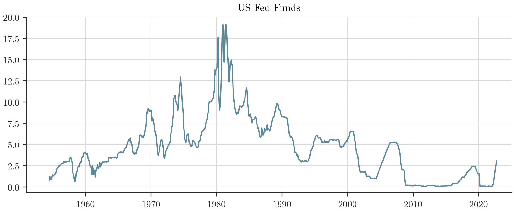
>
> **Figura 1** — Esempio di serie storica: Fed funds mensili osservati da luglio 1954 ad ottobre 2022. Il grafico mostra l'andamento del tasso di riferimento della Federal Reserve nel tempo, con marcati periodi di crescita (fine anni '70 - primi '80, con un picco vicino al 20%) e di successiva discesa fino a valori prossimi allo zero.
>
> 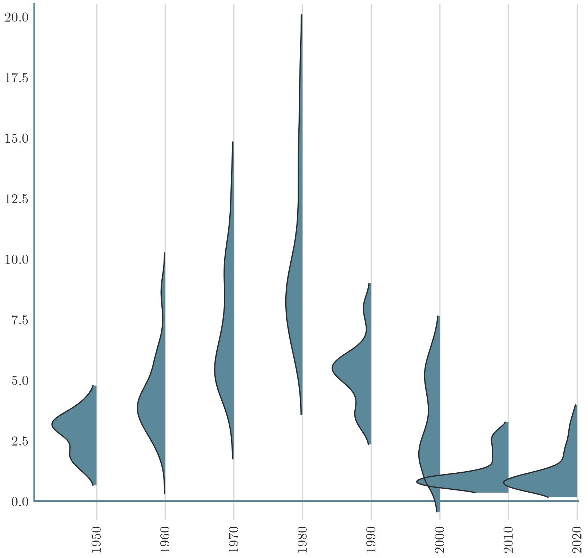
>
> **Figura 2** — Stima della distribuzione di probabilità dei tassi per decadi. Si nota che la distribuzione di $Y_t$ tende a cambiare nel tempo (forma e posizione delle distribuzioni stimate cambiano decade per decade), per cui risulta difficile ipotizzare che le osservazioni siano identicamente distribuite.

*(slide 3–5)*

## Notazione: ritardi, differenza prima, variazione percentuale

> [!abstract] Definizione
> Si consideri la variabile $Y$ che si assume osservabile nel tempo:
> - $Y_t$ è la realizzazione della variabile osservata al tempo $t$, $t=1,\dots,T$;
> - $Y_{t-j}$ è il ritardo $j$-esimo di $Y_t$;
> - la **differenza prima** di una variabile $Y_t$ è definita da
> $$\Delta Y_t = Y_t - Y_{t-1};$$
> - la **variazione percentuale** della serie $Y_t$ tra i periodi $t$ e $t-1$ è
> $$100\times\Delta\log Y_t = 100(\log Y_t - \log Y_{t-1}) \approx 100\times\frac{\Delta Y_t}{Y_{t-1}}.$$
>
> Infatti, sapendo che $\log(X+a)-\log X \approx a/X$ se $a\to 0$, si ha che
> $$
> 100\times[\log Y_t - \log Y_{t-1}] = 100\times[\log(Y_{t-1}+\Delta Y_t)-\log Y_{t-1}] \approx 100\times\frac{\Delta Y_t}{Y_{t-1}}, \quad \text{se } \Delta Y_t \to 0.
> $$

*(slide 6)*

## La trasformazione logaritmica e la stabilizzazione della varianza

> [!note] Dimostrazione
> Nell'analisi empirica spesso accade che, invece di analizzare la serie storica originale, risulti più conveniente considerare opportune trasformazioni monotone crescenti del tipo $Y_t = T(Z_t)$. In molti casi una trasformazione logaritmica consente di **stabilizzare la varianza** della serie trasformata.
>
> Si consideri la trasformazione generica $Y_t=T(Z_t)$ e il suo sviluppo in serie di Taylor al primo ordine attorno alla media di $Z_t$, cioè $\mu_t$:
> $$T(Z_t) \approx T(\mu_t) + T'(\mu_t)(Z_t-\mu_t).$$
>
> **Dimostrazione.** Si consideri una serie storica $Z_t$ la cui varianza sia proporzionale alla media, cioè $\mathrm{Var}(Z_t)=\sigma_t^2 = c\mu_t^2$, con $c$ costante positiva. Questa condizione si verifica frequentemente in molte serie storiche macroeconomiche e finanziarie.
>
> Considerando $Y_t = T(Z_t) = \log(Z_t)$, per cui $T'(\mu_t)=1/\mu_t$, si ottiene
> $$
> \mathrm{Var}(Y_t) = \mathrm{Var}\big(T(\mu_t)+T'(\mu_t)(Z_t-\mu_t)\big) = 0 + \frac{1}{\mu_t^2}\underbrace{\mathrm{Var}(Z_t)}_{\text{per ip. }\sigma_t^2=c\mu_t^2} = c\,\frac{1}{\mu_t^2}\mu_t^2 = c.
> $$
> Quindi la varianza della serie trasformata $Y_t=\log(Z_t)$ non dipende più da $t$: la trasformazione logaritmica ha stabilizzato la varianza.

*(slide 7–8)*

## Distribuzioni condizionali e distribuzione congiunta

> [!abstract] Definizione
> I modelli per le serie storiche descrivono, come tutti i modelli di regressione, l'evoluzione delle **medie condizionali**. Rispetto ai modelli di regressione classica, hanno anche come obiettivo quello di misurare la relazione esistente tra presente e passato di una certa variabile.
>
> Più in generale, lo scopo dei modelli per le serie storiche è approssimare le **distribuzioni condizionali** dei dati; in particolare cercano di approssimare
> $$
> p(Y_t|X_t) = p(Y_t|Y_{t-1},Y_{t-2},Y_{t-3},\dots).
> $$
> La distribuzione condizionale descrive, da un punto di vista statistico, il comportamento della variabile $Y_t$ una volta che si osserva tutto quello che è successo prima, avendo quindi informazioni esatte su $Y_{t-1},Y_{t-2},\dots$ fino a $Y_1$.
>
> In un'ottica di stima di massima verosimiglianza, tutte le distribuzioni condizionali contribuiscono a definire la **distribuzione congiunta**, cioè la distribuzione di probabilità dei dati nel loro insieme, $p(Y_1,Y_2,\dots,Y_T)$. In generale, la distribuzione congiunta si ottiene come prodotto delle distribuzioni condizionali:
> $$
> p(Y_1,Y_2,\dots,Y_T) = p(Y_1)p(Y_2|Y_1)\dots p(Y_t|Y_{t-1},Y_{t-2},\dots,Y_1)\dots p(Y_T|Y_{T-1},\dots,Y_1).
> $$

*(slide 9–10)*

## Esempio: verosimiglianza di un modello AR(1) Normale

> [!example] Esempio
> Si consideri il modello di regressione
> $$
> Y_t = \alpha + \beta Y_{t-1} + \epsilon_t,
> $$
> che suggerisce che il dato odierno $Y_t$ dipenda dall'osservazione misurata nel periodo precedente, $Y_{t-1}$, più uno shock $\epsilon_t$ che misura una variazione della variabile dipendente oggi, non predicibile. Ad esempio $\epsilon_t$ può essere una variabile casuale con media 0 e varianza $\sigma^2$.
>
> In questo caso il generico regressore $X_t$ coincide con la variabile $Y$ osservata al periodo precedente, cioè $Y_{t-1}$. La distribuzione condizionale è descritta dalle seguenti medie e varianze:
> - media condizionale: $E[Y_t|Y_{t-1},Y_{t-2},\dots] = \alpha+\beta Y_{t-1}$;
> - varianza condizionale: $\mathrm{Var}[Y_t|Y_{t-1},Y_{t-2},\dots] = \sigma^2$.
>
> Ipotizzando che $\epsilon_t$ sia una v.c. Normale con media 0 e varianza $\sigma^2$, si ottiene
> $$
> p(Y_t|Y_{t-1},Y_{t-2},\dots,Y_1) \sim N\big(\underbrace{\alpha+\beta Y_{t-1}}_{E[Y|X]},\ \underbrace{\sigma^2}_{\mathrm{Var}[Y|X]}\big).
> $$
>
> Di conseguenza la funzione di verosimiglianza è
> $$
> p(Y_1,\dots,Y_T) = p(Y_1)p(Y_2|Y_1)p(Y_3|Y_2)\dots p(Y_T|Y_{T-1})
> $$
> $$
> \propto \prod_{t=2}^{N} \frac{1}{\sigma\sqrt{2\pi}}\exp\left[-\frac{1}{2\sigma^2}(Y_t-\alpha-\beta Y_{t-1})^2\right]
> = \frac{1}{(2\pi\sigma^2)^{T/2}}\exp\left\{-\frac{\sum_{t=2}^{T}(Y_t-\alpha-\beta Y_{t-1})^2}{2\sigma^2}\right\}.
> $$

*(slide 11–12)*

## La distribuzione marginale

> [!abstract] Definizione
> Scopo dell'analisi statistica delle serie storiche è descrivere **come** la distribuzione condizionale della variabile dipendente evolve nel tempo. La distribuzione condizionale non deve essere confusa con quella marginale, che descrive la variabile $Y$ al netto del fattore tempo.
>
> La distribuzione marginale di $Y_t$ può essere calcolata dalla distribuzione congiunta di $Y_t$ e $Y_{t-1}$ sommando le probabilità di tutti i possibili risultati per i quali $Y$ assume un valore specifico. Se $Y_{t-1}$ potesse assumere $k$ valori diversi $y_1,\dots,y_k$, allora la probabilità marginale che $Y_t$ assuma il valore $y$ è
> $$
> p(Y_t=y) = \sum_{i=1}^{k} \Pr(Y_t=y,\ Y_{t-1}=y_i).
> $$

*(slide 13)*

## Esempio: distribuzioni marginale e condizionale nell'albero binomiale

> [!example] Esempio
> Si consideri un modello statistico, detto **albero binomiale**, che cerca di approssimare l'andamento di una serie storica finanziaria; è utilizzato di solito nel *pricing* di titoli derivati.
>
> Si consideri la variabile $S$ che descrive il prezzo nel tempo di una *security*. Si ipotizzi che oggi (giorno 0) il prezzo sia 4\$. Il giorno 1 il prezzo può raddoppiare (evento $H$) con probabilità 0.4, o dimezzarsi (evento $T$) con probabilità 0.6. Lo stesso accade per il giorno 2. $S_0,S_1,S_2$ sono le variabili che descrivono il prezzo nei tre giorni analizzati.
>
> 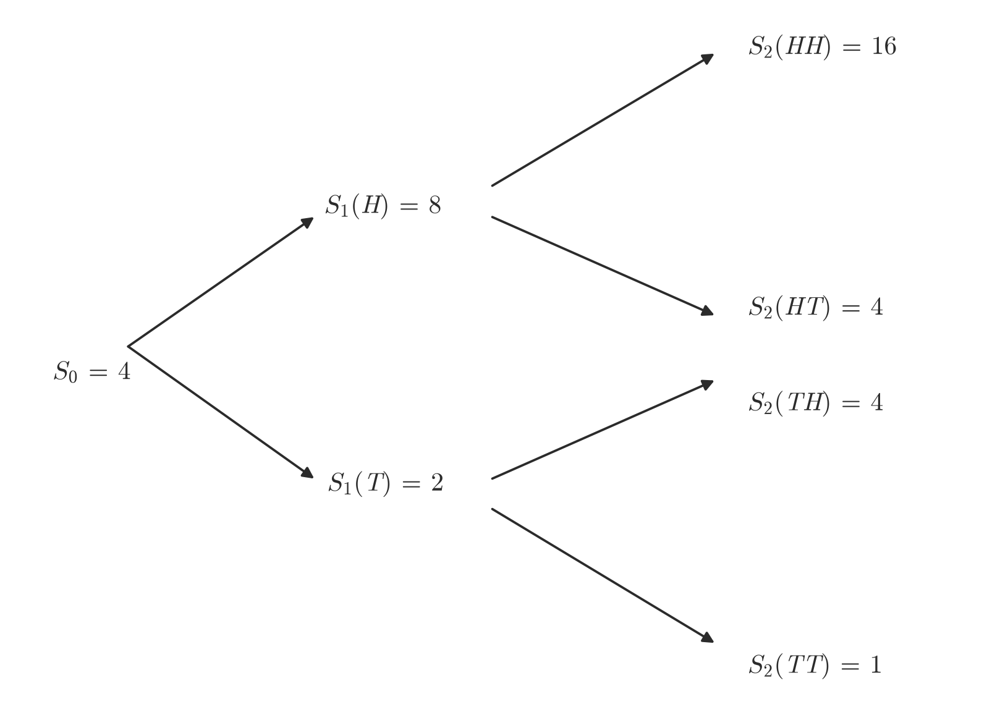
>
> **Figura 3** — Esempio di albero binomiale: da $S_0=4$ si diramano $S_1(H)=8$ e $S_1(T)=2$; da $S_1(H)=8$ si diramano $S_2(HH)=16$ e $S_2(HT)=4$; da $S_1(T)=2$ si diramano $S_2(TH)=4$ e $S_2(TT)=1$. Il grafico mostra tutte le traiettorie possibili del prezzo nei due giorni successivi ad oggi, con le relative probabilità di transizione (0.4 per il ramo "raddoppia", 0.6 per il ramo "dimezza").
>
> La **distribuzione condizionale** tra un giorno è
> $$
> p(S_1=s_1|S_0=4) = \begin{cases} s_1=8, & p=0.4 \\ s_1=2, & p=0.6\end{cases}
> $$
>
> Le **distribuzioni condizionali** tra due giorni risultano
> $$
> p(S_2=s_2|S_1=8) = \begin{cases} s_2=16, & p=0.4 \\ s_2=4, & p=0.6\end{cases}
> \qquad
> p(S_2=s_2|S_1=2) = \begin{cases} s_2=4, & p=0.4 \\ s_2=1, & p=0.6\end{cases}
> $$
>
> La **distribuzione marginale** dopo il primo giorno è
> $$
> p(S_1=s_1) = \begin{cases} s_1=8, & p=0.4 \\ s_1=2, & p=0.6\end{cases}
> $$
>
> La **distribuzione marginale** tra due giorni risulta quindi
> $$
> p(S_2=s_2) = \begin{cases}
> s_2=16, & p=0.4^2 \\
> s_2=4, & p=0.4\times0.6+0.6\times0.4 \\
> s_2=1, & p=0.6^2
> \end{cases}
> $$
> si ottengono così i valori numerici $p(S_2=16)=0.16$, $p(S_2=4)=0.48$, $p(S_2=1)=0.36$, che sommano correttamente a 1. Si noti la differenza concettuale rispetto alle distribuzioni condizionali sopra riportate: la marginale "integra via" l'informazione su $S_1$.

*(slide 14–17)*

## Autocorrelazione: definizione, ACF e PACF

> [!abstract] Definizione
> Nelle serie temporali è lecito aspettarsi che il valore di $Y$ al tempo $t$ sia dipendente dal proprio valore nel periodo successivo. La correlazione di una serie con i propri valori ritardati è detta **autocorrelazione** (o correlazione seriale): è la dipendenza lineare tra le realizzazioni di una variabile osservata in due istanti temporali diversi.
>
> Se, ad esempio, esiste un'autocorrelazione positiva, ci si aspetta che se $Y_{t-1}>0$, in media, anche $Y_t$ tenderà ad assumere valori positivi; oppure, al contrario, un'osservazione negativa sarà seguita da un'altra osservazione negativa.
>
> Si definisce la $j$-esima autocorrelazione $\rho_j$ come
> $$
> \rho_j = \frac{\mathrm{Cov}(Y_t,Y_{t-j})}{\sqrt{\mathrm{Var}(Y_t)\mathrm{Var}(Y_{t-j})}}.
> $$
>
> Lo stimatore della covarianza è
> $$
> \widehat{\mathrm{Cov}}(Y_t,Y_{t-j}) = \frac{1}{T-j-1}\sum_{t=j+1}^{T}(Y_t-\bar Y_{j+1,T})(Y_{t-j}-\bar Y_{1,T-j}),
> $$
> dove $\bar Y_{j+1,T}$ è la media campionaria calcolata sulle osservazioni $t=j+1,\dots,T$. Quindi lo stimatore della correlazione, **nell'ipotesi che** $\mathrm{Var}(Y_t)=\mathrm{Var}(Y_{t-j})$, è
> $$
> \hat\rho_j = \frac{\widehat{\mathrm{Cov}}(Y_t,Y_{t-j})}{\widehat{\mathrm{Var}}(Y_t)}.
> $$
>
> La **funzione di autocorrelazione (ACF)** descrive in maniera sintetica la struttura di correlazione tra $Y_t$ ed $Y_{t-j}$, indicata con $\rho_j$ per qualsiasi $j\ge 1$. Una rappresentazione grafica di tale dipendenza al variare di $j$ è detta **correlogramma**.
>
> Il coefficiente di **autocorrelazione parziale** misura la dipendenza di $Y_t$ da $Y_{t-j}$ al netto dei valori intermedi $Y_{t-1},\dots,Y_{t-j+1}$. La **funzione di autocorrelazione parziale (PACF)** descrive in maniera sintetica la sequenza di queste statistiche al variare di $j$.
>
> 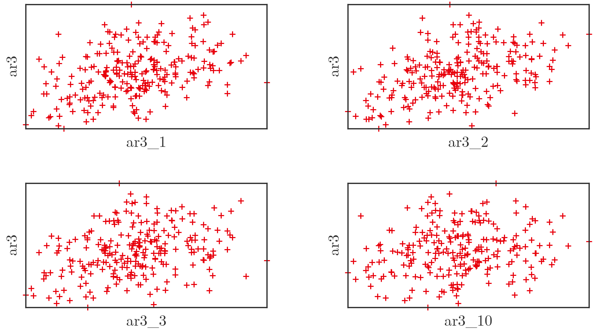
>
> **Figura 4** — Dipendenza tra $Y_t$ e $Y_{t-j}$, $j=1,2,3,4$ (serie "ar3"): quattro scatterplot di $Y_t$ contro i propri ritardi mostrano che la nuvola di punti è più "allineata" (correlata) per ritardi bassi e diventa più dispersa (meno correlata) all'aumentare del ritardo.
>
> 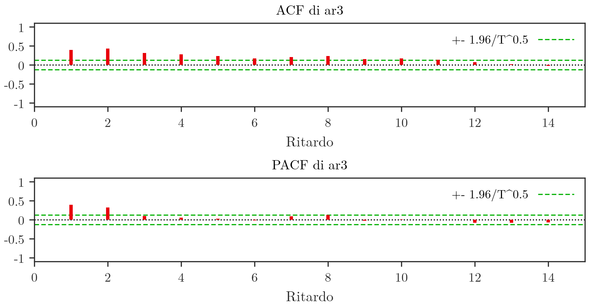
>
> **Figura 5** — Correlogramma della serie $Y_t$ (ar3): l'ACF mostra valori significativi ai primi ritardi che decrescono, mentre la PACF mostra picchi significativi solo ai primi ritardi (coerente con un processo autoregressivo di ordine basso); le bande tratteggiate rappresentano i limiti di significatività $\pm 1.96/\sqrt{T}$.

*(slide 18–22)*

## Il test di Ljung-Box per l'autocorrelazione

> [!tip] Teorema
> La struttura di autocorrelazione di una serie storica fornisce importanti informazioni, utili (i) per identificare un modello appropriato per i dati e (ii) per verificare se il modello proposto è corretto. È quindi importante controllare se le osservazioni presentano un'autocorrelazione seriale significativa. Tale verifica si basa sullo studio delle autocorrelazioni campionarie $\hat\rho_j$, $j=1,2,\dots$, che al variare del ritardo $j$ descrivono l'**autocorrelogramma**.
>
> Si dimostra che, sotto opportune ipotesi,
> $$
> \sqrt{T}\,\hat\rho_j \to N(0,1).
> $$
>
> Quindi, per verificare l'ipotesi nulla $H_0:\rho_j=0$ si può usare la statistica $\sqrt{T}\hat\rho_j$ e calcolare l'opportuno p-value con la distribuzione $N(0,1)$.
>
> Molto spesso si è interessati a verificare ipotesi più complesse, ad esempio l'ipotesi nulla congiunta $H_0:\rho_1=\rho_2=\dots=\rho_j=0$, cioè che le prime $j$ correlazioni siano nulle. Il **test di Ljung-Box** si basa sulla statistica
> $$
> Q_{LB}(j) = T(T+2)\sum_{i=1}^{j}\frac{\hat\rho_i^2}{T-i} \to \chi^2_j,
> $$
> ed è quindi possibile calcolare l'opportuno p-value.
>
> 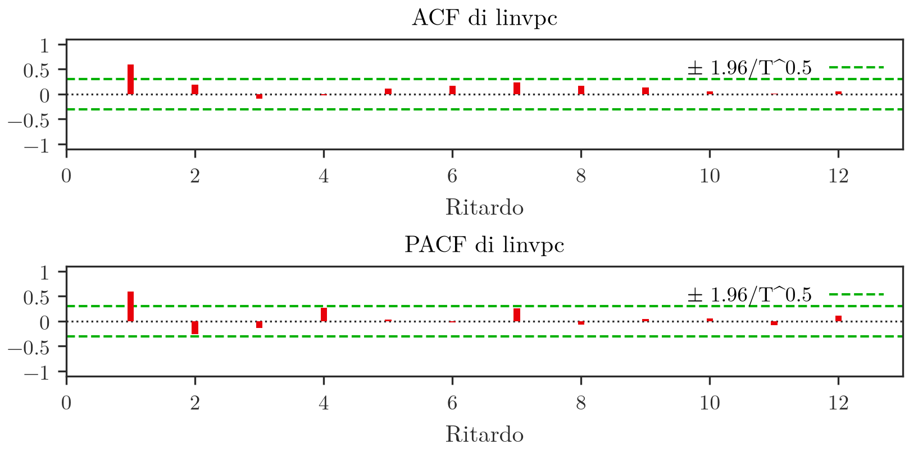
>
> **Figura 6** — Esempio di autocorrelogramma (serie "linvpc"): evidenzia la dipendenza tra un'osservazione della serie ed i suoi ritardi; sia ACF che PACF mostrano un picco marcato al primo ritardo, superiore alle bande di significatività.
>
> **Esempio numerico** — Funzione di autocorrelazione per $y_t$ per 12 ritardi:
>
> | LAG | ACF | Q-stat. | [p-value] |
> |---|---|---|---|
> | 1 | 0.5941 *** | 15.1699 | [0.000] |
> | 2 | 0.1864 | 16.6981 | [0.000] |
> | 3 | -0.0987 | 17.1372 | [0.001] |
> | 4 | -0.0255 | 17.1674 | [0.002] |
> | 5 | 0.1031 | 17.6713 | [0.003] |
> | 6 | 0.1613 | 18.9365 | [0.004] |
> | 7 | 0.2280 | 21.5325 | [0.003] |
> | 8 | 0.1696 | 23.0087 | [0.003] |
> | 9 | 0.1315 | 23.9214 | [0.004] |
> | 10 | 0.0556 | 24.0896 | [0.007] |
> | 11 | 0.0110 | 24.0964 | [0.012] |
> | 12 | 0.0475 | 24.2268 | [0.019] |
>
> Tutti i p-value della statistica $Q_{LB}(j)$ sono molto piccoli (≤ 0.019): si rifiuta l'ipotesi nulla di assenza di autocorrelazione fino al ritardo 12.

*(slide 23–26)*

## Modelli statici e il Capital Asset Pricing Model (CAPM)

> [!example] Esempio
> Il primo esempio di regressione statica riguarda la regressione semplice tra due variabili $Y$ ed $X$ in cui la relazione è definita da
> $$
> Y_t = \beta_0 + \beta_1 X_t + \epsilon_t, \qquad t=1,\dots,T.
> $$
> Il nome "statico" deriva dal fatto che si modella una relazione **contemporanea** tra le due grandezze. Questi modelli descrivono relazioni di lungo periodo, situazioni in cui l'economia si ipotizza essere in equilibrio. Sono proposti quando sembra ragionevole ipotizzare che $X$ abbia un impatto immediato su $Y$; quindi, se $\Delta\epsilon_t=0$, si può scrivere
> $$
> \Delta Y_t = \beta_1 \Delta X_t.
> $$
>
> **Esempio: il CAPM.** Un'idea rilevante della finanza moderna è che un investitore ha bisogno di un incentivo finanziario per assumere un rischio, cioè il rendimento atteso rischioso dovrebbe sempre essere maggiore di quello non rischioso. Il CAPM formalizza l'idea che il rischio dell'investimento è legato al rischio del mercato, approssimato tramite un **portafoglio di mercato**. Il CAPM si basa sulla relazione
> $$
> r_t - r_f = \beta(r_{mt}-r_f) + \epsilon_t,
> $$
> in cui $r_t$ ed $r_{mt}$ sono i rendimenti di un titolo rischioso e del portafoglio di mercato al tempo $t$, mentre $r_f$ è il rendimento di un titolo risk-free.
>
> 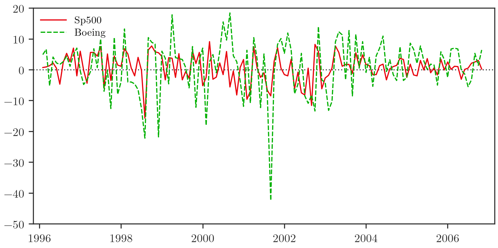
>
> **Figura 7** — Serie storiche del rendimento dell'indice Standard & Poor's 500 (portafoglio di mercato) e del titolo rischioso Boeing Co., dal 1996 al 2006: le due serie mostrano un andamento comovente, con la volatilità di Boeing generalmente amplificata rispetto a quella dell'indice.
>
> Stime OLS usando le 130 osservazioni 1996:02-2006:11, variabile dipendente: return_ba
>
> | VARIABILE | COEFFICIENTE | ERRORE STD | STAT T | P-VALUE |
> |---|---|---|---|---|
> | return_sp | 0.781803 | 0.161229 | 4.849 | <0.00001 *** |
>
> Media della variabile dipendente = 0.729731; Deviazione standard della variabile dipendente = 8.77071; Somma dei quadrati dei residui = 8452.02; Errore standard dei residui = 8.09441; R-quadro = 0.154171; R-quadro corretto = 0.154171; Statistica F (1, 129) = 23.5132 (p-value < 0.00001); Statistica Durbin-Watson = 1.92748.
>
> Un titolo con $\beta$ minore di 1 risulta meno rischioso rispetto al portafoglio di mercato e ha quindi un eccesso di rendimento atteso minore rispetto al portafoglio stesso. In pratica, un incremento dell'1% al tempo $t$ dell'eccesso di rendimento del portafoglio di mercato (S&P500) causa un incremento dello 0.78% del rendimento di Boeing.
>
> Il valore di
> $$
> R^2 = \frac{\hat\beta_i^2 \hat\sigma_M^2}{\hat\sigma_i^2} = 0.15
> $$
> può essere interpretato come la percentuale di rischio sistematico sul rischio complessivo.

*(slide 27–31)*

## Motivazioni per la specificazione dinamica dei modelli

In econometria esistono almeno due ragioni fondamentali che giustificano il ricorso alla specificazione dinamica dei modelli.
- Da un lato vi è l'esigenza di giungere ad una migliore comprensione del funzionamento nel tempo del sistema oggetto di studio, differenziando, ad esempio, il comportamento di breve periodo da quello di lungo periodo.
- Dall'altro lato vi può essere la necessità di disporre di un modello che, utilizzando osservazioni provenienti da serie storiche, abbia caratteristiche idonee a produrre buone previsioni.

Quindi l'idea è considerare modelli che, oltre a relazioni statiche tra variabili, incorporino al loro interno relazioni tra variabili differite nel tempo, quindi dinamiche.

*(slide 32)*

## Il processo white noise

> [!abstract] Definizione
> Una successione di variabili aleatorie $\epsilon_t$ si dice **white noise** (o rumore bianco) se ha le seguenti proprietà:
> $$
> E[\epsilon_t] = 0 \qquad \forall t
> $$
> $$
> E[\epsilon_t \epsilon_s] = \begin{cases}\sigma_\epsilon^2 & \text{se } t=s \\ 0 & \text{altrimenti.}\end{cases}
> $$
>
> Questo modello in generale non è adeguato per descrivere dati reali, che come già accennato sono molto spesso dipendenti; viene tuttavia utilizzato spesso per definire il processo che descrive il termine di errore (in inglese *noise*) di modelli più generali.
>
> 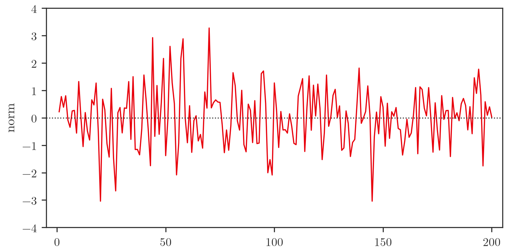
>
> **Figura 8** — Esempio di dati generati da un modello White Noise: la serie oscilla in modo irregolare attorno a zero, senza pattern visibile, con ampiezza compresa circa tra $-4$ e $4$.
>
> 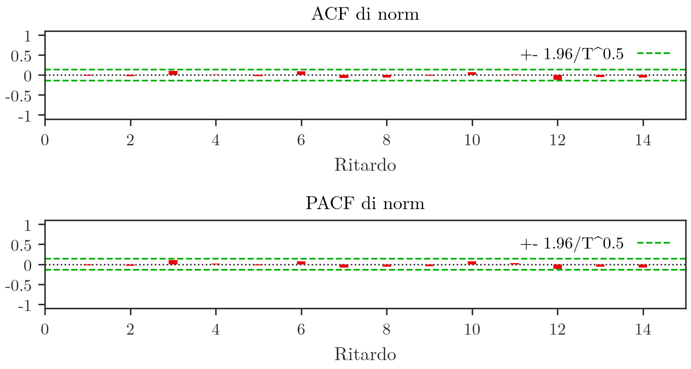
>
> **Figura 9** — Grafico dell'autocorrelogramma di un modello White Noise: sia l'ACF che la PACF non mostrano alcun valore significativamente diverso da zero a nessun ritardo, coerentemente con l'assenza di dipendenza seriale.

*(slide 33–35)*

## Modelli a media mobile MA(1) e MA(q)

> [!abstract] Definizione
> Una semplice estensione del modello White Noise si ottiene facendo dipendere l'osservazione presente dagli shock passati. Questa categoria di modelli prende il nome di **Moving Average (MA)**. Il modello MA(1), in cui l'osservabile dipende esclusivamente dallo shock passato e da quello presente, è
> $$
> Y_t = \alpha + \epsilon_t + \theta\epsilon_{t-1}, \qquad \epsilon_t \sim WN(0,\sigma^2).
> $$
>
> L'autocorrelogramma di $Y_t$ si calcola come segue:
> $$
> \mathrm{Cov}(Y_t,Y_{t-j}) = \begin{cases}
> (1+\theta)\sigma^2 & \text{se } j=0 \\
> \theta\sigma^2 & \text{se } j=1 \\
> 0 & \text{altrimenti.}
> \end{cases}
> $$
>
> **Dimostrazione.** Si ricordi che la sequenza $\epsilon_t$ soddisfa $\mathrm{Cov}(\epsilon_t,\epsilon_{t-j})=0$ per $j\ge 1$. Di conseguenza
> $$
> \mathrm{Cov}(Y_t,Y_{t-1}) = \mathrm{Cov}(\alpha+\epsilon_t+\theta\epsilon_{t-1},\ \alpha+\epsilon_{t-1}+\theta\epsilon_{t-2}) = \theta\sigma^2.
> $$
> La correlazione a ritardi superiori a 1 risulta sempre nulla.
>
> 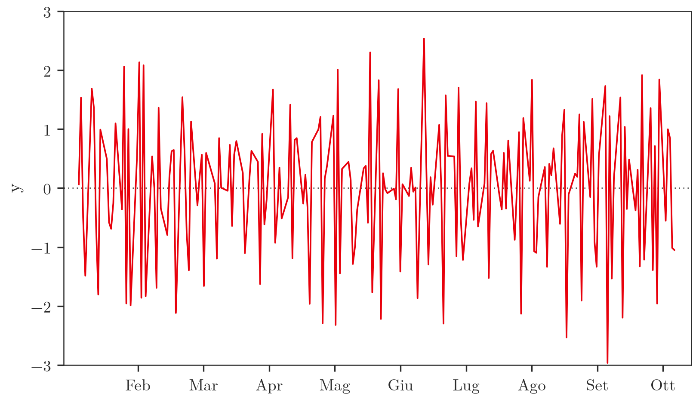
>
> **Figura 10** — Grafico di una serie storica MA(1) con $\theta=-0.7$ e $\sigma=0.9$: la serie oscilla in modo irregolare, con un pattern leggermente più "liscio" rispetto al white noise puro a causa della dipendenza dal ritardo 1.
>
> **Generalizzazione: MA(q).** L'osservazione di oggi dipende da $q$ shock passati:
> $$
> Y_t = \alpha + \epsilon_t + \theta_1\epsilon_{t-1} + \dots + \theta_q \epsilon_{t-q}.
> $$
> La media marginale è $E[Y_t]=\alpha$. La varianza marginale è
> $$
> \mathrm{Var}[Y_t] = \sigma^2\left(1+\theta_1^2+\dots+\theta_q^2\right).
> $$
> In generale, la funzione di autocorrelazione di un modello MA(q) assume valori diversi da 0 solo ai primi $q$ ritardi.
>
> **Esempio: MA(2).** Si consideri $Y_t = \alpha + \epsilon_t + \theta_1\epsilon_{t-1}+\theta_2\epsilon_{t-2}$. La struttura di autocorrelazione si calcola come segue.
>
> A ritardo 1:
> $$
> \mathrm{Cov}(Y_t,Y_{t-1}) = \mathrm{Cov}(\epsilon_t+\theta_1\epsilon_{t-1}+\theta_2\epsilon_{t-2},\ \epsilon_{t-1}+\theta_1\epsilon_{t-2}+\theta_2\epsilon_{t-3}) = \sigma^2\theta_1+\sigma^2\theta_1\theta_2 = \theta_1\sigma^2(1+\theta_2).
> $$
>
> A ritardo 2:
> $$
> \mathrm{Cov}(Y_t,Y_{t-2}) = \mathrm{Cov}(\epsilon_t+\theta_1\epsilon_{t-1}+\theta_2\epsilon_{t-2},\ \epsilon_{t-2}+\theta_1\epsilon_{t-3}+\theta_2\epsilon_{t-4}) = \sigma^2\theta_2.
> $$
>
> Per ritardi $j>2$:
> $$
> \mathrm{Cov}(Y_t,Y_{t-j}) = \mathrm{Cov}(\epsilon_t+\theta_1\epsilon_{t-1}+\theta_2\epsilon_{t-2},\ \epsilon_{t-j}+\theta_1\epsilon_{t-j-1}+\theta_2\epsilon_{t-j-2}) = 0.
> $$
>
> 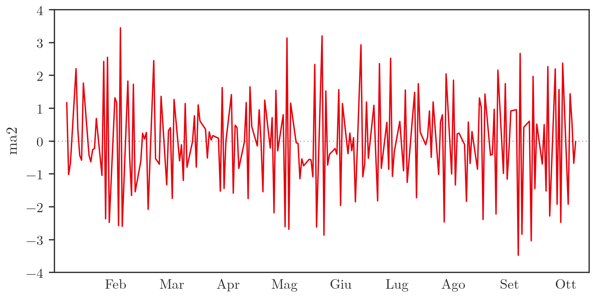
>
> **Figura 14** — Grafico di una serie storica di un modello MA(2) con $\theta_1=-0.9,\theta_2=0.7,\sigma=0.9$: la serie mostra oscillazioni più regolari rispetto al MA(1), riflesso della dipendenza da due shock passati.
>
> 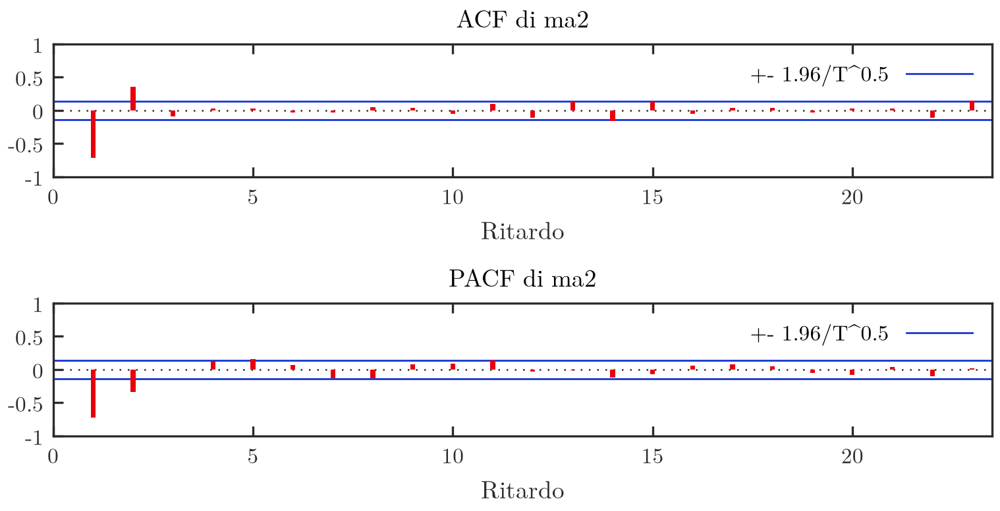
>
> **Figura 15** — Autocorrelogramma del modello MA(2) precedente: sia l'ACF sia la PACF mostrano valori significativi solo ai primi due ritardi, coerentemente con la teoria.

*(slide 36–38)*

## Esempio: il modello di Roll per il bid-ask spread (MA(1))

> [!example] Esempio
> Nel caso di applicazioni finanziarie, il modello MA(1) può essere interessante per descrivere l'andamento di un rendimento atteso in presenza di uno spread tra prezzi di domanda e di offerta.
>
> In alcuni mercati (NYSE) i *market maker* forniscono liquidità comprando e vendendo quantità rilevanti di asset in maniera anonima, senza modificarne sostanzialmente il prezzo. In cambio si riservano il diritto di vendere gli asset ad un prezzo leggermente maggiore rispetto a quello di acquisto. Essi acquistano un asset al prezzo *bid* $P_b$ e cercano di venderlo al prezzo *ask* $P_a$; la differenza $S=P_a-P_b$, detta **bid-ask spread**, è di solito piccola.
>
> Si consideri la serie storica dei prezzi intra-giornalieri di un asset finanziario osservata per 15 giorni nel mercato NYSE.
>
> 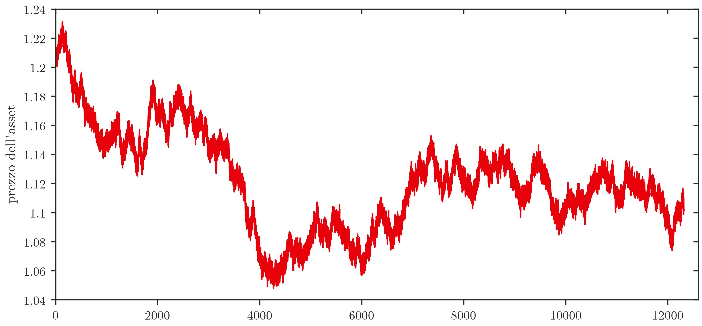
>
> **Figura 12** — Prezzi intra-giornalieri dell'asset: la serie oscilla tra circa 1.04 e 1.24, con andamento a zig-zag rapido tipico dei dati ad alta frequenza intraday.
>
> **Modello di Roll (1984).** Il prezzo osservato $P_t$ di un asset al tempo $t$ è
> $$
> P_t = P_t^* + I_t\frac{S}{2} = P_t^* + \begin{cases} +S/2 & \text{con prob. } 0.5 \\ -S/2 & \text{con prob. } 0.5 \end{cases}
> $$
> dove: $S=P_a-P_b$ è lo spread; $P_t^*$ è il prezzo teorico (fondamentale) dell'asset in un mercato senza frizioni; $I_t$ è una sequenza di variabili binarie con $P(I_t=-1)=P(I_t=1)=0.5$, interpretabile come indicatore del tipo d'ordine: $+1$ se la transazione è iniziata dall'acquirente, $-1$ se dal venditore.
>
> Ipotizzando che il prezzo fondamentale non cambi, si calcola il rendimento
> $$
> \Delta P_t = (I_t-I_{t-1})\frac{S}{2}.
> $$
> Si può facilmente dimostrare che:
> - $E[\Delta P_t] = 0$ (coerente con la teoria dei mercati efficienti);
> - $\mathrm{Var}(\Delta P_t) = S^2/2$;
> - $\mathrm{Cov}(\Delta P_t,\Delta P_{t-1}) = -S^2/4 \Rightarrow \mathrm{Corr}(\Delta P_t,\Delta P_{t-1}) = -0.5$;
> - $\mathrm{Cov}(\Delta P_t,\Delta P_{t-j}) = 0,\ \forall j>1$.
>
> Questo modello riproduce esattamente la struttura di autocorrelazione di un modello MA(1). Il bid-ask spread induce quindi una correlazione negativa a ritardo 1 nella serie osservata dei rendimenti: fenomeno chiamato in letteratura **bid-ask bounce**.
>
> **Intuizione.** Ipotizzando $P_t^* = (P_a+P_b)/2$, il prezzo osservabile risulta essere $P_a$ o $P_b$. Supponendo che il prezzo osservabile passato ($t-1$) sia $P_a$, oggi il prezzo sarà ancora $P_a$ oppure più basso ($P_b$). Come conseguenza:
> $$
> \Delta P_t = \begin{cases} 0 & \text{con prob. } 0.5 \\ -S & \text{con prob. } 0.5 \end{cases}
> $$
> L'autocorrelazione negativa a ritardo 1 (e non a ritardi successivi) viene introdotta in maniera evidente.
>
> 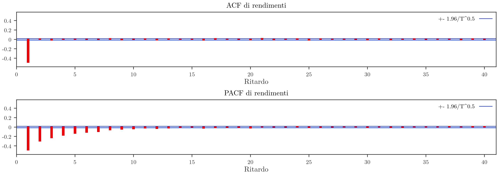
>
> **Figura 13** — Struttura di autocorrelazione (ACF e PACF) dei rendimenti calcolati sui dati di Figura 12: si osserva un unico valore negativo significativo al ritardo 1 nell'ACF, in linea con quanto atteso per un modello MA(1); la PACF mostra invece una struttura decrescente su più ritardi, tipica della rappresentazione AR di un processo MA.
>
> **Stima di massima verosimiglianza.** I modelli MA si stimano tipicamente per massima verosimiglianza. Stima dei parametri del modello MA(1) $Y_t = \alpha + \theta\epsilon_{t-1}+\epsilon_t$:
>
> Modello 2: MA, usando le osservazioni 1:002-124:017 (T = 12316). Stimato usando il filtro di Kalman (MV esatta). Variabile dipendente: rendimenti. Errori standard basati sull'Hessiana.
>
> | | coefficiente | errore std. | z | p-value |
> |---|---|---|---|---|
> | const | -8.20737e-06 | 9.22571e-06 | -0.8896 | 0.3737 |
> | theta_1 | -0.815431 | 0.00521480 | -156.4 | 0.0000 *** |
>
> Media var. dipendente -8.80e-06; SQM var. dipendente 0.007132; Media innovazioni -7.63e-07; SQM innovazioni 0.005545; Log-verosimiglianza 46503.13; Criterio di Akaike -93000.26; Criterio di Schwarz -92978.01; Hannan-Quinn -92992.81. (Note: SQM = scarto quadratico medio; E.S. = errore standard)

*(slide 39–46)*

## Modelli autoregressivi AR(1) e AR(p)

> [!abstract] Definizione
> Molto spesso i modelli specificati per dati di serie storica vengono utilizzati per fare previsioni su una variabile di interesse. Il primo modello considerato è il **Modello Autoregressivo**, in cui una variabile è spiegata dal proprio passato tramite ritardi. Il modello più semplice è quello autoregressivo del primo ordine, **AR(1)**:
> $$
> Y_t = \beta_0 + \beta_1 Y_{t-1} + \epsilon_t.
> $$
> L'autocorrelogramma tipico per questo modello tende a decrescere a zero: $Y_t$ dipende fortemente dalle osservazioni vicine ($Y_{t-1},Y_{t-2},\dots$) ma non da quelle lontane. Ad esempio, ciò che è successo 10 giorni fa potrebbe non essere interessante per prevedere ciò che accadrà domani, mentre lo è ciò che è accaduto ieri, l'altro ieri e così via, con importanza decrescente, fino a diventare nulla ad un numero elevato di ritardi.
>
> 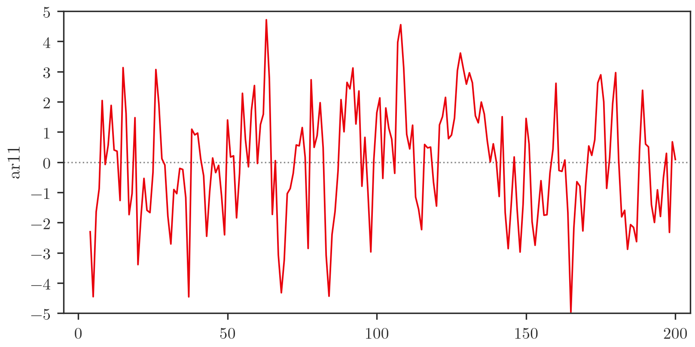
>
> **Figura 16** — Grafico di una serie autocorrelata al primo ordine: la serie oscilla con maggiore persistenza rispetto al white noise, alternando fasi più prolungate sopra e sotto lo zero.
>
> 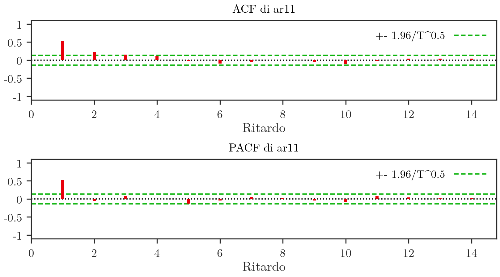
>
> **Figura 17** — Autocorrelogramma del modello AR(1): l'ACF decresce gradualmente verso zero all'aumentare del ritardo, mentre la PACF mostra un unico picco significativo al ritardo 1, coerente con la teoria del modello AR(1).
>
> **Modello AR(p).** Il modello AR(1) utilizza solo l'informazione fornita da $Y_{t-1}$ per prevedere $Y_t$. Un'estensione naturale è il modello autoregressivo di ordine $p$:
> $$
> Y_t = \beta_0 + \beta_1 Y_{t-1} + \dots + \beta_p Y_{t-p} + \epsilon_t.
> $$
> La previsione per $Y_{T+1}$ è data da
> $$
> \hat Y_{T+1|T} = \hat\beta_0 + \hat\beta_1 Y_T + \dots + \hat\beta_p Y_{T-p+1}.
> $$
>
> 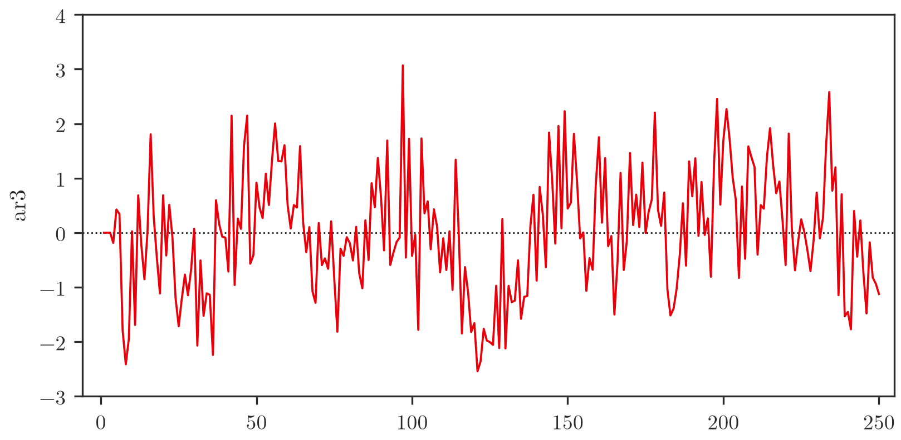
>
> **Figura 18** — Grafico di una serie autocorrelata al terzo ordine (AR(3)): la serie mostra cicli più ampi e persistenti rispetto all'AR(1), con più lenta reversione verso lo zero.
>
> 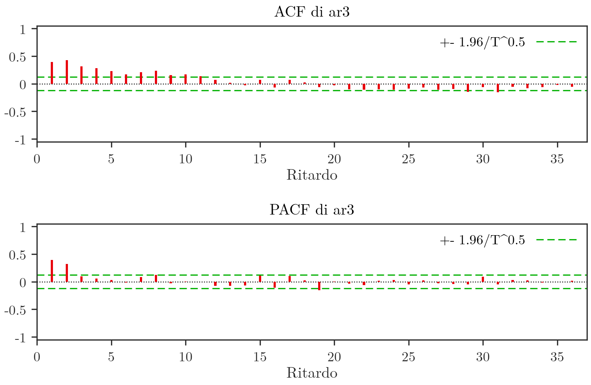
>
> **Figura 19** — Autocorrelogramma del modello AR(3): l'ACF decresce lentamente e in modo oscillante, mentre la PACF mostra picchi significativi solo ai primi tre ritardi, coerentemente con l'ordine del processo generatore.

*(slide 51–56)*

## Il modello autoregressivo misto ADL(p,q)

> [!abstract] Definizione
> I modelli visti fino ad ora sono modelli statistici, utili per fare previsioni. In economia, però, si è più spesso interessati allo studio delle relazioni causali tra variabili, per cercare di capire il tipo di dipendenza che esiste tra grandezze economiche. Per analizzare queste relazioni, quando i dati sono espressi in forma di serie storica, è stata proposta una tipologia di modelli più generali detti **modelli autoregressivi misti** o **ADL(p,q)** ("Autoregressive Distributed Lag"), definiti come segue:
> $$
> Y_t = \beta_0+\beta_1 Y_{t-1}+\dots+\beta_p Y_{t-p}+\delta_0 X_t+\delta_1 X_{t-1}+\dots+\delta_q X_{t-q}+\epsilon_t,
> $$
> in cui la dinamica riguarda sia la parte autoregressiva (relativa a $Y$) sia la componente detta **a ritardi distribuiti** (legata a $X$).

*(slide 57)*

## Le ipotesi per la stima OLS nei modelli dinamici: il problema dell'esogenità

> [!note] Dimostrazione
> Per fare inferenza è necessario prima verificare se sono soddisfatte le ipotesi per gli OLS. Si consideri ad esempio il modello AR(1)
> $$
> Y_t = \beta Y_{t-1} + \epsilon_t.
> $$
> Nel modello di regressione semplice deve valere, tra l'altro, $E[\epsilon_i|X_1,\dots,X_N]=0,\ \forall i$. Nel contesto dinamico AR(1), l'unico regressore è $X_t\equiv Y_{t-1}$. La condizione di esogenità diviene quindi $E[\epsilon_t|Y_1,\dots,Y_T]=0,\ \forall t$.
>
> **Dimostrazione (l'esogenità stretta non vale nei modelli dinamici).** Se vale $E[\epsilon_t|X_t]=E[\epsilon_t|Y_{t-1}]=0$, allora $\mathrm{Cov}[\epsilon_t Y_{t-1}]=0$. Si calcoli però
> $$
> E[\epsilon_t X_{t+1}] = E[\epsilon_t Y_t] = E[\epsilon_t(\beta Y_{t-1}+\epsilon_t)] = \beta\underbrace{E[\epsilon_t Y_{t-1}]}_{=0 \text{ per ip.}} + E[\epsilon_t^2] \neq 0.
> $$
> Per cui, nel caso di modelli dinamici, **non può essere utilizzata** l'ipotesi di stretta esogenità e quindi non si può parlare di non distorsione (unbiasedness) dello stimatore OLS. Fortunatamente è ancora possibile dimostrare, sotto opportune ipotesi, che lo stimatore OLS è **consistente** (l'eventuale distorsione sparisce per $T$ sufficientemente grande).
>
> **La sostituzione dell'ipotesi di indipendenza con la stazionarietà.** Non si può utilizzare l'ipotesi di indipendenza del vettore $(Y,X_1,\dots,X_K)$: i dati in serie storica per loro natura non sono indipendenti. È comunque possibile indebolire tale ipotesi sostituendola con opportune condizioni di regolarità sulla forma di dipendenza, ad esempio richiedendo che la serie storica sia **stazionaria**.
>
> Una serie storica è definita **stazionaria (debolmente)** se:
> - la media di $Y_t$ non dipende dal tempo, $E[Y_t]=\mu$;
> - la varianza di $Y_t$ non dipende da $t$, $\mathrm{Var}(Y_t)=\sigma^2$;
> - la struttura di dipendenza lineare dipende solo dalla distanza tra due osservazioni: $\mathrm{Cov}(Y_s,Y_t)=\gamma_{t-s}$.
>
> **Un altro caso di endogenità: errore autocorrelato con endogena ritardata.** Si consideri il modello
> $$
> Y_t = \beta_1+\beta_2 X_t+\beta_3 Y_{t-1}+\varepsilon_t, \qquad \varepsilon_t=\rho\varepsilon_{t-1}+\upsilon_t.
> $$
> È vero che $E(Y_{t-1}\varepsilon_t)=0$? Sostituendo,
> $$
> Y_t = \beta_1+\beta_2 X_t+\beta_3 Y_{t-1}+\underbrace{\rho\varepsilon_{t-1}+\upsilon_t}_{\varepsilon_t}.
> $$
> Se $\rho\neq 0$, $\varepsilon_t$ risulta chiaramente correlata con $Y_{t-1}$ (poiché $Y_{t-1}$ dipende, tramite la sua stessa equazione, da $\varepsilon_{t-1}$). Di conseguenza il modello non descrive una media condizionale corretta:
> $$
> E(Y_t|X_t,Y_{t-1}) = \beta_1+\beta_2 X_t+\beta_3 Y_{t-1}+\underbrace{E(\varepsilon_t|X_t,Y_{t-1})}_{\neq 0}.
> $$
> OLS, di conseguenza, **non è consistente** in questo caso.

*(slide 58–61)*

## L'ipotesi di stazionarietà nel caso AR(1)

> [!note] Dimostrazione
> Si consideri il modello AR(1) definito da $Y_t = \beta_0+\beta_1 Y_{t-1}+\epsilon_t$, con $\epsilon_t\sim WN(0,\sigma^2)$. È interessante chiedersi sotto quali condizioni questo modello risulta stazionario. Per semplicità si ipotizzi $\beta_0=0$; risolvendo all'indietro:
> $$
> Y_t = \beta_1\underbrace{Y_{t-1}}_{\beta_1 Y_{t-2}+\epsilon_{t-1}}+\epsilon_t = \beta_1^2 Y_{t-2}+\beta_1\epsilon_{t-1}+\epsilon_t = \dots = \sum_{j=0}^{\infty}\beta_1^j \epsilon_{t-j}.
> $$
>
> **Media.** È immediato constatare che
> $$
> E[Y_t] = \sum_{j=0}^{\infty}\beta_1^j E[\epsilon_{t-j}] = 0,
> $$
> non dipende quindi da $t$.
>
> **Varianza.** Diversamente, la varianza non dipende da $t$ solo se $|\beta_1|<1$:
> $$
> \mathrm{Var}(Y_t) = \mathrm{Var}(\epsilon_t)\sum_{j=0}^{\infty}\beta_1^{2j} = \frac{\sigma^2}{1-\beta_1^2}.
> $$
> Nota: si ricordi che $\sum_{j=0}^{\infty}x^j = \frac{1}{1-x} \iff |x|<1$. In questa applicazione $x\equiv\beta_1^2$.
>
> **Covarianza.** La covarianza dipende unicamente dalla distanza tra le due osservazioni. Tramite opportune sostituzioni all'indietro si può scrivere
> $$
> Y_t = \beta_1^s Y_{t-s} + \sum_{j=0}^{s-1}\beta_1^j \epsilon_{t-j},
> $$
> per cui la covarianza tra $Y_t$ ed $Y_{t-s}$ risulta
> $$
> \mathrm{Cov}(Y_t,Y_{t-s}) = E[Y_t Y_{t-s}] = E\left[\left(\beta_1^s Y_{t-s}+\sum_{j=0}^{s-1}\beta_1^j\epsilon_{t-j}\right)Y_{t-s}\right]
> $$
> $$
> = \beta_1^s\mathrm{Var}[Y_{t-s}]+\sum_{j=0}^{s-1}\mathrm{Cov}(Y_{t-s},\beta_1^j\epsilon_{t-j}) = \beta_1^s\mathrm{Var}(Y_t).
> $$

*(slide 62–64)*

## Break strutturali e il test di Chow

> [!tip] Teorema
> Quando si analizzano modelli di serie storiche, può succedere che un evento esterno modifichi il tipo di relazione tra variabile dipendente e regressore. I parametri del modello di regressione in un sotto-campione (ad esempio le prime $T_1$ osservazioni) possono essere diversi da quelli del secondo sotto-campione (le osservazioni da $T_1+1$ a $T$). Si parla in questi casi di **break strutturale**.
>
> Si scelga, per fissare le idee, il modello ADL(1,1)
> $$
> Y_t = \beta_0+\beta_1 Y_{t-1}+\delta_0 X_t+\delta_1 X_{t-1}+\epsilon_t,
> $$
> ipotizzando che un evento capace di causare un break strutturale sia avvenuto ad un tempo $\tau\in[1,T]$ **noto**.
>
> **Il test di Chow.** Si vuole verificare se i parametri del modello per le osservazioni precedenti a $\tau$ sono diversi da quelli per le osservazioni successive. Si costruisce una variabile dummy $D_t(\tau)$:
> $$
> D_t(\tau) = \begin{cases} 0 & \text{se } t\le\tau \\ 1 & \text{se } t>\tau. \end{cases}
> $$
> Il modello si riscrive come
> $$
> Y_t = \beta_0+\beta_1 Y_{t-1}+\delta_0 X_t+\delta_1 X_{t-1}+\gamma_0 D_t(\tau)+\gamma_1 D_t(\tau)Y_{t-1}+\gamma_2 D_t(\tau)X_t+\gamma_3 D_t(\tau)X_{t-1}+\epsilon_t,
> $$
> che assume le due forme:
> $$
> Y_t = \begin{cases}
> \beta_0+\beta_1 Y_{t-1}+\delta_0 X_t+\delta_1 X_{t-1}+\epsilon_t & t\le\tau \\
> (\beta_0+\gamma_0)+(\beta_1+\gamma_1)Y_{t-1}+(\delta_0+\gamma_2)X_t+(\delta_1+\gamma_3)X_{t-1}+\epsilon_t & t>\tau.
> \end{cases}
> $$
> Se non ci fosse rottura strutturale in $\tau$, le funzioni di regressione prima e dopo tale data dovrebbero coincidere. Il test di Chow verifica sotto $H_0$ l'uguaglianza a zero dei parametri $\gamma_i,\ \forall i$, cioè $\gamma_0=\gamma_1=\gamma_2=\gamma_3=0$. Se $H_0$ fosse vera, non si verificherebbe un cambiamento del modello in data $\tau$. Dal punto di vista pratico si tratta di calcolare un'opportuna statistica $F$.
>
> **Il problema della data ignota e la statistica QLR.** In generale non è nota a priori la data $\tau$ in cui si verificherà il break strutturale. Si può affrontare il problema calcolando il test di Chow per ogni potenziale valore di $\tau$, ottenendo una sequenza di statistiche $F_\tau$: la statistica $F$ con valore più grande presumibilmente corrisponde al possibile break. La statistica **QLR** (Quandt Likelihood Ratio) è
> $$
> QLR = \max\{F(1),\dots,F(T)\},
> $$
> la cui distribuzione non è nota in forma chiusa, anche se è comunque possibile calcolare numericamente i p-value.

*(slide 65–68)*

## Esempio: break strutturale nel titolo Exelon

> [!example] Esempio
> Si supponga di voler sottoporre a verifica il modello CAPM utilizzando gli extra-rendimenti mensili del titolo Exelon per il periodo 1991-2000, usando come proxy del mercato l'indice S&P 500.
>
> La verifica del CAPM su tutto il periodo evidenzia come il $\beta$ del titolo sia nullo — risultato apparentemente strano. Un'analisi economica più dettagliata ha evidenziato come nel 1998, in corrispondenza di una breve crisi economica, il titolo Exelon abbia realizzato una serie di extra-rendimenti elevati in controtendenza con l'intero mercato. Ci si chiede quindi se nel 1998 si siano verificati break strutturali che spiegano un valore del $\beta$ così anomalo.
>
> **Regressione sull'intero campione** (extra-rendimenti dal 1991 al 2000). Stime OLS usando le 119 osservazioni 1991:02-2000:12, variabile dipendente: rend_exln
>
> | VARIABILE | COEFFICIENTE | ERRORE STD | STAT T | P-VALUE |
> |---|---|---|---|---|
> | const | 0.00529475 | 0.00662467 | 0.799 | 0.42577 |
> | rend_mkt | 0.0153368 | 0.171593 | 0.089 | 0.92893 |
>
> Errore standard dei residui = 0.0722002; R-quadro = 6.82742e-005; R-quadro corretto = -0.00847815.
>
> **Test QLR.** Test del rapporto di verosimiglianza di Quandt per break strutturale in un punto sconosciuto del campione, escludendo il 15 percento iniziale e finale: il massimo di $F(2,115)=7.6702$ corrisponde all'osservazione 1998:04, significativo al livello del 5 per cento (5% valore critico = 5.86). Il test suggerisce che la data $\tau$ più plausibile per il break strutturale corrisponde al mese di aprile 1998.
>
> **Regressione sul primo sottocampione** (febbraio 1991 - marzo 1998, prima del break). Modello 2: stime OLS usando le 86 osservazioni 1991:02-1998:03, variabile dipendente: rend_exln
>
> | VARIABILE | COEFFICIENTE | ERRORE STD | STAT T | P-VALUE |
> |---|---|---|---|---|
> | const | -0.00507088 | 0.00580824 | -0.873 | 0.38513 |
> | rend_mkt | 0.582303 | 0.181555 | 3.207 | 0.00190 *** |
>
> Ora il $\beta$ risulta significativamente diverso da 0.
>
> **Regressione sul secondo sottocampione** (aprile 1998 - dicembre 2000, dopo il break). Stime OLS usando le 33 osservazioni 1998:04-2000:12, variabile dipendente: rend_exln
>
> | VARIABILE | COEFFICIENTE | ERRORE STD | STAT T | P-VALUE |
> |---|---|---|---|---|
> | const | 0.0254586 | 0.0170836 | 1.490 | 0.14627 |
> | rend_mkt | -0.483655 | 0.328312 | -1.473 | 0.15079 |
>
> Ora il $\beta$ risulta non significativo, ma solo in questo sottocampione (si verifichi che applicando il test QLR nei due sottocampioni non si verificano altri break).

*(slide 69–73)*

## Trend deterministico e trend stocastico

> [!abstract] Definizione
> Molto spesso le variabili economiche sono influenzate da una componente detta **trend**, che rappresenta un movimento persistente di lungo periodo di una variabile nel corso del tempo. Esistono due tipi di trend, che producono effetti molto diversi sulle serie dei dati:
> - **Trend deterministico**: la componente tendenziale è descritta da una funzione $g(\cdot)$ non aleatoria del tempo, ad esempio $g(t)=t$ oppure $g(t)=\alpha_1 t+\alpha_2 t^2+\dots+\alpha_p t^p$, con gli $\alpha_i$ noti.
> - **Trend stocastico**: la componente tendenziale varia nel tempo in maniera aleatoria; ad esempio può manifestarsi come un prolungato periodo di crescita della serie seguito da un prolungato periodo di stabilità o di decrescita.
>
> 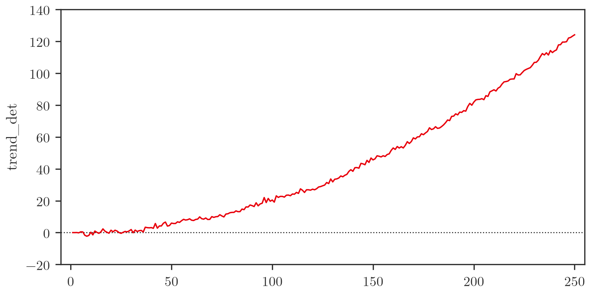
>
> **Figura 20** — Esempio di trend deterministico del tipo $Y_t = \alpha_0+\alpha_1 t+\alpha_2 t^2+\epsilon_t$: la serie cresce in modo regolare, curvilineo, con oscillazioni casuali di ampiezza contenuta attorno alla curva deterministica.
>
> 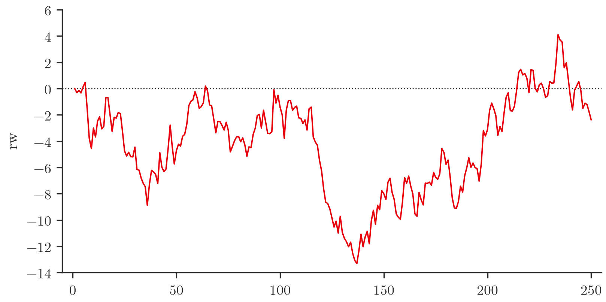
>
> **Figura 21** — Esempio di trend stocastico: la serie mostra fasi prolungate di crescita e decrescita irregolari, senza seguire un percorso deterministico prevedibile, scendendo fino a circa $-14$ nell'arco delle osservazioni mostrate.

*(slide 74–76)*

## Il random walk e la sua non stazionarietà

> [!note] Dimostrazione
> Il caso più interessante da un punto di vista economico è quello dei trend stocastici, poiché spesso non è credibile supporre che una serie storica economica sia predicibile in maniera deterministica. Uno dei modelli più semplici che generano trend stocastici è un AR(1) in cui $\beta_1=1$, detto **random walk**:
> $$
> Y_t = Y_{t-1}+\epsilon_t.
> $$
> L'idea di base è che quello che si osserverà domani, $Y_{t+1}$, sia uguale a quello che si osserva oggi, $Y_t$, più uno shock con media nulla. Tale modello sembra ragionevole soprattutto in applicazioni finanziarie, dove si pensa che la migliore previsione del prezzo di domani sia rappresentata dal prezzo osservato oggi (teoria dei mercati efficienti).
>
> 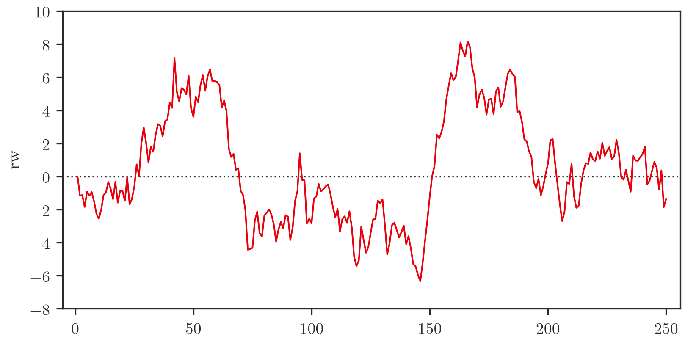
>
> **Figura 22** — Grafico di $Y_t=Y_{t-1}+\epsilon_t$: la serie mostra un tipico andamento "a deriva", con lunghe escursioni non prevedibili, muovendosi tra circa $-8$ e $10$.
>
> 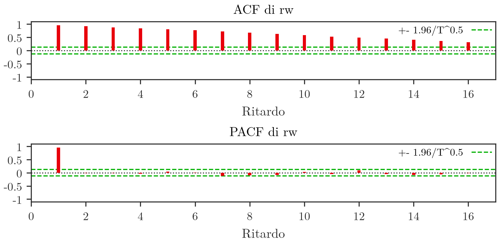
>
> **Figura 23** — Correlogramma di $Y_t=Y_{t-1}+\epsilon_t$: l'ACF decresce molto lentamente restando elevata anche a ritardi alti, mentre la PACF mostra un solo picco significativo al ritardo 1 — tipica "firma" di non stazionarietà.
>
> **Dimostrazione (il random walk non è stazionario).** Il random walk è un caso particolare del modello AR(1) con $\beta_0=0,\beta_1=1$. Se fosse stazionario, si dovrebbe avere $\mathrm{Var}(Y_t)=\sigma_Y^2,\ \forall t$. Tuttavia
> $$
> \mathrm{Var}(Y_t) = \mathrm{Var}(Y_{t-1})+\mathrm{Var}(\epsilon_t),
> $$
> condizione vera solo se $\mathrm{Var}(\epsilon_t)=0$, il che è impossibile poiché $\mathrm{Var}(\epsilon_t)=\sigma^2$ per ipotesi.
>
> Scrivendo $Y_t$ in funzione degli errori passati, ipotizzando per semplicità $Y_0=0$, si ottiene
> $$
> Y_1=\epsilon_1,\quad Y_2=Y_1+\epsilon_2=\epsilon_1+\epsilon_2,\quad\dots,\quad Y_t = \epsilon_1+\dots+\epsilon_t = \underbrace{\sum_{j=1}^{t}\epsilon_j}_{\text{trend stocastico}}.
> $$
> Quindi
> $$
> \mathrm{Var}(Y_t) = \mathrm{Var}\left(\sum_{j=1}^{t}\epsilon_j\right) = t\sigma^2,
> $$
> che dipende da $t$: la varianza diverge con $t$, e le autocorrelazioni non sono nemmeno definite (in senso teorico). Le autocorrelazioni campionarie però si possono comunque calcolare, e tendono ad essere prossime a uno anche ad elevati ritardi.

*(slide 77–81)*

## Random walk con drift

> [!abstract] Definizione
> Di frequente le serie economiche mostrano una tendenza sistematica. In questo caso una buona previsione non potrà essere data semplicemente dall'osservazione al tempo $t$, ma dovrà essere corretta per tenere conto della tendenza sistematica.
>
> L'estensione più ovvia del modello random walk è il **Random Walk con drift**:
> $$
> Y_t = \beta_0+Y_{t-1}+\epsilon_t = \beta_0 t+Y_0+\sum_{j=1}^{t}\epsilon_t.
> $$
> - Se $\beta_0>0$ allora $Y_t$ tenderà in media a crescere;
> - Se $\beta_0<0$ allora $Y_t$ tenderà in media a decrescere.
>
> La previsione associata a questo modello è il valore osservato oggi più il drift $\beta_0$.
>
> 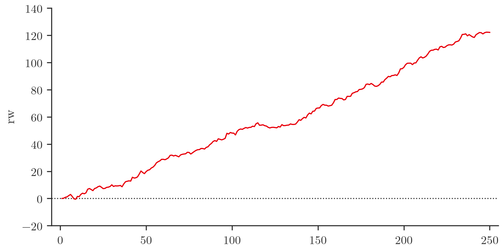
>
> **Figura 24** — Grafico di $Y_t=0.5+Y_{t-1}+\epsilon_t$: la serie mostra una crescita netta e progressiva, da circa 0 fino a circa 120-140, sovrapposta a fluttuazioni casuali di breve periodo — il drift positivo domina l'andamento di lungo periodo.

*(slide 82–83)*

## Conseguenze dei trend stocastici per la stima OLS

> [!tip] Teorema
> L'ipotesi di stazionarietà è imprescindibile ai fini dell'inferenza. La sua violazione ha importanti conseguenze:
>
> 1. Se un regressore $X_{jt}$ ha un trend stocastico, la distribuzione della statistica $t=\dfrac{\hat\beta_j-\beta_{j0}}{\hat\sigma_{\hat\beta_j}}$ ha una distribuzione diversa da quella Gaussiana sotto $H_0$, con la conseguenza che l'abituale procedura di verifica d'ipotesi porta a risultati errati.
>
> 2. Se la serie $Y_t$ è correttamente descritta da un modello random walk, ma per errore si stima un modello AR(1), si può dimostrare che lo stimatore è consistente ma **distorto**: infatti $E[\hat\beta_1] = 1-5.3/T$. Inoltre, la distribuzione asintotica di $\hat\beta_1$ risulta non Gaussiana ed asimmetrica (verso lo zero).
>
> 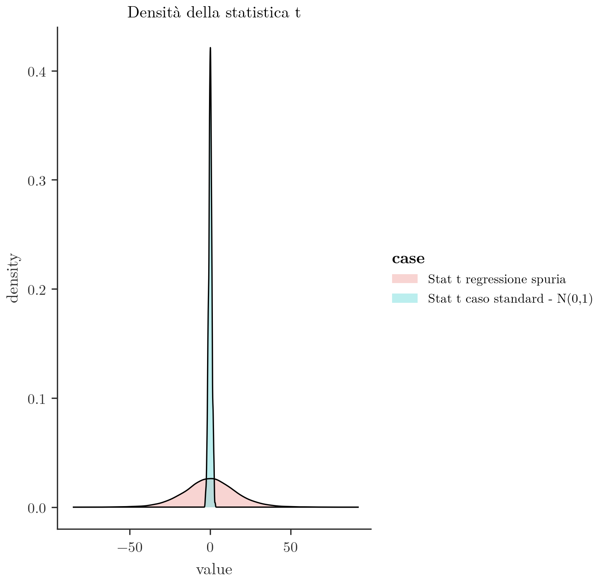
>
> **Figura 25** — Distribuzione della statistica $t$ nel caso standard (area verde — $N(0,1)$) e nel caso in cui $X$ ed $Y$ sono random walk (area rosa), con $T=500$: la densità dell'area rosa risulta molto più concentrata e stretta attorno allo zero rispetto alla Normale standard, mostrando che la statistica $t$ calcolata sotto trend stocastici non è confrontabile con i valori critici usuali di una $N(0,1)$.

*(slide 84–85)*

## La regressione spuria

> [!tip] Teorema
> Si consideri la regressione
> $$
> Y_t = \beta_0+\beta_1 X_t+\epsilon_t
> $$
> in cui sia $X_t$ che $Y_t$ sono descritti da **random walk indipendenti**. Il vero valore di $\beta_1$ è 0 per costruzione. Si dimostra che:
> - lo stimatore OLS $\hat\beta_1$ non converge a 0, ma ad una variabile casuale non Gaussiana e non necessariamente a media nulla;
> - la conseguenza più evidente riguarda la distribuzione della statistica $t$, che risulta ben lungi dall'essere una Normale standard (si veda la Figura 25);
> - l'$R^2$ della regressione tende a 1 se $T\to+\infty$, e quindi il modello potrebbe sembrare avere un buon adattamento anche se non è correttamente specificato.
>
> 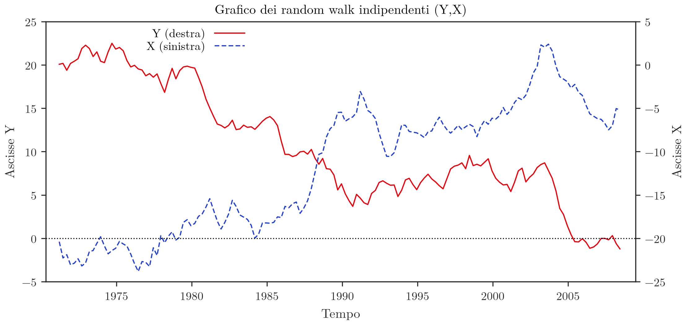
>
> **Figura 26** — Grafico delle serie storiche indipendenti $(X,Y)$, entrambe simulate come random walk indipendenti dal 1971 al 2008: le due serie mostrano andamenti di lungo periodo apparentemente correlati (una cresce mentre l'altra decresce, o viceversa) pur essendo generate in modo completamente indipendente — l'illusione visiva alla base della regressione spuria.
>
> **Esempio numerico.** Regressione tra $Y$ ed $X$ simulate al computer tramite due random walk indipendenti. Stime OLS usando le 150 osservazioni 1971:2-2008:3, variabile dipendente: Y, errori standard HAC (Kernel di Bartlett)
>
> | | coefficiente | errore std. | t-ratio | p-value |
> |---|---|---|---|---|
> | const | -2.99441 | 0.675510 | -4.433 | 1.80E-05 |
> | X | -0.792102 | 0.0829947 | -9.544 | 4.05E-017 |
>
> Errore standard della regressione = 3.31238; R-quadro = 0.75623; R-quadro corretto = 0.75458.
>
> Si noti che si rifiuta l'ipotesi nulla $H_0:\beta_1=0$ — nonostante $X$ e $Y$ siano per costruzione indipendenti: è l'evidenza empirica del fenomeno della regressione spuria.

*(slide 86–88)*

## Modelli per variabili non stazionarie: trend deterministico e stocastico

> [!abstract] Definizione
> È stato evidenziato come la non stazionarietà di una serie possa essere descritta da componenti deterministiche oppure stocastiche. Una formalizzazione generale è
> $$
> Y_t = TD_t + Y_t^*,
> $$
> dove: $TD_t$ è la componente deterministica, che potrebbe essere una semplice costante $TD_t=\kappa$, una retta $TD_t=\kappa+\delta t$ oppure un polinomio di secondo grado $TD_t=\kappa+\delta t+\gamma t^2$; $Y_t^*$ rappresenta la componente stocastica del processo generatore di $Y_t$; $Y_t$ è la serie storica osservabile.
>
> Se la componente stocastica $Y_t^*$ è stazionaria, allora $Y_t$ è detto **trend stazionario**, nel senso che il processo $Y_t-TD_t=Y_t^*$ è stazionario. In questi casi è possibile stimare la componente deterministica tramite OLS per poi descrivere la componente residuale (l'andamento di breve periodo) tramite un modello stazionario.
>
> Se invece $Y_t^*$ fosse un random walk, la componente di lungo periodo è descritta da
> $$
> Y_t^* = \sum_{i=1}^{t}\epsilon_t + Y_0^*,
> $$
> e si parla di presenza di **trend stocastico**.
>
> **Derivazione.** Ipotizzando $Y_t^* = Y_{t-1}^*+\epsilon_t$ (random walk), semplici passaggi algebrici permettono di scrivere il modello per $Y_t$ come
> $$
> Y_t = TD_t+Y_t^* = TD_t+Y_{t-1}^*+\epsilon_t = TD_t - TD_{t-1} + \underbrace{Y_{t-1}}_{Y_{t-1}^*}+\epsilon_t.
> $$
>
> - Nel caso di trend deterministico costante, $TD_t=\kappa$, la serie originale è descritta da un random walk:
> $$
> Y_t = Y_{t-1}+\epsilon_t.
> $$
> - Nel caso di trend lineare, $TD_t=\kappa+\delta t$, si ricava un random walk con drift:
> $$
> Y_t = \delta+Y_{t-1}+\epsilon_t = Y_0+\delta t+\sum_{j=1}^{t}\epsilon_j.
> $$
> - Nel caso di trend polinomiale di grado 2, si ottiene
> $$
> Y_t = (\delta-\gamma)-2\gamma t+Y_{t-1}+\epsilon_t.
> $$

*(slide 89–92)*

## Verifica della non stazionarietà: il test di Dickey-Fuller

> [!tip] Teorema
> Quando si usano serie storiche di dati economici, è necessario verificare se sono stazionari oppure no. In letteratura sono stati proposti diversi test per verificare la presenza o meno di una **radice unitaria**, cioè la presenza di una componente di tipo random walk nei dati.
>
> Si consideri innanzitutto il modello AR(1),
> $$
> Y_t = \beta_0+\beta_1 Y_{t-1}+\epsilon_t, \qquad \mathrm{Cov}(\epsilon_t,\epsilon_{t-j})=0,\ \forall j.
> $$
> Il random walk è un caso particolare di questo modello in cui $\beta_1=1$. L'idea alla base del test di **Dickey-Fuller (DF)** per verificare la non stazionarietà è di stimare il modello AR(1) e verificare il sistema d'ipotesi
> $$
> H_0:\beta_1=1 \quad \text{vs.} \quad H_1:\beta_1<1.
> $$
>
> Spesso in pratica risulta più utile considerare il modello AR(1) equivalente, riparametrizzato come
> $$
> \Delta Y_t = \beta_0+\delta Y_{t-1}+\epsilon_t, \qquad \delta=\beta_1-1,
> $$
> con la conseguenza che l'ipotesi di interesse diventa
> $$
> H_0:\delta=0 \quad \text{vs.} \quad H_1:\delta<0.
> $$
> Il sistema di ipotesi si verifica tramite la solita statistica $t=\hat\delta/\hat\sigma_{\hat\delta}$. La distribuzione asintotica di tale statistica **non è una Normale standard** e dipende dal modello utilizzato per la stima di $\delta$.
>
> Ipotizzando che il vero processo generatore dei dati sia il random walk $Y_t=Y_{t-1}+\epsilon_t$, $\epsilon_t\sim WN(0,\sigma^2)$, la statistica $t$ del test DF può essere calcolata sulla base di diversi modelli, ad esempio:
> - $Y_t = \beta_1 Y_{t-1}+\epsilon_t$;
> - $Y_t = \beta_0+\beta_1 Y_{t-1}+\epsilon_t$.
>
> Si può dimostrare che la distribuzione asintotica della statistica $t$ dipende dal modello utilizzato (Figura 27). È comunque possibile calcolare per via numerica i valori critici ed i p-value; i pacchetti econometrici disponibili forniscono tali quantità.
>
> 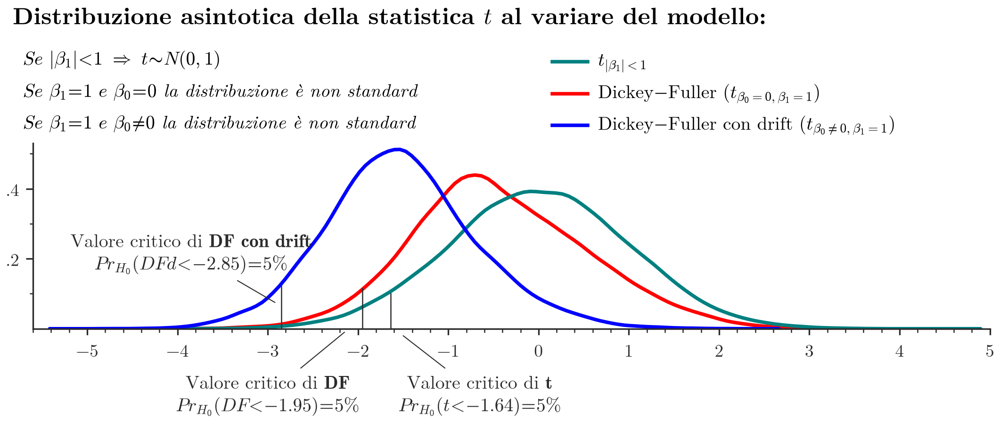
>
> **Figura 27** — Distribuzione asintotica della statistica $t$ (o $DF$) al variare del modello: se $|\beta_1|<1$, $t \to N(0,1)$; se $\beta_1=1,\beta_0=0$ la distribuzione è non standard (Dickey-Fuller, $t_{\beta_0=0,\beta_1=1}$); se $\beta_1=1,\beta_0\neq0$ la distribuzione è non standard (Dickey-Fuller con drift, $t_{\beta_0\neq0,\beta_1=1}$). Il grafico sovrappone le tre densità: quella $N(0,1)$ è la più stretta e centrata, mentre le due densità di Dickey-Fuller (senza e con drift) sono spostate verso sinistra e più larghe. Il valore critico al 5% unilaterale a sinistra risulta $-2.85$ per il test DF con drift, $-1.95$ per il test senza drift, ed $-1.64$ per una $N(0,1)$.

*(slide 93–96)*

## Il test aumentato di Dickey-Fuller (ADF)

> [!note] Dimostrazione
> Il test DF fornisce una decisione corretta sulla non stazionarietà se la serie originale è descritta da un modello AR(1) con errori incorrelati, cioè $\mathrm{Cov}(\epsilon_t,\epsilon_{t-j})=0,\ \forall j$. In generale questa potrebbe essere un'ipotesi poco credibile in casi pratici. Nel caso di autocorrelazione dei residui, la distribuzione asintotica della statistica $t$ risulta **non trattabile**.
>
> Per ovviare a questo inconveniente è stato proposto il test **Augmented Dickey-Fuller (ADF)**, che estende il test DF a un modello autoregressivo generico di ordine $p$. Come prima, la statistica test verifica sotto $H_0$ la presenza di radici unitarie. Si ipotizzi che i dati seguano un processo AR(p):
> $$
> Y_t = \beta_0+\beta_1 Y_{t-1}+\dots+\beta_p Y_{t-p}+\epsilon_t.
> $$
> Una rappresentazione equivalente del modello, utile ai fini del calcolo del test, è
> $$
> \Delta Y_t = \beta_0^*+\delta Y_{t-1}+\beta_1^*\Delta Y_{t-1}+\dots+\beta_p^*\Delta Y_{t-p+1}+\epsilon_t.
> $$
> Anche in questa parametrizzazione $\delta=\beta_1-1$. Il caso $\delta=0$ è equivalente alla presenza di radice unitaria; se $\delta<0$ vale la condizione di stazionarietà. L'alternativa è unilaterale, poiché se la serie fosse stazionaria $\delta$ risulterebbe negativo:
> $$
> H_0:\delta=0 \quad \text{vs.} \quad H_1:\delta<0.
> $$
>
> **Dimostrazione (derivazione per un processo AR(2), $p=2$).**
> $$
> Y_t = \phi_1 Y_{t-1}+\phi_2 Y_{t-2}+\epsilon_t = \phi_1 Y_{t-1}+(\phi_2 Y_{t-1}-\phi_2 Y_{t-1})+\phi_2 Y_{t-2}+\epsilon_t
> $$
> $$
> = (\phi_1+\phi_2)Y_{t-1}-\phi_2\Delta Y_{t-1}+\epsilon_t = \phi Y_{t-1}+\alpha\Delta Y_{t-1}+\epsilon_t \qquad (\phi\equiv\phi_1+\phi_2,\ \alpha=-\phi_2).
> $$
> Il primo regressore rappresenta il solito modello per il test DF; il secondo è la parte *augmented*, che se omessa introdurrebbe autocorrelazione nel termine d'errore della procedura standard del test DF.
>
> Sotto l'ipotesi nulla, la statistica $t$ si distribuisce seguendo una distribuzione non standard, diversa rispetto al caso del modello AR(1). Anche per il test ADF risulta possibile calcolare p-value e valori critici tramite simulazione.
>
> **Estensione: trend deterministico nel modello AR(p).** Un'ulteriore generalizzazione consiste nell'ipotizzare un modello in cui, oltre alla componente AR(p), si aggiunge un trend deterministico:
> $$
> Y_t = \beta_0+\alpha_1 t+\alpha_2 t^2+\beta_1 Y_{t-1}+\dots+\beta_p Y_{t-p}+\epsilon_t.
> $$
> Anche in questo caso è possibile calcolare la statistica test in maniera equivalente al caso precedente; quello che cambia in questa versione del test è la sua distribuzione asintotica.

*(slide 97–100)*

## Quale test di radice unitaria utilizzare?

Si ricordi che una serie storica può essere rappresentata dal modello $Y_t = TD_t+Y_t^*$. Risulta rilevante saper discriminare quale componente sia la causa della non stazionarietà, definendo un test che discrimini se una serie storica è (i) caratterizzata da trend stocastico, nel qual caso $Y_t^*$ è assimilabile a un random walk; oppure (ii) da un trend deterministico, nel qual caso la componente $TD_t$ risulta statisticamente significativa; oppure ancora (iii) se la non stazionarietà dipende da entrambi i fattori.

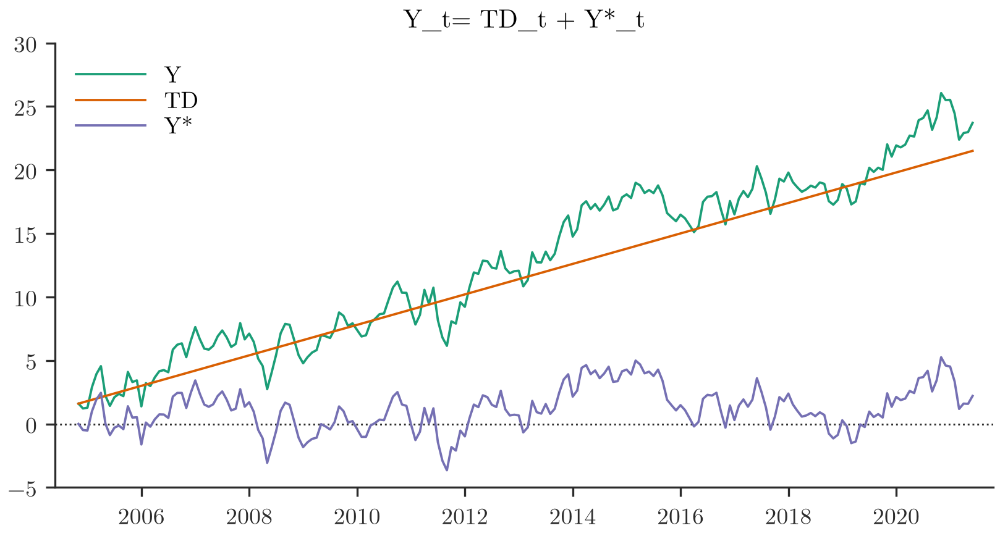

**Figura 28** — $Y_t = TD_t+Y_t^*$: la linea verde $Y_t$ rappresenta la serie osservata (con andamento crescente da circa 5 fino a circa 25-30 tra il 2006 e il 2022), rappresentata come combinazione del trend deterministico $TD_t$ (retta arancione crescente) e della dinamica stocastica $Y_t^*$ (serie blu oscillante attorno a zero senza trend).

**Caso 1: trend deterministico costante.** Si ipotizzi $TD_t=\kappa$ e $Y_t^*=\alpha Y_{t-1}^*+\epsilon_t$. Ne consegue che
$$
Y_t = TD_t+Y_t^* = \kappa+\alpha Y_{t-1}^*+\epsilon_t = \kappa(1-\alpha)+\alpha Y_{t-1}+\epsilon_t.
$$
Se fosse vera l'ipotesi nulla di non stazionarietà di $Y_t^*$, cioè $\alpha=1$, si ottiene
$$
Y_t = Y_{t-1}+\epsilon_t = Y_0+\sum_{j=0}^{t-1}\epsilon_{t-j}.
$$
Sotto la nulla, il modello diventa un random walk senza costante ma con valore iniziale $Y_0$ non necessariamente pari a 0.

**Caso 2: trend deterministico lineare.** Se $TD_t=\kappa+\delta t$,
$$
Y_t = TD_t+Y_t^* = \kappa+\delta t+\alpha Y_{t-1}^*+\epsilon_t = \kappa(1-\alpha)+\delta\alpha+\delta(1-\alpha)t+\alpha Y_{t-1}+\epsilon_t.
$$
Se fosse vera l'ipotesi nulla $\alpha=1$, si ottiene
$$
Y_t = \delta+Y_{t-1}+\epsilon_t,
$$
cioè, sotto la nulla, un random walk con drift, con valore iniziale $y_0$ non necessariamente pari a 0.

**Regola approssimativa** per decidere quale test utilizzare:
- se la serie storica non evidenzia un andamento tendenziale netto, si può usare il primo test (componente deterministica definita solo da una costante): sia sotto l'ipotesi nulla che sotto l'alternativa il processo ha media costante;
- se la serie storica evidenzia un andamento tendenziale di tipo lineare, si usa il secondo test: i processi compatibili sotto entrambe le ipotesi sono compatibili con un trend. Sotto la nulla il trend è causato dal drift del random walk; sotto l'alternativa è indotto dalla retta deterministica.

*(slide 101–105)*

## La differenziazione come soluzione alla non stazionarietà

Il trend, o comunque gli andamenti di tipo evolutivo che spesso caratterizzano le serie economiche, impongono di apportare alcune trasformazioni ai dati prima di poterne fare un'analisi statistica corretta. La **differenziazione** dei dati costituisce una trasformazione tipica utilizzata per rendere stazionarie serie integrate del primo ordine, cioè serie le cui differenze sono stazionarie, per cui si considera
$$
\Delta Y_t = \beta_0+\beta_1\Delta X_t+\epsilon_t.
$$

In maniera analoga è possibile considerare la **differenza logaritmica**, anche se in questo caso i risultati devono essere interpretati in termini di tassi di crescita (o incrementi percentuali):
$$
\Delta\log(Y_t) = \beta_0+\beta_1\Delta\log(X_t)+\epsilon_t.
$$

*(slide 106)*

## Riepilogo delle ipotesi OLS per le serie storiche e distribuzione asintotica

> [!tip] Teorema
> Concludendo, le ipotesi necessarie per ottenere stimatori OLS ottimali nel caso di modelli dinamici sono:
> - il modello è lineare;
> - il vettore $(Y_t,X_t)$ è stazionario, ed inoltre la dipendenza seriale tra $(Y_t,X_t)$ e $(Y_{t-j},X_{t-j})$ diventa nulla per $j$ grande;
> - $Y_t$ ed $X_t$ possiedono almeno i primi 8 momenti;
> - i regressori sono **esogeni**, nel senso che $E[\epsilon_t|X_{1,t},\dots,X_{K,t}]=0$;
> - vale la condizione di **omoschedasticità**;
> - non c'è perfetta collinearità.
>
> **Teorema (distribuzione asintotica per OLS).** Se valgono le ipotesi precedenti, si dimostra che:
>
> (i) lo stimatore $\hat\beta_j$ è **consistente**:
> $$
> \hat\beta_j \xrightarrow{p} \beta_j \qquad \forall j;
> $$
>
> (ii) lo stimatore $\hat\beta_j$ è **asintoticamente Normale**:
> $$
> \hat\beta_j \stackrel{a}{\sim} N\left(\beta_j,\sigma_{\hat\beta_j}^2\right) \qquad \forall j;
> $$
>
> (iii) la variabile casuale $t$, definita come $t=\dfrac{\hat\beta_j-\beta_j}{\hat\sigma_{\hat\beta_j}}$, converge ad una Normale standard:
> $$
> t=\frac{\hat\beta_j-\beta_j}{\hat\sigma_{\hat\beta_j}} \xrightarrow{p} N(0,1);
> $$
>
> (iv) lo stimatore $\hat\sigma_{\hat\beta_j}$ viene calcolato come nel caso del modello di regressione con errori omoschedastici.

*(slide 107–108)*
