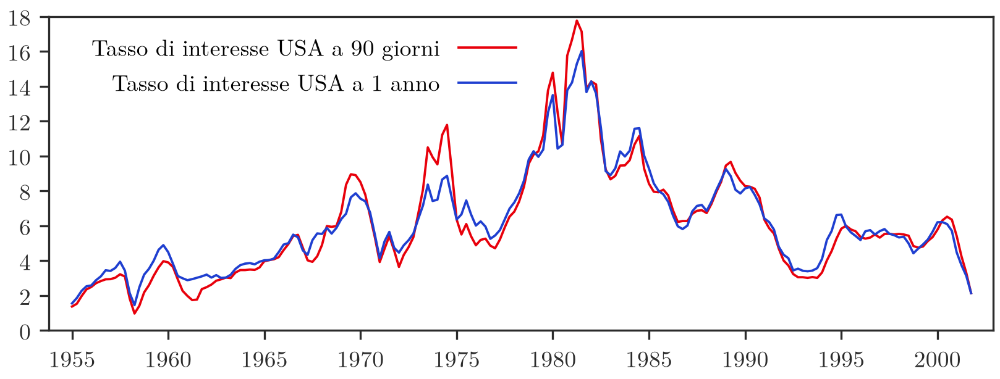
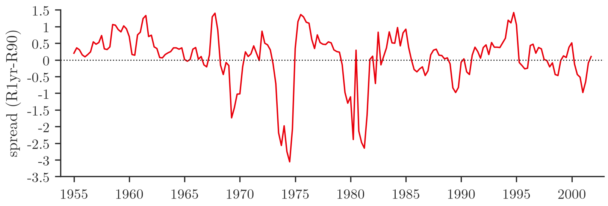
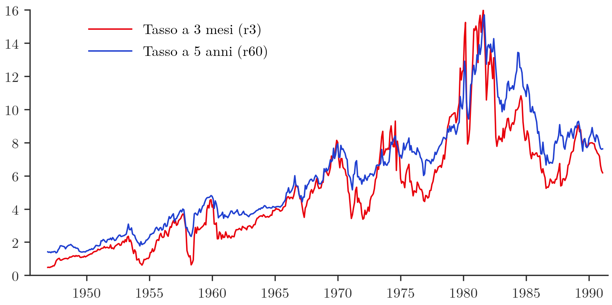
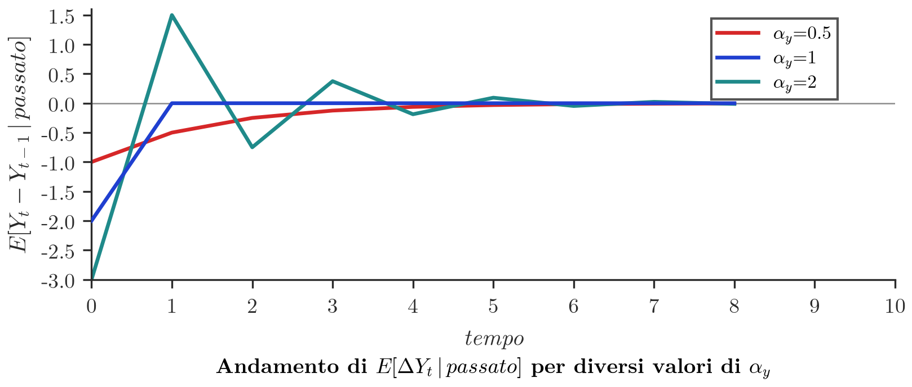

## Motivazione: serie non stazionarie che si muovono insieme

**Corso**: Econometria — *Introduzione alla Cointegrazione*, Davide Raggi, 10 dicembre 2025.

In linea di principio una variabile economica osservata come serie storica potrebbe avere un comportamento **non stazionario**. Tuttavia si può osservare che tale variabile tende ad evolvere in maniera simile ad altre (a loro volta non stazionarie). In sostanza, una variabile, seppur erratica, potrebbe tendere a **non discostarsi mai, in maniera sistematica, da altre**.

Questa evenienza può verificarsi quando più variabili tendono a muoversi attorno ad un **unico trend stocastico**. In questo caso, calcolando le differenze a coppie, queste tenderebbero ad essere stazionarie.

**Figura 1** — Serie storiche dei tassi di interesse USA ad 1 anno ed a 90 giorni (rispettivamente $R1yr$ ed $R90$), dal 1955 al 2000. I trend stocastici tendono ad essere simili. Il grafico mostra le due serie muoversi in maniera pressoché parallela nel tempo, suggerendo che condividano lo stesso trend stocastico sottostante.

**Figura 2** — La differenza tra tassi d'interesse, o spread $= (R1yr - R90)$, potrebbe sembrare un processo stazionario. A differenza delle serie di livello (che vagano senza un livello medio fisso), lo spread oscilla attorno a un valore vicino allo zero senza mostrare un trend persistente, suggerendo che la combinazione lineare delle due serie sia stazionaria anche se le serie singole non lo sono.

*(slide 1–4)*

## Definizione di cointegrazione: combinazione lineare stazionaria

> [!abstract] Definizione
> Dall'esempio precedente sembrerebbe che la differenza tra due serie $X$ ed $Y$, definita come $\epsilon_t = Y_t - X_t$, risulti essere stazionaria. In generale si può considerare una **generica combinazione lineare stazionaria** di $X$ ed $Y$:
>
> $$\epsilon_t = \beta_1 Y_t - \beta_2 X_t \propto Y_t - \underbrace{\frac{\beta_2}{\beta_1}}_{=\beta} X_t = Y_t - \beta X_t$$
>
> Tale relazione tra $X$ ed $Y$, essendo stazionaria, può essere interpretata come **stabile nel tempo**, o **di lungo periodo**. Il legame vale anche se il comportamento individuale di ogni serie risulta non stazionario. Si dice in questo caso che le variabili **co-integrano**, nel senso che sono integrate (non stazionarie), ma vagano attorno ad un unico trend stocastico.
>
> Una prima soluzione al problema della regressione spuria sarebbe analizzare la relazione tra le serie differenziate:
>
> $$\Delta Y_t = \beta_0 + \beta_1 \Delta X_t + \epsilon_t$$
>
> Tuttavia questo modo di procedere può non essere soddisfacente, perché si perdono tutte le informazioni sul comportamento dei **livelli** delle variabili nel lungo periodo, che rappresentano spesso uno degli obiettivi dell'analisi econometrica. La cointegrazione si presta bene all'analisi economica, in quanto permette di formalizzare opportune relazioni tra variabili di lungo periodo, nel contesto di un modello economico teorico.

*(slide 5–6)*

## Esempio: due random walk con trend stocastico comune

> [!example] Esempio
> Si considerino due random walk $X_t$ ed $Y_t$:
>
> $$Y_t = Y_{t-1} + \epsilon_{y,t} = \sum_{j=1}^{t} \epsilon_{y,j}$$
>
> $$X_t = X_{t-1} + \epsilon_{x,t} = \sum_{j=1}^{t} \epsilon_{x,j}$$
>
> Di solito, una combinazione lineare di due variabili non stazionarie $X$ ed $Y$ risulta **non stazionaria**, e quindi problematica dal punto di vista inferenziale.
>
> Tuttavia, si ipotizzi la situazione in cui $\epsilon_{y,j} = \theta \epsilon_{x,j}$. Come conseguenza si avrà che $Y_t = \theta X_t$. In questo caso si dice che $Y_t$ ed $X_t$ condividono lo stesso trend stocastico, in quanto
>
> $$Y_t = \theta \sum_{j=1}^{t} \epsilon_{x,j} \qquad \text{ed} \qquad X_t = \sum_{j=1}^{t} \epsilon_{x,j}$$
>
> Risulta chiaro, in questo caso, che $Y_t - \theta X_t = 0$, relazione che rappresenta, dal punto di vista economico, una situazione di **equilibrio** tra le due variabili, per qualsiasi valore di $t$.
>
> Più in generale, se si mantiene l'ipotesi che $\epsilon_{x,t}$ ed $\epsilon_{y,t}$ siano proporzionali, ma non IID (ad esempio autocorrelate), la sequenza di deviazioni dall'equilibrio potrebbe essere espressa da
>
> $$\epsilon_t = Y_t - \theta X_t$$
>
> in cui $\epsilon_t$ non è sistematicamente nulla ma risulta **stazionaria**.
>
> **Definizione.** Si dice che $X$ ed $Y$ sono **cointegrate** se esiste una loro opportuna combinazione lineare che è stazionaria. Tale definizione può essere generalizzata ad una $n$-pla di variabili $(Y, X_1, \ldots, X_{n-1})$.
>
> Dal punto di vista statistico ha quindi senso pensare di stimare il parametro $\theta$, che rappresenta il legame stabile nel tempo tra oggetti che individualmente sono instabili, ma congiuntamente lo sono.

*(slide 7–9)*

## Stima OLS in presenza di cointegrazione: superconsistenza

> [!tip] Teorema
> Siano $X$ ed $Y$ non stazionarie e cointegrate, e si vuole stimare
>
> $$Y_t = \beta_0 + \beta_1 X_t + \epsilon_t$$
>
> Per questo modello, pur essendo le variabili non stazionarie, si dimostra che lo stimatore OLS di $\beta_1$ è **superconsistente**, nel senso che
>
> $$(\hat\beta_1 - \beta_1) \xrightarrow{p} 0$$
>
> più velocemente rispetto allo stimatore OLS calcolato nelle ipotesi del modello di regressione con variabili stazionarie.
>
> La distribuzione asintotica di $\hat\beta_1$ tuttavia **non è Gaussiana**. Tale distribuzione dipende dalle ipotesi che vengono fatte sul termine di errore $\epsilon_t$, che comunque deve rimanere stazionario. In generale, si dimostra che la statistica $t$ **non si distribuisce come una normale standard**. Un caso particolare, in cui vale l'approssimazione alla Normale, si ha quando $\epsilon_t$ ed $\epsilon_{x,t}$ sono serialmente e mutualmente incorrelati.

*(slide 10)*

## Lo stimatore DOLS (Dynamic OLS)

> [!abstract] Definizione
> In termini pratici, nel caso di variabili cointegrate, risulta possibile ottenere stime puntuali molto accurate per via della superconsistenza. Tuttavia non risulta possibile costruire delle statistiche test opportune a causa della distribuzione asintotica non standard della statistica $t$.
>
> Una soluzione è stata proposta da **Stock e Watson (1993)** con lo stimatore **DOLS (Dynamic Ordinary Least Squares)** per $\beta_1$. Tale stimatore si basa sulla stima OLS della regressione aumentata:
>
> $$Y_t = \beta_0 + \beta_1 X_t + \underbrace{\gamma_0 \Delta X_t + \gamma_{-1}\Delta X_{t-1} + \ldots + \gamma_{-\ell_T}\Delta X_{t-\ell_T}}_{\text{lags}} + \underbrace{\gamma_1 \Delta X_{t+1} + \ldots + \gamma_{\ell_T}\Delta X_{t+\ell_T}}_{\text{leads}} + \epsilon_t^*$$
>
> Il parametro $\ell_T$ indica il numero di regressori da aggiungere al modello originale. Il valore di $\ell_T$ dipende dalla numerosità campionaria $T$.
>
> Si noti che i parametri di interesse nel modello aumentato sono solamente $\beta_0$ e $\beta_1$. Gli altri regressori sono solo strumentali ed hanno uno scopo puramente tecnico, nel senso che servono ad eliminare l'effetto dovuto all'eventuale autocorrelazione di $\epsilon_{x,t}$.
>
> Anche in questo caso la distribuzione asintotica dello stimatore DOLS $\hat\beta_1$ risulta **non Gaussiana**. In generale i residui del modello rimangono autocorrelati. Occorre quindi utilizzare uno stimatore consistente per gli errori standard che tenga conto dell'autocorrelazione e dell'eteroschedasticità (ad es. **Newey-West** o **HAC**).
>
> La statistica $t$ si distribuisce come una variabile casuale Normale standard sotto l'ipotesi nulla, con la conseguenza che l'inferenza può essere condotta come al solito.

*(slide 11–12)*

## Test di cointegrazione di Engle-Granger (CDF)

> [!abstract] Definizione
> La presenza di una relazione di cointegrazione permette di derivare una corretta inferenza nel modello di regressione anche nel caso in cui le variabili in esame siano non stazionarie. Risulta quindi necessario poter accertare quando, avendo variabili non stazionarie, ci si trova in presenza di questo tipo di relazione.
>
> Si consideri la relazione di lungo periodo
>
> $$\epsilon_t = Y_t - \theta X_t$$
>
> Se le variabili $X$ ed $Y$ condividessero lo stesso trend stocastico, ne risulterebbe la stazionarietà di $\epsilon_t$ e di conseguenza un test di radice unitaria rifiuterebbe l'ipotesi nulla. Un'idea per verificare la presenza di cointegrazione potrebbe basarsi sulla verifica dell'assenza di radice unitaria per $\epsilon_t$.
>
> Il processo $\epsilon_t$ risulta tuttavia non osservabile. Si ricordi però che gli stimatori OLS e DOLS $\hat\theta$ sono superconsistenti per $\theta$, e quindi $\hat\epsilon_t = Y_t - \hat\theta X_t$ è consistente per $\epsilon_t$.
>
> L'idea di **Engle e Granger (1987)** per verificare la presenza di cointegrazione è dunque quella di calcolare un test di radice unitaria per la serie dei residui $\hat\epsilon_t$, ad esempio il test **Dickey-Fuller per la Cointegrazione (CDF)**.
>
> **NOTA**: occorre precisare che la distribuzione asintotica della statistica CDF cambia a seconda che nella relazione di lungo periodo sia inserita l'intercetta oppure no. Inoltre tale distribuzione risulta differente rispetto al caso di test di radice unitaria classici. In ogni caso i principali software econometrici permettono di gestire in maniera automatica tali differenze.

*(slide 13–14)*

## Esempio applicato: cointegrazione tra tassi di interesse USA (r3 e r60)

> [!example] Esempio
> Si vuole verificare se le due serie storiche dei tassi di interesse USA, cioé $r3$ (tasso a 3 mesi) ed $r60$ (tasso a 5 anni), sono cointegrate. Occorre:
>
> 1. Verificare se $r3$ e $r60$ sono non stazionarie (integrate);
> 2. Stimare l'eventuale relazione di cointegrazione tramite OLS: $r60_t = a + b\, r3_t + \epsilon_t$;
> 3. Verificare se i residui della regressione $\hat\epsilon_t$ sono stazionari (tramite un opportuno test di tipo ADF).
>
> 
>
> **Figura 3** — Tassi USA a 3 mesi ed a 5 anni osservati da Dicembre 1946 a Febbraio 1992. Le due serie ($r3$ e $r60$) mostrano andamenti simili nel tempo, con picchi comuni (in particolare attorno al 1980), suggerendo la possibilità di cointegrazione.
>
> **Passo 1 — Test ADF sulle singole serie.** I test ADF evidenziano che entrambe le serie sono non stazionarie:
>
> | Serie | Ritardi di (1-L) inclusi | Specificazione | p-value asintotico |
> |---|---|---|---|
> | r3 | 8 | Test con costante | 0.3643 |
> | r60 | 7 | Test con costante | 0.5203 |
>
> **Passo 2 — Stima della relazione di cointegrazione.** OLS, usando le osservazioni 1946:12-1991:02 ($T = 531$), variabile dipendente $r60$:
>
> | | coefficiente | errore std. | rapporto t | p-value |
> |---|---|---|---|---|
> | const | 1.09161 | 0.0755948 | 14.44 | 4.36e-40 *** |
> | r3 | 0.952326 | 0.0124198 | 76.68 | 1.06e-288 *** |
>
> E.S. della regressione: 0.939385. R-quadro: 0.917454. R-quadro corretto: 0.917298.
>
> Si stimano quindi i residui del modello $\hat\epsilon_t$.
>
> **Passo 3 — Test CDF sui residui.** Si calcola da: Modello ⇒ Serie Storiche Multivariate ⇒ Test di Cointegrazione (Engle-Granger). Vengono riportati i test di stazionarietà delle serie storiche individuali, la relazione di cointegrazione eventuale e l'opportuno test ADF sui residui (di seguito solo l'ultimo passo, poiché i risultati dei passi precedenti coincidono con quelli già mostrati).
>
> **Passo 4 — Test per una radice unitaria in uhat.** Test Dickey-Fuller aumentato per uhat, inclusi 12 ritardi di (1-L)uhat, ampiezza campionaria 518. Ipotesi nulla di radice unitaria: $a = 1$.
>
> Modello: $(1-L)y = b_0 + (a-1)y_{(-1)} + \ldots + e$
>
> - Coefficiente di autocorrelazione del prim'ordine per $e$: -0.000
> - Differenze ritardate: $F(12, 505) = 1.793\ [0.0464]$
> - Valore stimato di $(a-1)$: -0.0744308
> - Statistica test: $\tau_c(2) = -3.44665$
> - p-value asintotico: 0.03747
>
> Il p-value del test CDF sui residui è basso (0.03747), per cui si rifiuta l'ipotesi nulla di radice unitaria nei residui: $r3$ ed $r60$ risultano **cointegrate**.

*(slide 15–20)*

## Dal modello ADL(1,1) al Modello a Correzione dell'Errore (ECM)

> [!note] Dimostrazione
> I modelli ADL possono essere utilizzati per descrivere ipotesi di teoria economica in cui esiste una relazione di **equilibrio di lungo periodo** tra variabili. Ad esempio potrebbe valere una relazione lineare del tipo $Y = a + bX$.
>
> Si riconsideri il modello ADL(1,1):
>
> $$Y_t = \kappa + \alpha_1 Y_{t-1} + \beta_0 X_t + \beta_1 X_{t-1} + \epsilon_t$$
>
> È possibile riparametrizzare il modello sottraendo $Y_{t-1}$ e sommando/sottraendo $\beta_0 X_{t-1}$:
>
> $$Y_t - Y_{t-1} = \kappa + \alpha_1 Y_{t-1} - Y_{t-1} + \beta_0 X_t + \beta_1 X_{t-1} + \beta_0 X_{t-1} - \beta_0 X_{t-1} + \epsilon_t$$
>
> $$= \beta_0 \Delta X_t + (\alpha_1 - 1)\left(Y_{t-1} - \underbrace{\frac{\kappa}{1-\alpha_1}}_{=a} - \underbrace{\frac{\beta_0+\beta_1}{1-\alpha_1}}_{=b} X_{t-1}\right) + \epsilon_t$$
>
> In sintesi il modello ADL(1,1) può essere riparametrizzato come
>
> $$\Delta Y_t = \beta_0 \Delta X_t + (\alpha_1 - 1)\underbrace{(Y_{t-1} - a - bX_{t-1})}_{\text{disequilibrio a } t-1} + \epsilon_t$$
>
> Il modello così definito evidenzia un **meccanismo a correzione dell'errore**. In particolare una variazione della variabile dipendente viene spiegata da una variazione del regressore $X_t$ e dall'eventuale scostamento dall'equilibrio (disequilibrio) realizzatosi nel periodo precedente. Anche ipotizzando che $\Delta X_t = 0$ e che $\epsilon_t = 0$, la variazione di $Y_t$ risulta diversa da $0$ in virtù del fatto che $Y_{t-1} \neq cX_{t-1}$.
>
> La velocità del ritorno all'equilibrio statico dipende dal valore del coefficiente $(\alpha_1 - 1)$.

*(slide 21–22)*

## Interpretazione del coefficiente di aggiustamento e dinamica di ritorno all'equilibrio

> [!note] Dimostrazione
> Per interpretare $\alpha_y = \alpha_1 - 1$, si ipotizzi che il regressore sia stabile nel tempo, quindi $X_{t-1} = X_t = X_{t+1} = X_{t+2} = \ldots$, che $\epsilon_t = 0$ e, per semplicità, che $a = 0$ e $Y_{t-1} - bX_{t-1} \neq 0$.
>
> $$\Delta Y_t = \underbrace{\beta_0 \Delta X_t}_{=0} + \alpha_y(Y_{t-1} - bX_{t-1})$$
>
> $$\Rightarrow Y_t = Y_{t-1} + \alpha_y(Y_{t-1} - bX_{t-1})$$
>
> $$\Rightarrow Y_t - bX_t = Y_{t-1} + \alpha_y(Y_{t-1}-bX_{t-1}) - \underbrace{bX_t}_{=bX_{t-1}\text{ per ip.}} = (1+\alpha_y)(Y_{t-1}-bX_{t-1})$$
>
> $$\Rightarrow \Delta Y_{t+1} = \beta_0 \Delta X_{t+1} + \alpha_y(Y_t - bX_t) = \alpha_y(1+\alpha_y)(Y_{t-1}-bX_{t-1})$$
>
> $$\Rightarrow \Delta Y_{t+2} = \alpha_y(Y_{t+1}-bX_{t+1}) = \alpha_y(1+\alpha_y)^2(Y_{t-1}-bX_{t-1})$$
>
> Tipicamente, osservando valori di $\alpha_y < 0$, ci si attende che il ritorno ad un nuovo equilibrio arrivi ad un tasso di $\alpha_y(1+\alpha_y)^j$. Il ri-equilibrio si otterrebbe se $\Delta Y_{t+h} = 0$ ed in particolare
>
> $$\Delta Y_{t+j} = \alpha_y(1+\alpha_y)^j (Y_{t+j-1} - bX_{t+j-1})$$
>
> È chiaro che quando $\Delta Y_{t+j} = 0$, vuol dire che il disequilibrio passato è stato riassorbito completamente dal sistema (non essendoci altre variabili che possono aver influenzato la dipendente, in particolare shock e regressori esogeni, che sono fissati).

*(slide 23–24)*

## Esempio applicato: ECM per i tassi di interesse USA

> [!example] Esempio
> In precedenza è stato verificato come i tassi d'interesse USA a 3 mesi ed a 5 anni fossero legati da una relazione di cointegrazione. Risulta quindi possibile definire un modello a correzione dell'errore per descrivere tale relazione:
>
> $$\underbrace{\Delta r60_t}_{} = \beta_1 \underbrace{\Delta r3_t}_{\text{staz.}} + \alpha \underbrace{(r60_{t-1} - a - b\, r3_{t-1})}_{\text{staz. se coint.}} + \epsilon_t$$
>
> Per stimare questo modello occorre conoscere $r60_{t-1} - a - br3_{t-1}$. Ma questi non sono altro che i residui della relazione di cointegrazione calcolati ad un ritardo. Quindi per stimare il modello a correzione dell'errore è sufficiente definire $\Delta r3_t$, $\Delta r60_t$ ed $\hat\epsilon_{t-1}$.
>
> **Procedura operativa (gretl)**:
> - Le variabili $\Delta r3_t$ e $\Delta r60_t$ si calcolano dal menu Aggiungi ⇒ Differenze delle Variabili Selezionate.
> - I residui $\hat\epsilon_t$ si stimano a partire dall'output standard del modello di regressione $r60_t = a + br3_t + \epsilon_t$, usando il menu Salva ⇒ Residui ⇒ Nome dei residui.
> - Il modello ECM si stima dal menu Modello ⇒ OLS, definendo i regressori e la variabile dipendente. Per includere il ritardo di $\hat\epsilon_t$ basta usare l'opzione Ritardi e definire 1 sia come ritardo minimo che come ritardo massimo.
>
> **Risultato.** OLS, usando le osservazioni 1947:01-1991:02 ($T = 530$), variabile dipendente $d\_r60$:
>
> | | coefficiente | errore std. | rapporto t | p-value |
> |---|---|---|---|---|
> | const | 0.00691546 | 0.0116796 | 0.5921 | 0.5540 |
> | d_r3 | 0.438546 | 0.0216191 | 20.29 | 4.80e-68 *** |
> | uhat_1 | -0.0658423 | 0.0124831 | -5.275 | 1.95e-07 *** |
>
> E.S. della regressione: 0.268831.
>
> Il coefficiente di $uhat\_1$ suggerisce che un disequilibrio osservato a $t-1$ viene assorbito nella misura di 0.065 punti percentuali al periodo $t$.

*(slide 25–27)*

## La rappresentazione VECM (Vector Error Correction Mechanism)

> [!note] Dimostrazione
> Le relazioni di cointegrazione si prestano bene ad analizzare modelli di equilibrio economico nel contesto di modelli dinamici. Si consideri ad esempio un modello **multivariato**, che descrive congiuntamente la dinamica di due variabili non stazionarie $X$ ed $Y$:
>
> $$X_t = \delta_x + \phi_{11}X_{t-1} + \phi_{12}Y_{t-1} + \epsilon_{x,t}$$
>
> $$Y_t = \delta_y + \phi_{22}Y_{t-1} + \phi_{21}X_{t-1} + \epsilon_{y,t}$$
>
> Alcuni passaggi algebrici permettono di riparametrizzare il modello come segue:
>
> $$\Delta X_t = \delta_x - \phi_{12}(Y_{t-1} - \beta_x X_{t-1}) + \epsilon_{x,t}$$
>
> $$\Delta Y_t = \delta_y - (1-\phi_{22})(Y_{t-1} - \beta_y X_{t-1}) + \epsilon_{y,t}$$
>
> $\Delta X_t$, $\Delta Y_t$, $\epsilon_{x,t}$ ed $\epsilon_{y,t}$ sono stazionari per costruzione. Il modello risulta ben definito solo se $(Y_{t-1} - \beta_x X_{t-1})$ e $(Y_{t-1} - \beta_y X_{t-1})$ sono stazionarie. Di conseguenza deve esistere una relazione di cointegrazione tra $X$ ed $Y$.
>
> È possibile dimostrare che, nel caso di soli due processi cointegrati, tutti i possibili coefficienti di cointegrazione sono **proporzionali**. Questo consente di ottenere $\beta_x = \beta_y = \beta$ e quindi:
>
> $$\Delta X_t = \delta_x - \alpha_x(Y_{t-1} - \beta X_{t-1}) + \epsilon_{x,t}$$
>
> $$\Delta Y_t = \delta_y - \alpha_y(Y_{t-1} - \beta X_{t-1}) + \epsilon_{y,t}$$
>
> Questo modello è definito **Meccanismo a Correzione dell'Errore Vettoriale**, o **VECM** (Vector Error Correction Mechanism).

*(slide 28–29)*

## VECM semplificato e interpretazione economica dell'aggiustamento

> [!example] Esempio
> Per capire come funziona in pratica il meccanismo di correzione dell'errore, è utile considerare il seguente sistema VECM semplificato, in cui $\delta_x = \delta_y = \alpha_x = 0$ e $\alpha_y > 0$:
>
> $$\Delta X_t = \epsilon_{x,t}$$
>
> $$\Delta Y_t = -\alpha_y(Y_{t-1} - \beta X_{t-1}) + \epsilon_{y,t}$$
>
> In questo caso la variazione attesa $\Delta Y_t$ risulta
>
> $$E[\Delta Y_t\,|\,\text{passato}] = -\alpha_y(Y_{t-1} - \beta X_{t-1})$$
>
> quindi dipende dal disequilibrio osservato nel periodo precedente. È opportuno notare che se le variabili fossero espresse in termini logaritmici, allora si dovrebbero interpretare i risultati in termini di variazioni percentuali o tassi di crescita.
>
> Sulla base del modello precedente si possono verificare 3 possibili situazioni:
>
> (a) **Nessun disequilibrio a $t-1$**, cioé $Y_{t-1} = \beta X_{t-1}$, per cui $E[Y_t\,|\,\text{passato}] = Y_{t-1}$. Se a $t-1$ si osserva equilibrio, ci si aspetta che le variabili rimangano in tale situazione.
>
> (b) **$Y_{t-1} > \beta X_{t-1}$**: ci si attende una variazione negativa di $Y$. Per compensare un disequilibrio positivo occorre che $Y_t$ decresca per tornare in equilibrio.
>
> (c) **$Y_{t-1} < \beta X_{t-1}$**: ci si trova in una situazione sotto il livello di equilibrio; per compensare a tale situazione ci si aspetta che $Y$ cresca.
>
> La velocità con cui si ritorna ad un livello di equilibrio è determinata dal coefficiente $\alpha_y > 0$.

*(slide 30–31)*

## Esempio: ritorno all'equilibrio nel VECM semplificato

> [!example] Esempio
> Si consideri il modello semplificato definito in precedenza. Si ipotizzi:
>
> - Viene osservato un disequilibrio iniziale pari a $(Y_{t-1} - \beta X_{t-1}) = 2$;
> - $X$ sia costante nel tempo, quindi $X_{t-1} = X_t = \ldots = X_{t+j}$, ed $\epsilon_{y,t} = 0,\ \forall t$.
>
> $$\Delta Y_t = -\alpha_y(Y_{t-1}-\beta X_{t-1}) \;\Rightarrow\; Y_t = Y_{t-1} - \alpha_y(Y_{t-1}-\beta X_{t-1})$$
>
> $$\Rightarrow Y_t - \beta X_t = (1-\alpha_y)(Y_{t-1}-\beta X_{t-1})$$
>
> $$\Rightarrow \Delta Y_{t+1} = -\alpha_y(1-\alpha_y)(Y_{t-1}-\beta X_{t-1})$$
>
> Analogamente si ottiene
>
> $$Y_{t+1} - \beta X_{t+1} = (1-\alpha_y)(Y_t - \beta X_t) \;\Rightarrow\; \Delta Y_{t+2} = -\alpha_y(1-\alpha_y)(Y_t - \beta X_t)$$
>
> In generale, infine,
>
> $$Y_{t+j-1} - \beta X_{t+j-1} = (1-\alpha_y)(Y_{t+j} - \beta X_{t+j})$$
>
> $$\Rightarrow \Delta Y_{t+j} = -\alpha_y(1-\alpha_y)(Y_{t+j-1}-\beta X_{t+j-1}), \quad \forall j \ge 0$$
>
> 
>
> **Figura** — *Andamento di $E[\Delta Y_t\,|\,\text{passato}]$ per diversi valori di $\alpha_y$* ($\alpha_y = 0.5$, $\alpha_y = 1$, $\alpha_y = 2$), sull'orizzonte temporale $t = 0, \ldots, 10$, partendo da un disequilibrio iniziale pari a 2. Il grafico mostra che con $\alpha_y = 1$ il disequilibrio viene riassorbito immediatamente (un solo periodo), con $\alpha_y = 0.5$ il ritorno all'equilibrio è più lento e monotono, mentre con $\alpha_y = 2$ il sistema oscilla attorno allo zero con ampiezza decrescente prima di stabilizzarsi: valori di $\alpha_y$ superiori a 1 generano un aggiustamento oscillante (overshooting), mentre valori tra 0 e 1 generano un aggiustamento monotono verso l'equilibrio.

*(slide 32–33)*
